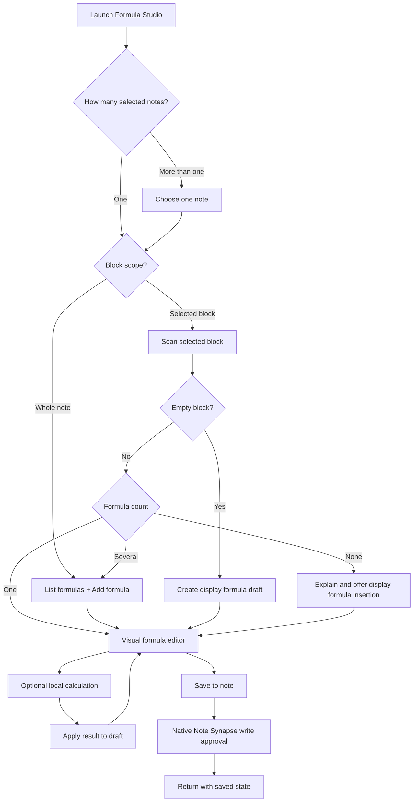

# Formula Studio — Note Action Design

Status: design complete; requirements approved
Requirements: approved in conversation
Implementation status: not started

## 1. Product definition

Formula Studio is a bundled Note Action user app for visually composing,
editing, and locally evaluating mathematical formulas stored in Note Synapse
notes.

The app is intentionally a formula editor with a lightweight symbolic
calculator, not a general computer algebra notebook. MathLive provides the
WYSIWYG math field and touch keyboard. Cortex Compute Engine provides local
symbolic and numeric operations. No feature requires AI, a server, or a network
connection.

The durable representation is always editable LaTeX in the note:

- inline math: `\( ... \)`
- display math: `\[ ... \]`

Formula Studio never replaces a formula with a raster image and never rewrites
a note merely by opening it.

## 2. Approved product decisions

1. Support the complete launch behavior:
   - direct editing of a selected display formula;
   - formula selection within a paragraph;
   - formula selection across a whole note;
   - creation from a selected empty block;
   - creation at the end of a whole note.
2. Operate on one note at a time. If several notes were selected, the user
   chooses a note before choosing a formula.
3. Include every Compute Engine operation that is both directly supported and
   simple to expose, except plotting.
4. Results remain previews until the user deliberately applies them to the
   draft and then saves the draft to the note.
5. Bundle pinned, minified MathLive, Compute Engine, and required fonts in the
   application. There are no downloads or CDN fallbacks.
6. Preserve formulas that Compute Engine cannot evaluate. Clearly distinguish
   "calculation unavailable" from "formula cannot be edited."
7. Recognize legacy dollar-delimited math conservatively and normalize an
   edited legacy formula to Note Synapse delimiters with a visible notice.
8. Decimal precision is configurable, angles default to radians, and
   trigonometric evaluation offers radians/degrees.
9. Calculus and solving results are inserted as self-contained mathematical
   statements rather than ambiguous equality chains.

## 3. Experience architecture



### 3.1 Launch routing

| Launch input | Initial screen |
|---|---|
| One block containing exactly one formula | Editor |
| One block containing several formulas | Formula picker scoped to that block |
| Empty selected block | New display-formula editor |
| Non-empty block without a formula | Explanation with "Insert display formula" |
| One whole note | Formula picker with "Add formula at end" |
| Several notes | Note picker, followed by the appropriate route |

The app receives only the notes already selected by the user through
`Synapse.Notes`; it does not query for unrelated notes.

### 3.2 Formula picker

Each formula row contains:

- a read-only rendered formula;
- an Inline, Display, or Legacy badge;
- a short, escaped context snippet;
- the note title when the launch included multiple notes.

Rows must be real buttons with accessible names. Note content is inserted using
`textContent`, never `innerHTML`.

For a whole note, "Add formula" appends a new display formula. For a block
without math, "Insert display formula" inserts into that block. A formula list
is never shown when there is exactly one unambiguous target.

### 3.3 Editor

The editor contains four conceptual regions:

1. **Context bar**
   - note title;
   - Block, Inline, or Display scope;
   - a back-to-formulas control when applicable.
2. **Math field**
   - MathLive `<math-field>`;
   - physical keyboard support;
   - touch virtual keyboard;
   - smart fences and smart superscripts;
   - matrices and piecewise entry through MathLive templates.
3. **Source and calculations**
   - collapsible raw-LaTeX source editor;
   - contextual calculation actions;
   - result preview and result-application actions;
   - compact warning or error messages.
4. **Commit bar**
   - Cancel;
   - Save to note;
   - dirty/unchanged state.

The source editor and math field synchronize in both directions. Programmatic
updates use MathLive's silent-update option so they do not create input loops.
Invalid or partially supported raw LaTeX remains in the source editor and is
not discarded.

The page uses `viewport-fit=cover` and
`interactive-widget=resizes-content`. All controls have at least a 44 px touch
target. The active field scrolls into view when the virtual keyboard opens.

### 3.4 Leaving and deleting

- Leaving with no changes closes immediately.
- Leaving with an unsaved draft asks whether to discard it.
- Clearing an existing formula and pressing Save asks "Remove this formula?"
  before requesting the native note write.
- Saving an empty new formula is disabled.
- Removing a formula removes its delimiters too. It does not remove surrounding
  prose or unrelated blank lines.

## 4. Formula model and scanner

### 4.1 Formula unit

The pure parser represents each target as:

```text
FormulaUnit
  noteId
  startOffset              inclusive, into the launch snapshot
  endOffset                exclusive
  raw                      delimiters plus body
  body                     LaTeX without delimiters
  kind                     inline | display
  delimiter                paren | bracket | dollar | doubleDollar
  lineEnding               "\n" | "\r\n"
  leadingPadding           spacing just inside the opening delimiter
  trailingPadding          spacing just before the closing delimiter
  indent                   display-block indentation
  contextBefore            bounded relocation anchor
  contextAfter             bounded relocation anchor
  occurrence               ordinal among byte-identical formulas
  legacy                   boolean
```

Offsets always refer to UTF-16 JavaScript string indices, which match
`String.slice()` and the bridge's JSON strings. The app never converts offsets
to bytes.

### 4.2 Canonical scanning

The scanner recognizes, outside Markdown code:

- `\(...\)` as inline math;
- `\[...\]` as display math, including multi-line display math;
- `$$...$$` as legacy display math.

It skips:

- fenced code blocks opened with backticks or tildes;
- inline code spans, including multi-backtick spans;
- escaped delimiter openers;
- unmatched openers.

The implementation is a deterministic state machine rather than one large
regular expression. It records fenced-code and inline-code ranges first, then
scans the remaining ranges for math delimiters.

### 4.3 Legacy inline-dollar scanning

Inline `$...$` is recognized only when the user explicitly selected the
containing paragraph or block. It is not discovered during a whole-note scan.
This avoids treating currency such as `$25 and $30` as a formula.

The selected-block legacy scanner additionally requires:

- unescaped opening and closing dollar signs;
- non-whitespace immediately inside both delimiters;
- no newline between delimiters;
- no second dollar adjacent to either delimiter.

On the first edit, the editor displays:

> This formula uses legacy dollar delimiters. Saving will convert it to Note
> Synapse math format.

### 4.4 Serialization

Editing preserves the formula's mode:

- inline stays inline;
- display stays display;
- a new formula is display math;
- legacy inline/display becomes canonical inline/display.

The serializer preserves:

- the note's dominant line ending;
- existing single-line versus multi-line display layout where practical;
- indentation of an existing display block;
- harmless padding just inside existing canonical delimiters.

MathLive output replaces only the formula body. Merely parsing with Compute
Engine never changes the draft.

## 5. Target relocation and note safety

A formula selected from a launch snapshot may move while Formula Studio is
open. Every save therefore re-reads current content and relocates the target
before writing.

Relocation proceeds conservatively:

1. Use the original range if it still contains the exact original raw formula.
2. Otherwise find all exact raw matches of the same delimiter type.
3. Score candidates using the bounded before/after anchors and proximity to the
   original offset.
4. Accept only an unambiguous candidate.
5. Abort if the formula disappeared or two candidates remain equally plausible.

The error is actionable:

> The note changed and this formula can no longer be located safely. Reopen
> Formula Studio from the note and try again.

The app never falls back to replacing the launch snapshot wholesale.

## 6. Write-back paths

### 6.1 Block scope

For `note.isBlockScope == true`:

1. Re-read current block content with `Synapse.runQuery()` using the transient
   block id.
2. Relocate the formula inside the current block content.
3. Compose the updated block text.
4. Call `Synapse.updateNotes()` on the transient block id with:

   ```javascript
   {
     modification: {
       content: { action: "replace", text: updatedBlock }
     }
   }
   ```

5. Treat `success: true, updatedCount: 0` as a failed write and surface
   `errors`.

`BlockNoteScopeService` owns final range validation, relocation, locking, and
splicing into the parent note.

### 6.2 Whole-note scope

For an ordinary note:

1. Read fresh raw content with
   `SELECT content FROM notes WHERE id = ...`.
2. Abort if the read fails; never use stale launch content as a fallback.
3. Relocate the selected formula in the fresh text.
4. Splice only the formula range.
5. Call `Synapse.updateNotes()` with a whole-content replacement.
6. Verify `updatedCount == 1`.

If the user chose "Add formula," append to the fresh content rather than using
an old offset:

- empty note: `\[ ... \]`;
- non-empty note: two dominant line endings followed by `\[ ... \]`.

### 6.3 Result insertion

"Insert below" is part of the same single pending content write as the edited
formula. It never performs two note writes.

- Display formula: insert the result as the next display block.
- Inline formula: preserve the paragraph and insert a display result after the
  selected block.
- Whole-note formula: splice both the edited target and the adjacent result
  into the fresh note in one composition step.

### 6.4 Native approval

Every save flows through `Synapse.updateNotes()` so the existing native
modification approval remains authoritative. The app does not use raw SQL for
writes and does not ask the user to approve twice.

## 7. Empty-block host integration

`BlockNoteScopeService` already supports zero-width spans and anchor-based
validation, but `NoteDetailScreen._handleNoteActionAppSelection()` currently
rejects `spanEnd <= spanStart`.

The host change is:

- accept `spanEnd == spanStart` for a selected blank-line block;
- continue rejecting `spanEnd < spanStart`;
- open a block scope whose text is empty;
- rely on the existing before/after anchors to validate the insertion point.

Required regression tests:

- selecting a blank block launches a Note Action with empty content;
- saving inserts at that exact blank-line position;
- a changed anchor refuses the insertion rather than writing mid-word;
- the existing non-empty block behavior is unchanged.

This is a general Note Action improvement, not a Formula Studio special case.

## 8. Compute Engine adapter

### 8.1 Version isolation

Formula Studio does not use `mathField.expression`. MathLive and Compute Engine
are deliberately coupled only by a LaTeX string:

```text
MathLive value -> Compute Engine parse -> result LaTeX -> MathLive draft
```

This avoids depending on MathLive's internal Compute Engine version and allows
each vendored project to be upgraded and tested independently.

The adapter creates an isolated Compute Engine instance for the current editor.
Substitutions do not mutate a global engine scope.

### 8.2 Operations

| User action | Compute Engine shape | Parameters |
|---|---|---|
| Simplify | `expr.simplify()` | none |
| Exact | `expr.evaluate()` | none |
| Decimal | `expr.N()` | significant digits |
| Substitute | `expr.subs(values)` | one value per selected symbol |
| Expand | evaluate `["Expand", expr]` | none |
| Factor | evaluate `["Factor", expr]` | none |
| Solve | `expr.solve(variable)` | one detected variable |
| Differentiate | evaluate `["D", expr, variable]` | variable |
| Integrate | evaluate `["Integrate", expr, variable]` | variable |
| Definite integral | evaluate `["Integrate", expr, ["Tuple", variable, low, high]]` | variable and bounds |
| Numeric integral | evaluate `["NIntegrate", ...]` | variable and bounds |
| Limit | evaluate `["Limit", function, target]` | variable and target |

Only actions valid for the parsed expression are enabled. For example:

- Solve requires an equation or a nonconstant expression plus a variable.
- Calculus actions require an expression and a variable.
- Definite integration requires both bounds.
- Limit requires an approach value.

Variables are detected from the parsed expression and presented as choices.
Built-in constants such as pi and e are not offered as substitution variables.

### 8.3 Precision and angles

- default decimal precision: 10 significant digits;
- allowed precision: 3–50 significant digits;
- default angle unit: radians;
- optional angle unit: degrees.

These preferences are stored with `Synapse.storeAppState()`. Formula text,
calculation results, and substitutions are not persisted in app state.

### 8.4 Evaluation outcomes

The adapter returns one of:

```text
success(resultLatex, exactOrApproximate)
unchanged(reason)
unsupported(message)
invalid(parseErrors)
failed(safeMessage)
```

Messages distinguish:

- **Invalid formula** — parser errors are shown, but source remains editable.
- **Calculation unavailable** — the formula can still be edited and saved.
- **No closed form found** — the returned expression still contains the
  requested integral, limit, or solve operation.
- **Unchanged** — the engine found no simpler or different representation.

Detailed exceptions go to `console.error` with a stack trace. User messages do
not expose stack traces or raw internal objects.

Calculations are disabled for formulas over 10,000 LaTeX characters. Editing
and saving remain available, with a hint that the calculation limit protects
the editor from expensive symbolic work.

## 9. Applying results

Applying a result changes the in-app draft. It does not write the note.

### 9.1 Replace

Replace the selected formula body with the result. This is always available for
a successful result, but never preselected.

### 9.2 Append relationship

Available for transformations that express mathematical equivalence:

- simplify;
- exact evaluation;
- substitution;
- expand;
- factor.

Exact/equivalent results use `=`. Decimal approximations use `\approx`.
Appending is disabled when the original is already relational or when the
operation returns several results.

### 9.3 Insert a self-contained result

This is the preferred action for:

- solving: `x = ...` or a solution set;
- differentiation: derivative notation `= result`;
- integration: integral notation `= result`, with `+ C` for an indefinite
  antiderivative when Compute Engine does not already include it;
- limits: limit notation `= result`;
- multiple results.

The generated statement is previewed in MathLive before it becomes part of the
draft.

## 10. Offline assets

### 10.1 Bundled dependency layout

```text
assets/scripts/
  mathlive/
    mathlive.min.js
    fonts/
      *.woff2
    LICENSE
  compute-engine/
    compute-engine.min.js
    LICENSE
assets/libraries.yaml
```

Research snapshot used for this design:

- MathLive 0.110.0 minified browser bundle: about 844 KB raw / 226 KB gzip;
- 20 MathLive WOFF2 fonts: about 260 KB total;
- Compute Engine 0.94.0 UMD bundle: about 1.92 MB raw / 529 KB gzip.

Implementation must re-check versions, APIs, licenses, hashes, and compressed
sizes before vendoring. Tests pin SHA-256 for every vendored script and font.

MathLive sounds are disabled (`soundsDirectory = null`) rather than bundled.

### 10.2 `synapse://` serving

The current built-in library handler is filename-only and text-only. It must be
extended to serve nested binary asset paths:

```text
synapse://mathlive/mathlive.min.js
synapse://mathlive/fonts/KaTeX_Main-Regular.woff2
synapse://compute-engine/compute-engine.min.js
```

The handler:

- combines the URI host and decoded path segments;
- rejects `.`, `..`, empty traversal segments, backslashes, and paths outside
  `assets/scripts/`;
- loads bytes with `rootBundle.load()`, not `loadString()`;
- returns explicit MIME types:
  - `.js` -> `application/javascript`;
  - `.css` -> `text/css`;
  - `.woff2` -> `font/woff2`;
- preserves existing one-file URLs such as `synapse://mermaid.min.js`;
- preserves custom global-library lookup behavior.

MathLive is configured with:

```text
fontsDirectory = "synapse://mathlive/fonts/"
soundsDirectory = null
```

### 10.3 Network prohibition

Formula Studio's first-party source contains:

- no HTTP or HTTPS executable resource URLs;
- no calls to `fetch`, `XMLHttpRequest`, `WebSocket`, `proxyFetch`, or
  `originFetch`;
- no CDN fallback;
- no AI call.

The reviewed vendor distributions do contain optional network-capable paths.
MathLive can probe a relative script URL and can load optional sounds; Compute
Engine includes an optional OEIS sequence lookup. Formula Studio keeps those
paths unreachable:

- `fontsDirectory` is an absolute `synapse://` URL, so MathLive does not need
  its relative-URL `HEAD` probe;
- `soundsDirectory` is `null`;
- the evaluator adapter exposes only the operations in section 8 and never
  exposes sequence/OEIS lookup;
- the document Content Security Policy permits only the required inline/local
  app code, `synapse:` scripts and fonts, and data images, with
  `connect-src 'none'`.

Vendor bundles remain pinned, hashed, and unmodified unless a documented
WebView incompatibility requires a narrowly reviewed patch. Browser integration
tests instrument network primitives and assert that boot, editing, and every
supported evaluator operation attempt no network request.

If either library fails to load, the app shows a boot error naming the missing
local component and performs no write. This also makes an exported Formula
Studio YAML fail safely when imported into an older Note Synapse version that
lacks the bundled assets.

## 11. User-app source layout

```text
contrib/formula-studio/
  LICENSE
  README.md
  dev/
    harness.html
    synapse_stub.js
    run_core_tests.mjs
    run_evaluator_tests.mjs
    run_writeback_tests.mjs
    run_ui_tests.mjs
  plugins/
    Formula_Studio.yaml
    build.sh
    formula_studio.html
    src/
      formula_core.js
      evaluator.js
      writeback.js
      i18n.js
      ui.js
assets/starter/apps/Formula_Studio.yaml
test/contrib_formula_studio_test.dart
```

Responsibilities:

- `formula_core.js`: pure scanning, relocation, serialization, and draft
  composition;
- `evaluator.js`: Compute Engine adapter and result semantics;
- `writeback.js`: fresh reads and the two Synapse write paths;
- `i18n.js`: English and Simplified Chinese strings;
- `ui.js`: routing, state, MathLive synchronization, accessibility, and
  interactions;
- `formula_studio.html`: semantic shell, tokens, and local asset tags.

The build script inlines every first-party module into the installable HTML.
Only `synapse://` library script tags remain external. The contrib YAML and
starter YAML must be byte-identical.

## 12. Visual language and localization

Formula Studio follows the modern Table Studio conventions:

- mobile-first responsive layout;
- system font for application chrome;
- light/dark colors from `prefers-color-scheme`;
- restrained accent color;
- cards and dividers rather than dense desktop toolbars;
- sticky commit controls that do not obscure the math keyboard.

All app-owned strings have English and Simplified Chinese translations. Locale
selection uses `navigator.language`, falling back to English. Math symbols are
not localized. Unsupported MathLive internal menu strings do not block use;
the app exposes its primary actions through its own localized controls.

Accessibility requirements:

- meaningful labels for every icon button;
- visible keyboard focus;
- logical focus order;
- no status conveyed by color alone;
- `aria-live="polite"` for calculation results and save status;
- respect `prefers-reduced-motion`;
- preserve MathLive's screen-reader math output.

## 13. Failure-state contract

| Condition | User behavior |
|---|---|
| No selected notes | Explain how to launch as a Note Action; no write controls |
| Multiple notes | Choose one note |
| No formula in selected prose | Offer display-formula insertion |
| Invalid raw LaTeX | Show parse location when available; allow continued source editing |
| MathLive accepts formula, Compute Engine does not | Show "Editable and saveable; calculation unavailable" |
| No closed form | Show unchanged symbolic operation, not a red error |
| Formula changed externally but relocates uniquely | Merge into fresh content |
| Formula disappeared or relocation is ambiguous | Abort save |
| Fresh note read fails | Abort save |
| Native approval denied | Keep draft and report that no change was made |
| `updatedCount == 0` | Treat as failed write and surface bridge errors |
| Local library/font missing | Boot gate; no degraded textarea-only write path |
| Oversized formula | Editing works; calculations disabled |

## 14. Verification strategy

### 14.1 Pure parser tests

- canonical inline and display formulas;
- multi-line display formulas;
- several formulas in one paragraph;
- code fences, longer fences, tilde fences, and unterminated fences;
- inline code with one or several backticks;
- escaped delimiters;
- unmatched delimiters;
- currency false positives;
- selected-block legacy dollar math;
- CRLF preservation;
- Unicode before formula offsets;
- duplicate formulas and anchor-based relocation;
- ambiguous relocation refusal;
- formula removal;
- result insertion beside inline and display formulas.

### 14.2 Evaluator tests against the real vendored engine

- simplify, exact, decimal, substitution, expand, and factor;
- one-variable solve with zero, one, and several solutions;
- derivative;
- indefinite and definite integral;
- numerical integral;
- finite and infinite limits supported by the engine;
- radians versus degrees;
- significant-digit preference;
- invalid expressions;
- unsupported custom commands;
- unchanged and unevaluated results;
- result serialization back to parseable LaTeX.

Tests assert capability conservatively. They do not claim that the engine can
solve every equation or integral in a mathematical category.

### 14.3 Write-back tests

- block-scope direct edit;
- block-scope empty insertion;
- whole-note edit;
- whole-note add-at-end;
- fresh-note merge after unrelated edits;
- target deletion;
- duplicate-target ambiguity;
- approval denial;
- `success: true` with `updatedCount: 0`;
- bridge error propagation;
- exactly one update call per save.

### 14.4 Browser UI tests

- each launch-routing path;
- formula picker keyboard and touch operation;
- MathLive/source two-way synchronization;
- virtual-keyboard viewport behavior;
- contextual action enablement;
- result application without immediate note write;
- dirty-exit confirmation;
- empty-formula removal confirmation;
- English and Simplified Chinese;
- light, dark, narrow, and landscape layouts;
- reduced motion and keyboard focus.

### 14.5 Flutter integration tests

- nested `synapse://` JavaScript and WOFF2 responses;
- traversal rejection and MIME types;
- legacy one-file global assets still load;
- blank-block Note Action scope can open and insert;
- starter YAML matches the contrib build;
- vendored asset SHA-256 pins;
- no external executable resource or forbidden Synapse capability in
  first-party app source;
- boot, editing, and supported calculations issue no network request even
  though optional vendor paths exist;
- CSP blocks an intentional test request.

## 15. Implementation sequence

1. Extend and test nested binary `synapse://` asset serving.
2. Vendor and pin MathLive, Compute Engine, fonts, and licenses.
3. Permit and test zero-width block Note Action scopes.
4. Implement and exhaustively test `formula_core.js`.
5. Implement the Compute Engine adapter against the pinned bundle.
6. Implement the Synapse write-back layer and stub.
7. Build the responsive editor and launch routing.
8. Add localization and accessibility passes.
9. Generate the installable YAML and bundled starter copy.
10. Run Node/browser tests, focused Flutter tests, `flutter analyze`, and the
    full Flutter test suite.

## 16. Explicitly out of scope

- plotting and graphing;
- AI-generated math or explanations;
- handwriting recognition;
- step-by-step proofs or pedagogical derivations;
- general physical-unit conversion;
- multi-note batch edits;
- persistent worksheets, variable notebooks, or calculation history;
- collaborative/live concurrent editing guarantees beyond safe target
  relocation and refusal;
- changing Note Synapse's general Markdown math syntax.

## 17. Design completion criteria

The design is ready for implementation when the reviewer agrees that:

- the launch routing matches the approved requirements;
- the fully offline host-asset approach is acceptable;
- the conservative legacy-dollar policy is acceptable;
- contextual calculus actions and result insertion semantics are acceptable;
- the small general host changes (binary asset serving and zero-width block
  scopes) are in scope.

There are no unresolved product questions in this document.
