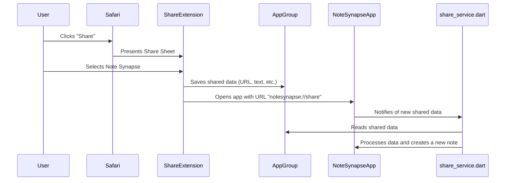

# iOS Share Extension Modification Design

## Overview

This document outlines the design for implementing an iOS Share Extension for the Note Synapse application. The goal is to allow users to share content (URLs, text, images, and files) from other apps to Note Synapse, similar to the existing functionality on Android.

## Problem Analysis

Currently, the Note Synapse app does not appear in the iOS share sheet. This is because the iOS project has not been configured to support a share extension, and there is no mechanism to handle incoming data from such an extension.

The existing `ShareViewController.swift` and `share_service.dart` files provide a starting point, but they are not fully integrated. The `ShareViewController.swift` saves data to an App Group's `UserDefaults` and opens a custom URL, but the Flutter app does not handle this URL or read the data.

## Alternatives Considered

### 1. Using a Third-Party Package

Packages like `receive_sharing_intent` or `share_handler` could simplify the implementation. However, given that there is already some native code in place, and to have more control over the user experience and data handling, this design will focus on a custom implementation using `MethodChannel` and App Groups. This approach also avoids introducing a new dependency.

### 2. Embedding Flutter UI in the Share Extension

It is technically possible to embed a Flutter view directly into the share extension. This would allow for a more customized UI within the share sheet. However, this is an advanced and not fully supported feature of Flutter, and it can lead to a larger extension size and slower performance. A native UI for the extension is the recommended and more stable approach.

## Detailed Design

The proposed design involves three main parts:

1.  **Configuring the iOS Project:** Setting up the necessary capabilities and URL schemes.
2.  **Enhancing the Share Extension:** Modifying the Swift code to reliably save data and open the app.
3.  **Implementing the Flutter-side Handling:** Creating the logic in the Flutter app to receive and process the shared data.

### 1. iOS Project Configuration

#### App Groups

An App Group will be used to share data between the share extension and the main app.

*   **App Group ID:** `group.com.github.kkspeed.note-synapse` (as defined in `ShareViewController.swift`)
*   **Configuration:** This App Group needs to be enabled for both the `Runner` and `ShareExtension` targets in Xcode.

#### URL Scheme

A custom URL scheme will be used to launch the main app from the share extension.

*   **URL Scheme:** `notesynapse` (as defined in `ShareViewController.swift`)
*   **Configuration:** The `notesynapse` URL scheme will be added to the `Info.plist` file for the `Runner` target.

### 2. Share Extension (`ShareViewController.swift`)

The existing `ShareViewController.swift` will be modified to ensure it correctly handles all supported data types and properly launches the main app.

The logic will be as follows:

1.  When the share extension is invoked, it will determine the type of the shared content (URL, text, image, file).
2.  The content will be saved to the `UserDefaults` of the shared App Group. For files (images, PDFs, etc.), the file will be saved to the shared container, and the file path will be saved to `UserDefaults`.
3.  The main app will be launched using the `notesynapse://share` URL.

### 3. Flutter-side Handling

#### `AppDelegate.swift`

The `AppDelegate.swift` file will be modified to handle the custom URL scheme and to set up a `MethodChannel` for communication with the Flutter app.

1.  **URL Handling:** The `application(_:open:options:)` method will be implemented to detect when the app is opened with the `notesynapse://share` URL. When this happens, it will send a notification to the Flutter app.
2.  **MethodChannel:** A `FlutterMethodChannel` named `com.github.kkspeed/share` will be created. This channel will be used to send the shared data from the native side to the Flutter side.

#### `share_service.dart`

The `share_service.dart` file will be modified to listen for incoming data from the `MethodChannel`.

1.  **MethodChannel Listener:** A method handler will be set up on the `com.github.kkspeed/share` channel.
2.  **Data Processing:** When data is received from the native side, the `processSharedContent` method will be called to process the data and create a new note.

### Mermaid Diagram

## Summary of Design

This design establishes a robust and reliable mechanism for sharing content to the Note Synapse app on iOS. By using a combination of App Groups, custom URL schemes, and `MethodChannel`, it ensures that shared data is correctly passed from the share extension to the Flutter app for processing.

## Research URLs

*   [Implementing an iOS Share Extension in a Flutter application](https://flutter.dev/docs/development/platform-integration/ios-share-extension)
*   [How to add iOS Share Extension to your Flutter app](https://medium.com/flutter-community/how-to-add-ios-share-extension-to-your-flutter-app-55de55941831)
*   [share_handler package](https://pub.dev/packages/share_handler)
*   [receive_sharing_intent package](https://pub.dev/packages/receive_sharing_intent)