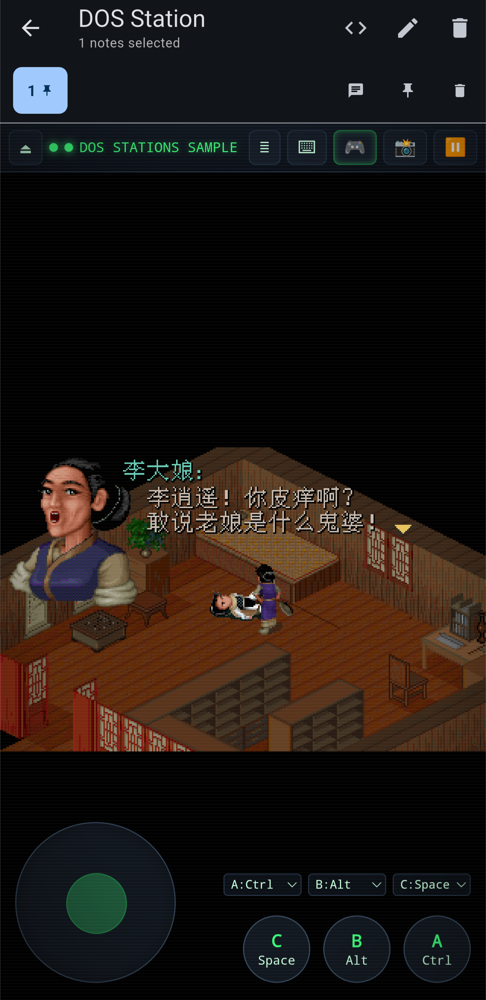
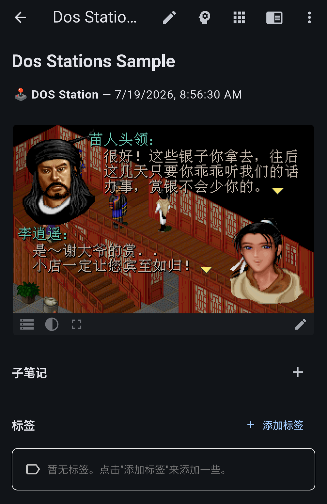
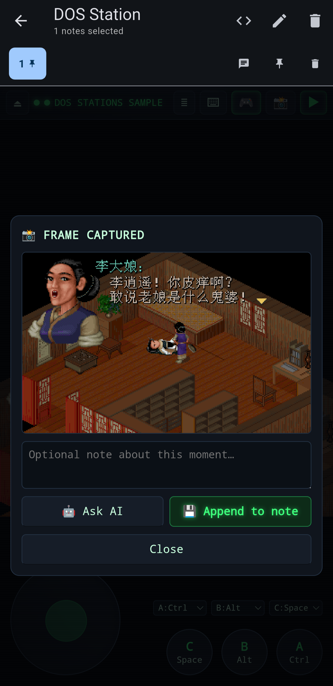

# DOS Station



Play classic DOS games stored inside your notes. DOS Station is a Note Synapse
user app that runs a full DOSBox emulator (compiled to WebAssembly) entirely
inside the plugin sandbox, using only the public Synapse API:

- **Game from a note** — select a note that has a `.zip` attachment; the zip is
  read with `Synapse.readAttachment`, unpacked in JavaScript, and mounted as
  the DOS `C:` drive.
- **Config from the note** — put a fenced ` ```dosbox ` block in the note to
  control the emulator (any `dosbox.conf` sections, including `[autoexec]`).
- **On-screen controls** — a full DOS keyboard overlay (sticky modifiers,
  quick-type bar) and a virtual gamepad (d-pad + mappable A/B/C buttons) for
  touch play.
- **Capture back to the note** — snapshot the current frame at any time; the
  PNG is attached to the note and appended inline to the note body together
  with an optional comment (`Synapse.updateNotes` granular append). You can
  also ask the app's AI channel about the frame (`Synapse.chatAI` with an
  image attachment) before saving.
- **Self-installing engine** — on first run the DOSBox WebAssembly engine
  (js-dos 6.22.60, ~2 MB) is downloaded via `Synapse.proxyFetch`, verified
  against pinned SHA-256 hashes with `Synapse.crypto.digest`, and cached in
  app state (`Synapse.storeAppState`) so later runs work offline.






## Installing

1. Open `plugins/DOS_Station.yaml` with Note Synapse (share/open it on your
   device) to import the user app.
2. Optional: create a skill from `skills/DOS_Station.md` so the AI assistant
   knows how to prepare game notes and embed the player.

## Preparing a game note

1. Create a note (e.g. "Commander Keen") and attach the game's `.zip`.
2. Optionally add a config block to the note body:

   ````markdown
   ```dosbox
   [cpu]
   cycles=fixed 12000

   [autoexec]
   mount c /dos
   c:
   KEEN1.EXE
   ```
   ````

   - The zip is always mounted at `/dos`; `mount c /dos` + `c:` are added to
     your `[autoexec]` automatically if you leave them out.
   - With no ` ```dosbox ` block (or no `[autoexec]`), DOS Station scans the
     zip for `.exe`/`.com`/`.bat` programs and shows a launcher menu.

3. Select the note and run **DOS Station** (it is a note-action app), or embed
   the player right inside the note:

   ```markdown
   @[640x480](synapseresource://app/282d85c5-82cd-4d0f-b03d-1bb99a84419b?note=current&autoboot=1)
   ```

   Supported embed params: `autoboot` (skip the launcher when possible),
   `exe` (program to run, e.g. `exe=KEEN1.EXE`), `zip` (attachment file name
   to use when the note has several zips).

## Folder layout

- `plugins/dos_station.html` — the plugin source (single self-contained file).
- `plugins/build.sh` — regenerates `DOS_Station.yaml` from the HTML.
- `plugins/DOS_Station.yaml` — the installable user app.
- `skills/DOS_Station.md` — optional assistant skill.
- `dev/` — a browser test harness with a stubbed Synapse API (not installed).

## Licensing

- The plugin code is MIT (see the header of `plugins/dos_station.html`).
- The HTML embeds [fflate](https://github.com/101arrowz/fflate) (MIT) for zip
  extraction.
- At runtime the plugin downloads the DOSBox WebAssembly build shipped by
  [js-dos 6.22](https://js-dos.com) (DOSBox is GPL-2.0). The engine is fetched
  onto the user's own device and is not distributed with this plugin or with
  Note Synapse.

Game files are whatever the user attaches to their notes; only use software
you have the rights to run.
