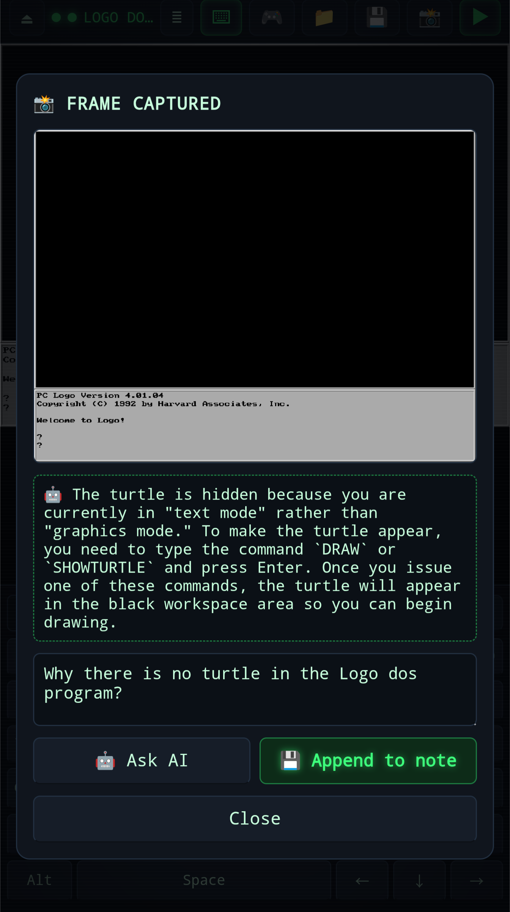

# DOS Station


Play classic DOS games stored inside your notes. DOS Station is a Note Synapse
user app that runs a full DOSBox emulator (compiled to WebAssembly) entirely
inside the plugin sandbox, using only the public Synapse API:

- **Game from a note** — select a note that has a `.zip` attachment; the zip is
  read with `Synapse.readAttachment`, unpacked in JavaScript, and mounted as
  the DOS `C:` drive.
- **Config from the note** — put a fenced ` ```dosbox ` block in the note to
  control the emulator (any `dosbox.conf` sections, including `[autoexec]`).
- **Files from the note** — a code block tagged `{dos-name="HELLO.BAS"}` lands
  on `C:` automatically; other code blocks and attachments can be added from
  the 📁 files panel, and anything DOS changes can be saved back to the note.
  A note with files but no game zip still boots, to a bare `C:\>` prompt.
- **On-screen controls** — a full DOS keyboard overlay (sticky modifiers,
  quick-type bar) and a virtual gamepad (analog d-pad with four discrete
  direction buttons for arrow-key games, plus mappable A/B/C buttons) for
  touch play. The keyboard docks below the picture so it never covers the game.
- **Game saves that stick** — anything the game writes to `C:` (RPG save
  games, configs, high scores) is diffed against the game zip and stored on
  the note as a `dos-saves-*.zip` attachment (via the 💾 button, a 60-second
  change-detecting autosave, and on eject), then restored automatically the
  next time the game boots.
- **Capture back to the note** — snapshot the current frame at any time; the
  PNG is attached to the note and appended inline to the note body together
  with an optional comment (`Synapse.updateNotes` granular append). You can
  also ask the app's AI channel about the frame (`Synapse.chatAI` with an
  image attachment) before saving.
- **Self-installing engine** — on first run the DOSBox WebAssembly engine
  (js-dos 6.22.60, ~2 MB) is downloaded via `Synapse.proxyFetch`, verified
  against pinned SHA-256 hashes with `Synapse.crypto.digest`, and cached in
  app state (`Synapse.storeAppState`) so later runs work offline.




## Installing

1. Open `plugins/DOS_Station.yaml` with Note Synapse (share/open it on your
   device) to import the user app.
2. Optional: create a skill from `skills/DOS_Station.md` so the AI assistant
   knows how to prepare game notes and embed the player.

## Preparing a game note

1. Create a note (e.g. "Commander Keen") and attach the game's `.zip`.
2. Optionally add a config block to the note body:

   ````markdown
   ```dosbox
   [cpu]
   cycles=fixed 12000

   [autoexec]
   mount c /dos
   c:
   KEEN1.EXE
   ```
   ````

   - The zip is always mounted at `/dos`; `mount c /dos` + `c:` are added to
     your `[autoexec]` automatically if you leave them out.
   - With no ` ```dosbox ` block (or no `[autoexec]`), DOS Station scans the
     zip for `.exe`/`.com`/`.bat` programs and shows a launcher menu.

3. Select the note and run **DOS Station** (it is a note-action app), or embed
   the player right inside the note:

   ```markdown
   @[640x480](synapseresource://app/282d85c5-82cd-4d0f-b03d-1bb99a84419b?note=current&autoboot=1)
   ```

   Supported embed params: `autoboot` (skip the launcher when possible),
   `exe` (program to run, e.g. `exe=KEEN1.EXE`), `zip` (attachment file name
   to use when the note has several zips).

## Files from the note

The 📁 button (in the launcher and in the player HUD) shows everything the note
puts on `C:`, and lets you add or remove it.


### Code blocks

Tag a fenced block's info string with `dos-name` and it is written to `C:` every
time the note is mounted — no clicking required:

````markdown
```basic {dos-name="HELLO.BAS"}
10 PRINT "HELLO WORLD!"
20 GOTO 10
```
````

The attribute is inert to the renderer (the block still highlights as BASIC), and
you never have to type it by hand: pick any code block in the 📁 panel, give it a
name, and DOS Station writes the attribute into that fence for you.

- **Names** are DOS 8.3, uppercased, subdirectories allowed:
  `hello.bas` → `C:\HELLO.BAS`, `src/main.bas` → `C:\SRC\MAIN.BAS`. Anything
  illegal is rejected in the panel with the reason. The block must be closed —
  a stray unclosed ` ``` ` swallows the rest of the note, so DOS Station will
  not import from it or write back into it.
- **Text is converted**, since DOS does not read UTF-8: line endings become
  CRLF and characters are transcoded to code page 437 (so box-drawing and
  accented characters survive; anything CP437 cannot represent becomes `?`, and
  the panel warns first). The exact reverse happens on the way back.

### Attachments

Attachments are **never** copied automatically — pick them in the 📁 panel. Your
choices are recorded in the note as a ` ```dos-files ` block, so they travel with
it:

````markdown
```dos-files
# DOS Station — attachments copied to C:. Managed by the app.
attachment: levels.dat -> LEVELS.DAT
attachment: readme.md -> DOCS\READ.TXT | text
```
````

`-> NAME` is optional (a DOS name is derived from the file name otherwise), and
`| text` asks for the CP437 + CRLF conversion instead of a byte-for-byte copy.
The app also manages a `| v=…` option — leave that one alone; see below.

### When DOS changes an imported file

The autosave keeps it like any other file on `C:`, and the 📁 button grows an
amber badge to say `C:` no longer matches the note. In the panel each file shows
what happened and what you can do:

| State | Meaning | Actions |
| --- | --- | --- |
| *(clean)* | `C:` and the note agree | `✕ REMOVE` (drops it from the note and from `C:`) |
| `CHANGED IN DOS` | DOS edited it this session | `↑ TO NOTE`, `↻ FROM NOTE`, `✕ UNLINK` |
| `SAVED COPY IN USE` | a saved copy replaced the note's at boot | same |
| `NOT ON C:` | deleted inside DOS | `↻ RESTORE`, `✕ UNLINK` |

**A saved copy always wins over the note copy at boot.** The note only seeds a
file the saves do not have, so work you did inside DOS is never silently
overwritten — the badge tells you the two have drifted, and `↑ TO NOTE` is how
you reconcile them.

`↑ TO NOTE` behaves differently by source, and neither one destroys anything:

- a **code block** is rewritten where it stands, keeping its `dos-name`;
- an **attachment** is saved as a *new* file (`levels-<stamp>.dat`) and the
  `dos-files` entry starts pointing at it via `| v=…`. Your original attachment
  is never modified or deleted.

Each of these changes the note, so the app asks for your approval the first time
in a session (pushing an attachment back asks twice: once to attach the file,
once to point the note at it).

`↻ FROM NOTE` throws away the DOS-side changes and re-copies the note's version;
it needs a second tap to confirm. Files added or removed while DOSBox is running
appear on `C:` immediately (DOS Station refreshes DOSBox's directory cache for
you) — though a program that already has the file open will not notice until it
reopens it.

### Files DOS created

The panel's **NEW / CHANGED ON C:** section lists the other direction: files a
DOS program created this session, and game files DOS modified, that the note
does not know about yet. (They are already safe — the autosave keeps them — but
linking one makes it visible and editable in the note.) The list is computed
when the panel opens; `↻ REFRESH` re-scans without closing it.

Each file offers:

- **`+ CODE BLOCK`** — appends a fenced block to the note with the `dos-name`
  attribute already set (CP437 → UTF-8, CRLF → LF on the way in). Text files
  only, up to 512 KB; over 64 KB the button asks for a confirming second tap
  before dropping that much text into the note.
- **`+ ATTACHMENT`** — saves the bytes as a new attachment (named after the DOS
  file) and records it in the `dos-files` block, byte-for-byte. Up to 8 MB.

Either way the file becomes an ordinary linked import: it moves up to the
*ON C: FROM THIS NOTE* section and gets the drift tracking and `↑ TO NOTE` /
`↻ FROM NOTE` actions described above. The DOS path stays exactly what it is on
`C:` — only files whose names fit the 8.3 rules can be linked (others stay
listed with the reason).

### A note with no game

If a note has `dos-name` blocks or a `dos-files` list but no `.zip`, DOS Station
boots a bare `C:\>` prompt holding just those files. That is the quick way to try
a `.bat`, a BASIC listing, or a config file without packaging anything.

## Game saves

Save inside the game as you normally would (e.g. the RPG's own *Save Game*
menu). DOS Station notices files that changed on `C:` compared to the game
zip and writes just that diff to the note as a `dos-saves-<game>-<stamp>.zip`
attachment — on the next boot the diff is unpacked on top of the game files
before DOS starts, so the game finds its save files where it left them.

- Saving happens on the 💾 HUD button, every 60 seconds when something
  actually changed, when the app is backgrounded, and on eject (⏏).
- Each save replaces the previous `dos-saves` attachment for that game zip;
  notes with several game zips keep independent saves per zip.
- Deleting the `dos-saves-*.zip` attachment resets the game to a fresh
  install; moving it (with the game zip) to another device restores progress
  there.

## Folder layout

- `plugins/dos_station.html` — the plugin source (single self-contained file).
- `plugins/build.sh` — regenerates `DOS_Station.yaml` from the HTML.
- `plugins/DOS_Station.yaml` — the installable user app.
- `skills/DOS_Station.md` — optional assistant skill.
- `dev/` — a browser test harness with a stubbed Synapse API (not installed).

## Developing

```bash
# Pure-logic tests (CP437, the fence scanner, DOS names, the dos-files grammar).
# These slice the `core:begin`/`core:end` region out of the HTML and run it in Node.
node dev/run_core_tests.mjs

# Full UI, in a browser, against a stubbed Synapse:
python3 -m http.server 8471     # from this directory
open http://localhost:8471/dev/test_harness.html
# ?scenario=zipless | block | readonly, and ?reset=1 to clear the stub's storage

./plugins/build.sh              # regenerate the installable YAML after any HTML edit
```

`test/contrib_dos_station_test.dart` (in the app repo) checks that the YAML was
rebuilt and that the pure core stayed pure.

## Licensing

- The plugin code is MIT (see the header of `plugins/dos_station.html`).
- The HTML embeds [fflate](https://github.com/101arrowz/fflate) (MIT) for zip
  extraction.
- At runtime the plugin downloads the DOSBox WebAssembly build shipped by
  [js-dos 6.22](https://js-dos.com) (DOSBox is GPL-2.0). The engine is fetched
  onto the user's own device and is not distributed with this plugin or with
  Note Synapse.

Game files are whatever the user attaches to their notes; only use software
you have the rights to run.
