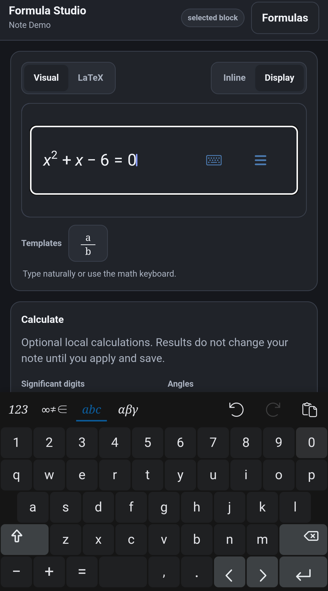
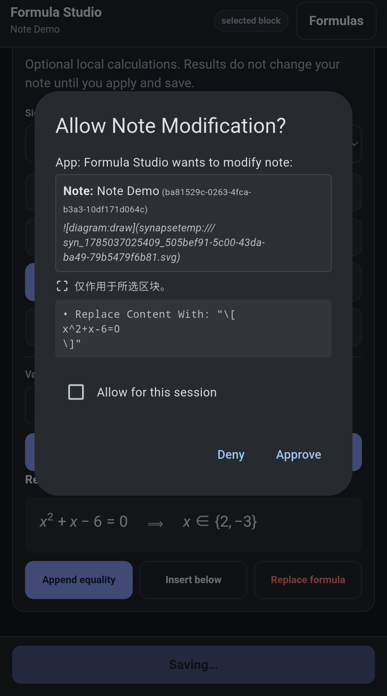

# Formula Studio

Formula Studio is a bundled Note Action User App for visually editing the
LaTeX formulas in Note Synapse notes. It uses the locally packaged MathLive
math field and Cortex Compute Engine; editing and all supported calculations
work without a network connection.






## User flow

- Launch on a selected formula or paragraph to edit formulas in that block.
- Launch on a selected blank block to create a display formula there.
- Launch on one or more whole notes to choose one note, then choose or add a
  formula.
- Optionally preview a local calculation and deliberately apply it to the
  draft.
- Save once to request the normal native Note Synapse write approval.

Canonical note syntax is `\( ... \)` for inline formulas and `\[ ... \]` for
display formulas. Legacy dollar-delimited formulas are recognized
conservatively and converted only when the user saves an edited formula.

## Development

From the repository root, use the bundled or system Node executable:

```bash
node contrib/formula-studio/dev/run_core_tests.mjs
node contrib/formula-studio/dev/run_evaluator_tests.mjs
node contrib/formula-studio/dev/run_writeback_tests.mjs
```

Build the installable app and synchronized starter copy with:

```bash
contrib/formula-studio/plugins/build.sh
```

The readable application source is `plugins/formula_studio.html`; the build
inlines only Formula Studio's first-party modules. The large reviewed
dependencies and MathLive fonts remain APK assets addressed through
`synapse://`.

Pinned dependency versions and SHA-256 hashes are recorded in
`vendor-lock.json`. Their upstream MIT licenses are packaged beside the
bundles under `assets/scripts/`.
