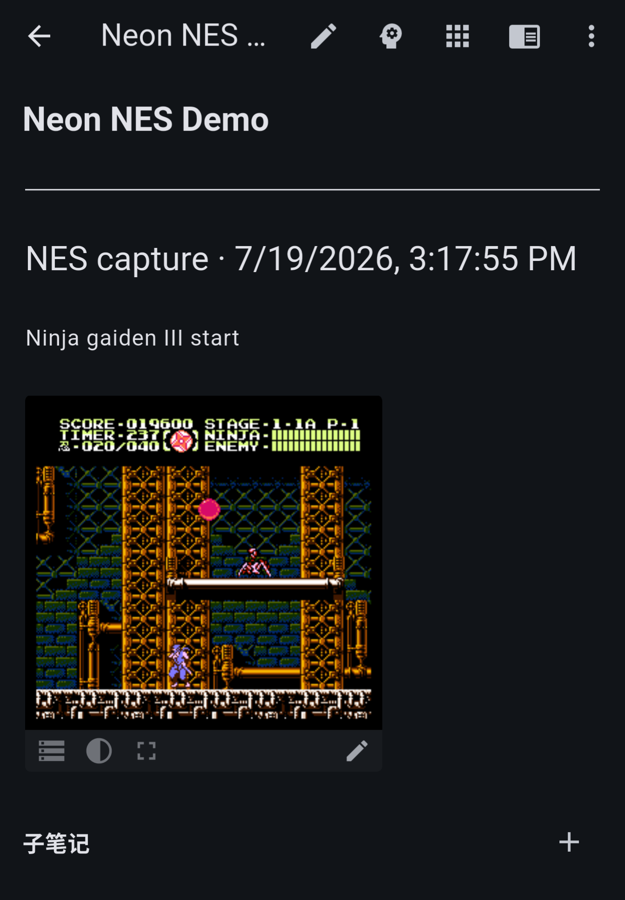
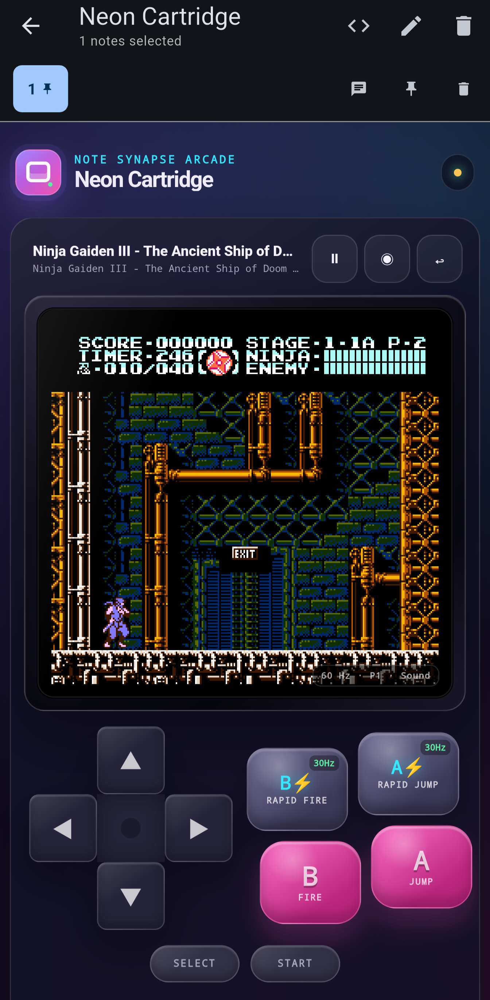

# Neon Cartridge

Neon Cartridge is an offline-capable NES emulator packaged as a Note Synapse
note-action user app. It loads an uncompressed `.nes` ROM from a selected
note's attachments and provides:

- responsive touch controls for portrait and landscape phones;
- keyboard and physical gamepad input through jsnes;
- dedicated 30 Hz Rapid Jump (Turbo A) and Rapid Fire (Turbo B) controls;
- pause, reset, and per-cartridge quick save/load;
- annotated PNG captures saved both as note attachments and inline Markdown.





## Install

Open `plugins/Neon_Cartridge.yaml` with Note Synapse. Attach a legally obtained
uncompressed `.nes` ROM to a note, select that note, and run **Neon Cartridge**
from the Note Action menu.

ROMs are read locally through the Synapse plugin API. The app does not upload
ROMs or gameplay data and makes no network requests.

## Build

Edit `plugins/nes_arcade.html`, then run:

```bash
cd contrib/nes-arcade/plugins
./build.sh
```

The build script inlines the pinned jsnes distribution before base64-encoding
the complete app into the installable YAML.

## Licensing

Neon Cartridge is licensed under Apache-2.0. It vendors
[jsnes 2.0.0](https://github.com/bfirsh/jsnes), also licensed under
Apache-2.0. The upstream license is preserved at
`plugins/vendor/LICENSE.jsnes`.

Version 2.0.0 is deliberately pinned. jsnes 2.1.0 introduced an OAM sprite
evaluation regression that scrambles sprites in MMC3 games, accompanied by
audio underruns and frame catch-up bursts
([upstream issue #771](https://github.com/bfirsh/jsnes/issues/771)).

No game ROMs are included. Users are responsible for ensuring they have the
right to use any ROM they attach.
