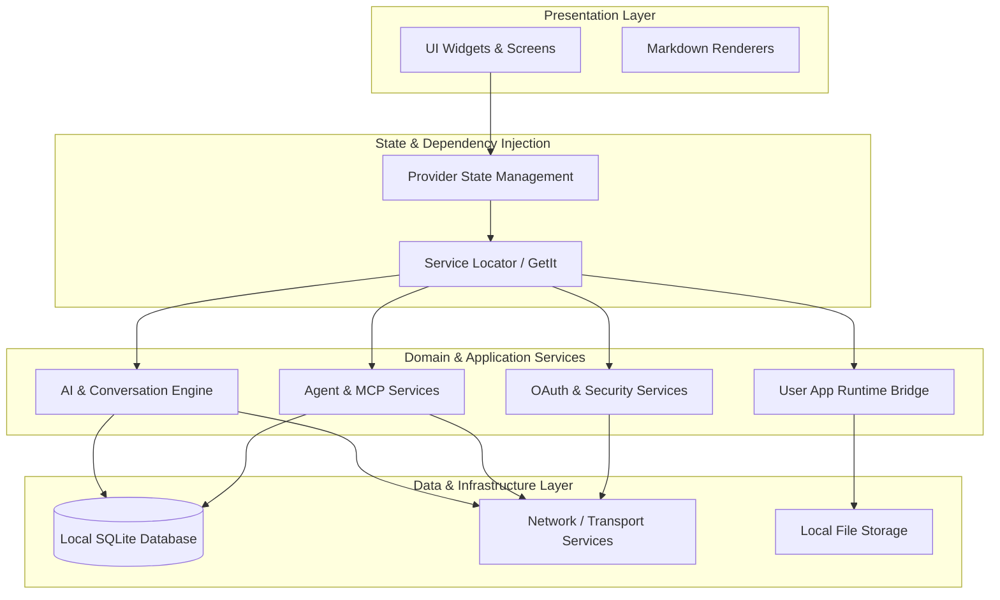

# Note Synapse Architecture

This document outlines the high-level architecture of Note Synapse.

## Architecture Diagram

## Component Overview

### Presentation Layer
The presentation layer is responsible for rendering the user interface and handling user interactions.
- **UI Widgets & Screens**: Standard Flutter widgets that construct the application's view. This includes complex visualizations like tree-structured conversations using standard graphing libraries.
- **Markdown Renderers**: Custom markdown capabilities to render LLM responses, mathematical formulas, and complex data formats seamlessly within the chat and notes interface.

### State & Dependency Injection
This layer bridges the UI and the underlying business logic.
- **Provider State Management**: Used to manage UI state, allowing the interface to reactively update when background data changes.
- **Service Locator (GetIt)**: Acts as a central registry for all application services. It injects dependencies, ensuring that classes remain decoupled and are easier to test isolated from their concrete implementations.

### Domain & Application Services
The core business logic resides here, orchestrating data flow and providing specialized functionality.
- **AI & Conversation Engine**: Manages interactions with LLM providers. It maintains the tree structure of conversations and manages context parameters, such as token budgets and targeted document attachments.
- **Agent & MCP Services**: Handles complex, multi-step tasks. The Agent subsystem integrates with the Model Context Protocol (MCP) to allow tools and scripts to extend the AI's capabilities dynamically.
- **User App Runtime Bridge**: Executes and securely manages bounded logic via "Synapse Apps." It provides the necessary execution context, allowing local micro-applications to run safely within the note interface.
- **OAuth & Security Services**: Manages authentication flows and securely stores API keys and sensitive tokens using local encrypted secure storage.

### Data & Infrastructure Layer
This layer handles persistence and fundamental data operations.
- **Local SQLite Database**: The primary, local-first data store. It persists all critical application state, such as notes, hierarchical tags, model presets, and conversation histories. 
- **Network / Transport Services**: Standardized networking clients handling outbound communication with model API endpoints, OAuth servers, and external servers for web content extraction.
- **Local File Storage**: Direct file system operations for storing media attachments, document caches, and local backups.
