# Note Synapse Architecture

This document outlines the high-level architecture of Note Synapse.

## System Overview

Note Synapse is a Flutter application organized into four layers: **Presentation**, **State Management**, **Application Services**, and **Data/Infrastructure**. Services are wired together via a `GetIt` service locator, registered in dependency order at startup.

```mermaid
graph TD
    subgraph Presentation["Presentation Layer"]
        Screens["Screens"]
        Widgets["Widgets"]
        Markdown["Markdown Renderers"]
    end

    subgraph State["State Management"]
        AppProvider["AppProvider<br/>(ChangeNotifier)"]
        AgentNotifier["AgentService<br/>(ChangeNotifier)"]
    end

    subgraph Services["Application Services"]
        direction LR
        subgraph NotesSvc["Notes & Tags"]
            NoteModSvc["NoteModificationService"]
            ContentIngest["ContentIngestionService"]
            TagImageSvc["TagImageService"]
        end

        subgraph ConvSvc["Conversations"]
            ConversationSvc["ConversationService"]
            ConvAIEngine["ConversationAiEngine"]
            ConvAttachSvc["ConversationAttachmentService"]
            ContextMgr["ContextManagerService"]
        end

        subgraph AISvc["AI / LLM"]
            AIService["AIService"]
            ModelSelector["ModelSelector"]
            ModelStorage["ModelStorageService"]
            PromptSystem["Prompt System"]
        end

        subgraph AgentSvc["Agent Framework"]
            AgentService["AgentService"]
            AgenticSettings["AgenticSettingsService"]
            ApprovalSvc["ApprovalService"]
            NoteTools["NoteTools"]
        end

        subgraph AppSvc["Synapse Apps"]
            UserAppSvc["UserAppService"]
            RuntimeBridge["UserAppRuntimeBridge"]
            UserAppLib["UserAppLibraryService"]
        end

        subgraph ExtSvc["External Integration"]
            McpSvc["McpService"]
            McpToolInteg["McpToolIntegrationService"]
            OAuthSvc["OAuthService"]
            NetworkProv["NetworkProvider"]
        end

        subgraph ContentSvc["Content & Sharing"]
            ShareSvc["ShareService"]
            WebExtract["WebContentExtractionService"]
            ImportSvc["ImportService"]
        end
    end

    subgraph Data["Data & Infrastructure"]
        DB[(SQLite<br/>DatabaseService)]
        SecureStore["SecureStorageService"]
        FileSystem["Local File System"]
    end

    Screens --> AppProvider
    Screens --> AgentNotifier
    Widgets --> AppProvider
    AppProvider --> NotesSvc
    AppProvider --> AISvc
    AppProvider --> ConvSvc

    AIService --> ModelSelector
    ModelSelector --> ModelStorage
    ConvAIEngine --> ModelSelector
    ConvAIEngine --> McpToolInteg

    AgentService --> ContextMgr
    AgentService --> AIService
    AgentService --> NoteTools

    UserAppSvc --> AIService
    RuntimeBridge --> DB

    McpToolInteg --> McpSvc
    McpSvc --> OAuthSvc
    OAuthSvc --> NetworkProv

    NoteModSvc --> DB
    ContentIngest --> DB
    ConversationSvc --> DB
    AIService --> DB
    AgentService --> DB
    UserAppSvc --> DB
    ShareSvc --> DB

    McpSvc --> SecureStore
    OAuthSvc --> SecureStore
```

## Component Descriptions

### Presentation Layer

The presentation layer consists of Flutter `Screen` and `Widget` classes. Key screens include:

- **MainScreen / NotesScreen**: The primary note list and navigation hub, with hierarchical tag filtering.
- **NoteDetailScreen**: Renders a single note with inline markdown, attachments, and AI interaction controls. Supports "Immersive Mode" for side-by-side reading and conversation.
- **ConversationChatScreen / ConversationTreeScreen**: Manage tree-structured AI conversations. The tree screen uses `graphview` to visualize branching dialogue paths.
- **UserAppViewScreen / UserAppEditScreen**: Host Synapse Apps inside a sandboxed WebView and provide a code editor for manual revisions.
- **CalendarScreen**: A task and event calendar backed by note metadata.
- **SettingsScreen / ModelConfigurationScreen / McpSettingsScreen**: Configuration for models, MCP endpoints, and application preferences.

Custom markdown rendering is handled by `InteractiveCheckboxMarkdown`, which extends `gpt_markdown` with interactive checkboxes, custom image handling, link interception, and inline LaTeX via `flutter_math_fork`.

---

### State Management

- **AppProvider** (`ChangeNotifier`): The central UI state holder. It owns the in-memory list of notes, tags, and model configuration. All CRUD operations on notes and tags flow through `AppProvider`, which delegates persistence to the data layer and notifies listeners for UI updates.
- **AgentService** (`ChangeNotifier`): Exposes the agent's live execution state (running, paused, stopped, task tree) to the UI so that screens can display progress and allow pause/resume control.

Both are provided to the widget tree via the `provider` package. The service locator (`GetIt`) handles wiring of non-UI services independently of the widget tree.

---

### Application Services

#### Notes and Tags

| Service | Responsibility |
|---|---|
| `NoteModificationService` | Paragraph-level editing, block operations, and content mutations on individual notes. |
| `ContentIngestionService` | Processes newly shared or imported content (text, images, PDFs, audio) into note records. |
| `TagImageService` | Maps tags to decorative images for the UI, persisted in the database. |

Notes use a **hierarchical tagging** model. Tags are dot-separated strings (e.g., `cs.algorithms.sorting`) that form a natural tree without requiring explicit folder structures.

#### Conversations

| Service | Responsibility |
|---|---|
| `ConversationService` | CRUD for conversations and messages. Builds and caches the conversation **tree** (branching via fork operations). |
| `ConversationAiEngine` | The multi-turn tool-use loop. Sends prompt requests to the model, dispatches tool calls, feeds results back, and iterates until the model produces a final text response. |
| `ConversationAttachmentService` | Manages per-conversation file attachments and their inclusion flags for context targeting. |
| `ContextManagerService` | Token-budget-aware hierarchical context builder for the agent system. Maintains a tree of `ContextNode` objects with automatic summarization when approaching token limits. |

Conversations are **tree-structured**: every fork operation creates a new branch from an existing message, preserving the original thread. The `ConversationService` reconstructs this tree for visualization in `ConversationTreeScreen`.

#### AI / LLM Abstraction

| Service | Responsibility |
|---|---|
| `AIService` | High-level AI operations: note transformation, note creation, audio transcription, content extraction, and app generation. |
| `ModelSelector` | Capability-based model routing. Maintains a pool of configured models and selects the best match based on required capabilities (e.g., `tool_use`, `image_gen`, `generateCode`). |
| `ModelStorageService` | Persists model configurations (API keys, endpoints, parameters) in secure storage. |
| **Prompt System** (`prompts/`) | A registry of prompt configurations. Each prompt type (note creation, app generation, tag extraction, etc.) is registered with a `PromptConfigurationRegistry` and built by `NotePromptBuilder` or `SystemPromptBuilder`. |

Two model backends are implemented behind a common `AIModel` interface:

- `GeminiModel` -- Google Gemini / Vertex AI
- `OpenAIModel` -- OpenAI-compatible APIs

The `ModelSelector` can auto-switch between models mid-operation when a particular capability (e.g., image generation) is required but unavailable on the currently active model.

#### Agent Framework

| Service | Responsibility |
|---|---|
| `AgentService` | The agentic execution loop. Manages a hierarchical task tree, delegates subtasks, executes tool calls, and produces a final summary. Supports pause, resume, and stop controls. |
| `AgenticSettingsService` | Configurable parameters for agent behavior (max iterations, subtask depth, compaction thresholds). |
| `ApprovalService` | Gating mechanism that prompts the user before the agent executes potentially destructive operations (SQL writes, note deletions). |
| `NoteTools` / `ReadTaskResultTool` | Built-in tool declarations that the agent can invoke (search notes, create notes, read files, query the database). |

The agent operates in a **plan-execute loop**: the LLM proposes tool calls, the agent dispatches them, feeds results back, and repeats. Subtask spawning creates child `ContextNode` entries managed by `ContextManagerService`, which handles token budgeting and automatic context compaction.

#### Synapse Apps

| Service | Responsibility |
|---|---|
| `UserAppService` | Lifecycle management for Synapse Apps: AI-assisted creation, revision tracking, code editing, export/import as `.nsapp` bundles. |
| `UserAppRuntimeBridge` | The JavaScript-to-Dart bridge. Injects the `Synapse.*` API namespace into a WebView and handles calls from JavaScript (CRUD notes, chat with AI, query the database, pick files). |
| `UserAppLibraryService` | Manages third-party JavaScript library dependencies for apps, downloading and caching them locally. |

Synapse Apps are self-contained HTML/JS applications that run inside a sandboxed `InAppWebView`. The `UserAppRuntimeBridge` exposes a controlled API surface -- apps can read/write notes, invoke AI, and query the database, but all write operations pass through the approval layer.

#### External Integration

| Service | Responsibility |
|---|---|
| `McpService` | Client for the Model Context Protocol. Manages MCP endpoint registration, tool discovery, and tool invocation over SSE or Streamable HTTP transports. |
| `McpToolIntegrationService` | Bridges MCP tools into the conversation and agent tool-use loops, translating between MCP tool schemas and the internal tool format. |
| `OAuthService` | Full OAuth 2.0 flow with PKCE, token refresh, and dynamic client registration. Used to authenticate against MCP servers. |
| `NetworkProvider` | Centralized HTTP client layer built on `rhttp` (Rust-backed HTTP) for high-performance networking. |

#### Content and Sharing

| Service | Responsibility |
|---|---|
| `ShareService` | Export notes as Markdown (with ZIP packaging), PDF, or plain text. Handles OS-level share intents on Android/iOS. |
| `WebContentExtractionService` | Extracts readable content from web pages using Readability.js inside a headless WebView. |
| `ImportService` | Bulk import of notes from Markdown files or ZIP archives. |

---

### Data and Infrastructure Layer

| Component | Responsibility |
|---|---|
| `DatabaseService` | SQLite database via `sqflite`. Owns the full schema, migration pipeline (versioned with rollback-safe pre-migration backups), and all raw CRUD queries. |
| `SecureStorageService` | Encrypted key-value store (`flutter_secure_storage` on mobile, `shared_preferences` fallback on desktop) for API keys and OAuth tokens. |
| **Local File System** | Media attachments, cached images, PDF thumbnails, and Synapse App library files are stored directly on the device file system via `path_provider`. |

The database schema currently spans 40+ migration versions, covering tables for notes, tags, conversations, conversation messages, attachments, user apps, app revisions, model configurations, MCP endpoints, agent task results, and more.

---

### Dependency Injection

All services are registered in `service_locator.dart` using `GetIt`, organized in dependency waves:

1. **Wave 1 (Foundation)**: `DatabaseService`, `McpService` -- no dependencies.
2. **Wave 2 (Data Access)**: `NoteModificationService`, `ContentIngestionService`, `ConversationService`, `TagImageService` -- depend on `DatabaseService`.
3. **Wave 3 (Model Layer)**: `ModelStorageService`, `ModelPreferenceService`, `ModelSelector`, `SqlQueryService` -- depend on storage and database services.
4. **Wave 4 (AI)**: `AIService` -- depends on `DatabaseService` and `ModelSelector`.
5. **Wave 5 (High-Level)**: `UserAppService`, `ContextManagerService`, `AgentService` -- depend on `AIService` and other lower-wave services.
