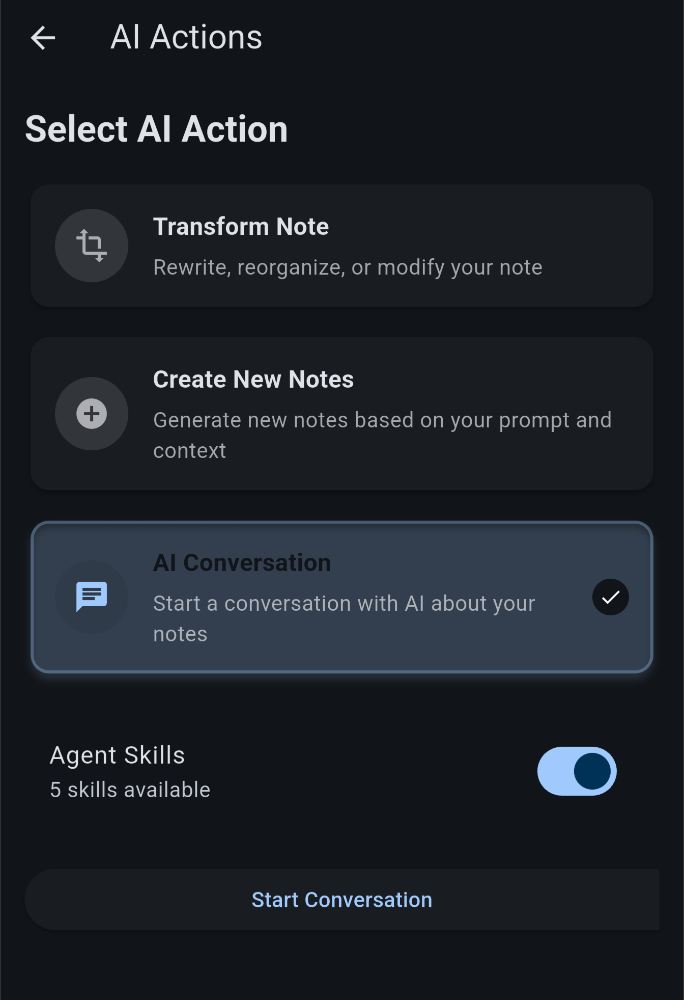
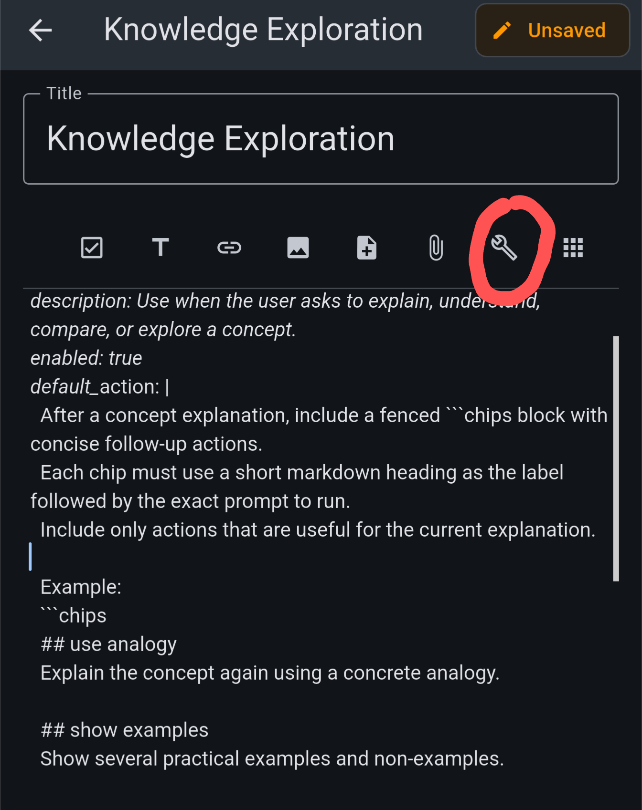
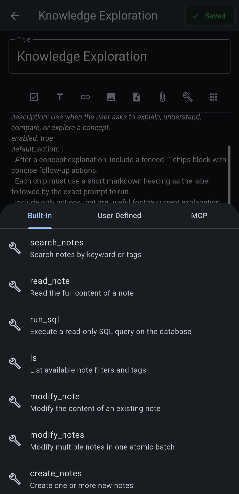
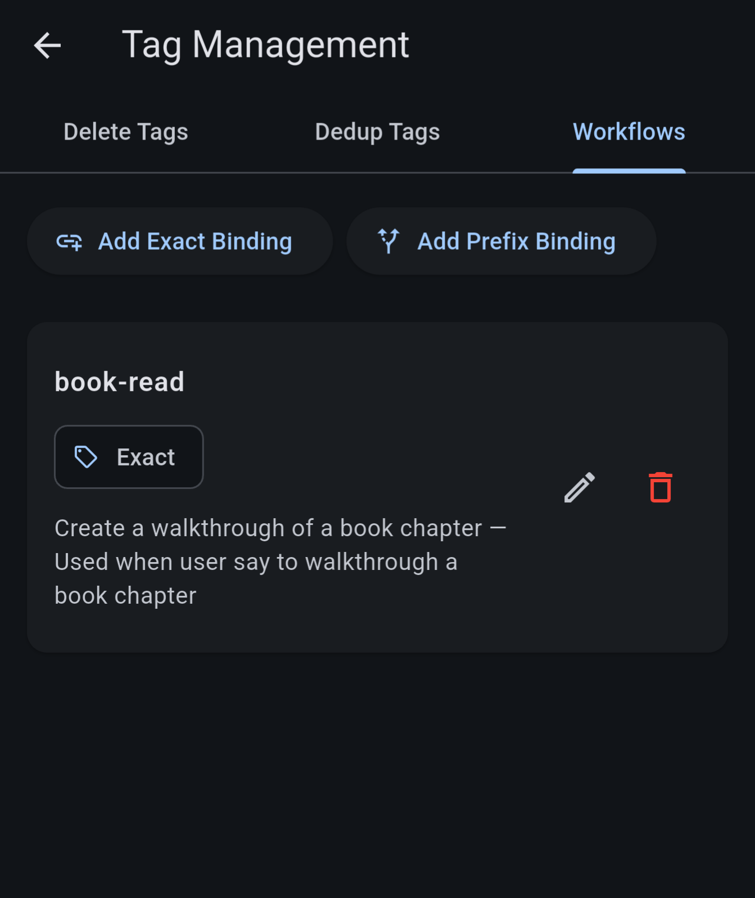

# Tutorial: Agent Skills

Agent skills let you teach the AI reusable workflows using nothing but notes. Any note tagged **`agent-skill`** becomes a skill: the AI sees a short index of all your skills, and loads the full instructions of a skill only when it decides the skill is relevant to your request. This keeps the context small while giving the AI deep, task-specific playbooks.

To use skills in a conversation, turn on the **Agent Skills** switch when starting an AI Conversation. The switch shows how many skills are available; if it says "No skills found", create a note tagged `agent-skill` first.



In the conversation screen, you can toggle on/off skills in the tools & MCP panel.

## Writing a Skill: the YAML Front Matter

A skill note starts with a YAML front matter block on the very first line, followed by the skill body — the actual instructions the AI will follow:

```markdown
---
name: Paper Summarizer
skill_ref: paper-summarizer
description: Use when the user asks to summarize or file a research paper.
enabled: true
---

When summarizing a paper:
1. Read the note and extract the core contribution.
2. ...
```

The fields:

-   **`name`** (required): human-readable skill name.
-   **`description`** (required): tells the AI *when* to use this skill — this is what the AI sees in the skill index, so make it a good trigger description.
-   **`skill_ref`** (optional): a stable identifier for the skill. If omitted, one is generated from the name.
-   **`enabled`** (optional): set to `false` to hide the skill from the AI without deleting the note.
-   **`default_action`** (optional): extra instructions for suggesting follow-up action chips after the skill runs.

A note missing `name` or `description` is silently ignored, so double-check the front matter if a skill doesn't show up.

You can install ready-made examples from **Install Starter Skills**; they become ordinary notes you can edit and learn from.

## Referencing Tools

A skill can bring its own tools online. When the skill body contains tool links, loading the skill automatically registers those tools for the session — you don't need to pre-configure anything.

In the note editor, use the **Insert Tool Link** toolbar button to pick a tool. It has three tabs:

-   **Built-in**: native tools like `search_notes`, `read_note`, `create_notes`.
-   **User Defined**: tools exposed by your user apps (plugins).
-   **MCP**: tools from a connected MCP endpoint.

Picking one inserts a link like `[search_notes](notesynapse://tool/builtin/search_notes)` at the cursor. Reference the tools your workflow needs right where the instructions mention them.





## Tag-Associated Workflows

Workflow bindings connect a skill to a tag, so the skill runs **automatically** whenever a note with that tag is added — for example, auto-summarizing everything tagged `web-clip`, or updating another note when a note of a tag is added.

Create a binding from either place:

-   **Tag detail dialog** → expand the **Workflow Binding** section → **Set Binding**.
-   **Tag Manager** → the **Workflows** section → **Add Exact Binding** or **Add Prefix Binding**.

In the binding dialog you choose:

-   **The tag** — either an exact tag, or a **prefix pattern** (e.g. `wiki-source-`) that matches any tag starting with it.
-   **The skill** to run.
-   An optional **workflow prompt override** with extra instructions for this binding.
-   **Make matching notes content-immutable** — protects the note's content and title from edits (tags, links and attachments stay editable), useful when the workflow should only ever read the source note.

When a matching note is ingested, the skill is pre-loaded and an agent task runs it against the note — you'll see "Starting workflow for tag …" and can watch it work.

Note that AI tool's updates to notes may not be reflected immediately due to limitations to the UI observer pattern. You can use the refresh button to reload the UI so they would show up.


