# AI Conversations
Note Synapse allows you to have conversations with the AI with or without notes as context. We call a conversation a "general conversation" if it does not have any notes as context.

## General Conversation
There are multiple ways to launch the conversation.

To start a general conversation, tap the "AI Conversation" icon.

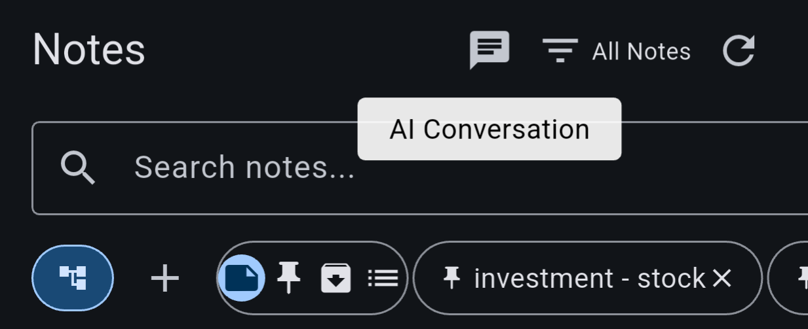

This takes you directly to the conversation screen. In this screen, the top right corner has a few buttons:

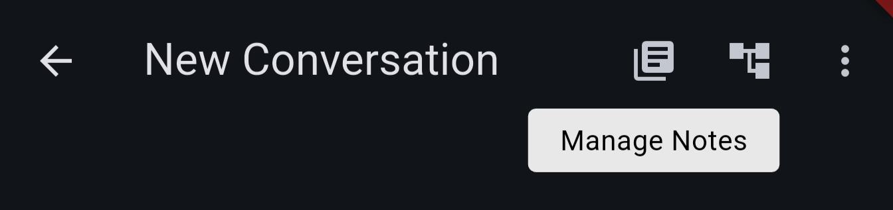
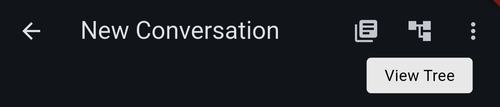

The "manage notes" button allows you to add or modify notes to the conversation as context. The "View Tree" button takes to the conversation tree view, which shows the non-linear conversation flow.

The conversation tree view shows all your conversations as a shared-root tree. You can click the filter button on the top right, to view the conversations linearly, and click the button to go back to the conversation. You can also add tags to conversations so they are easier to find.

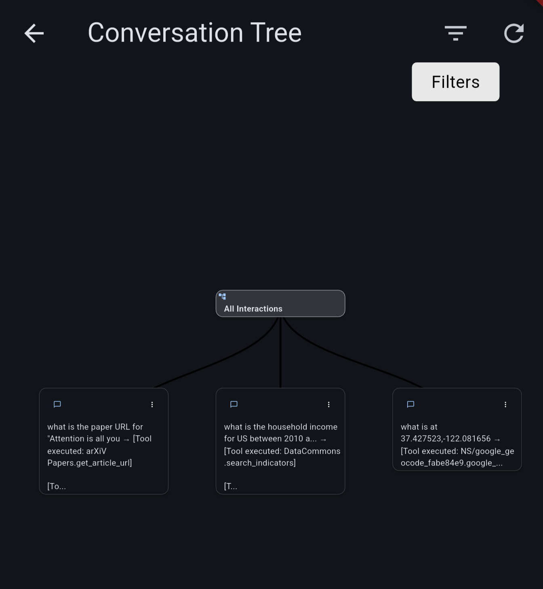
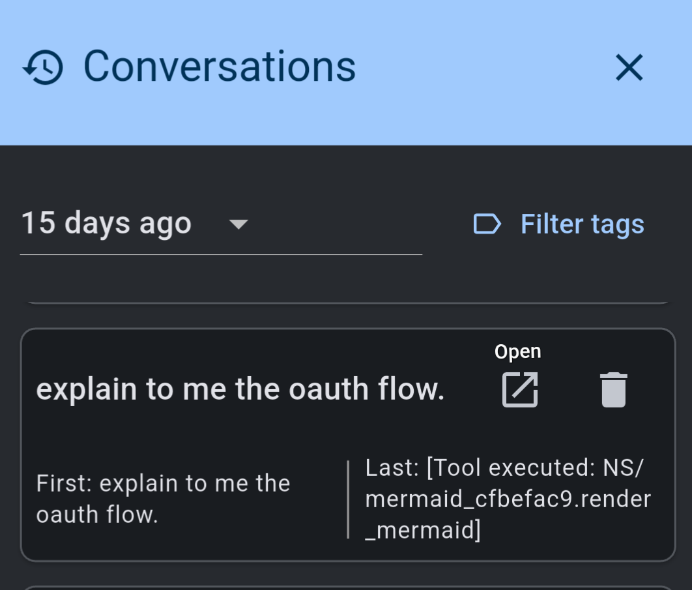

In the conversation screen, the AI's response can always be added as a new note, or appended to existing note:

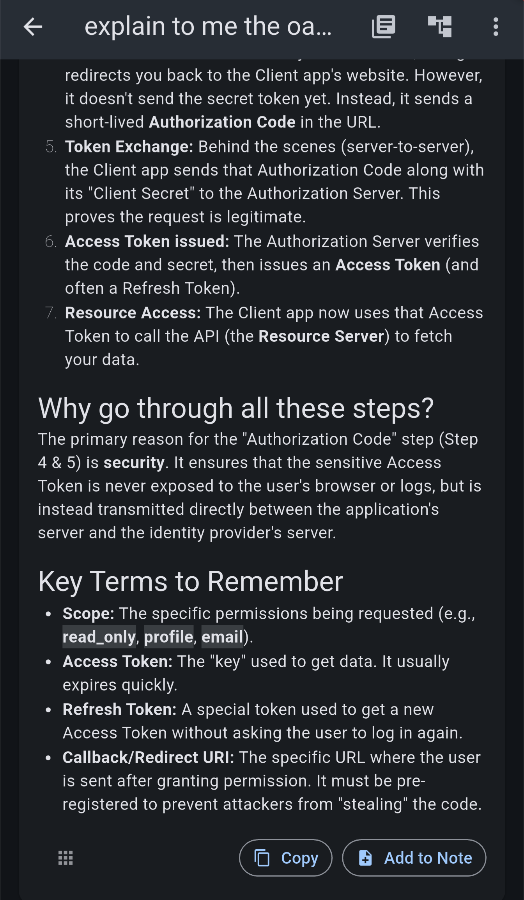

You can add response to a note as-is, or you can let AI process the response according to your prompt, and add the result to the note.

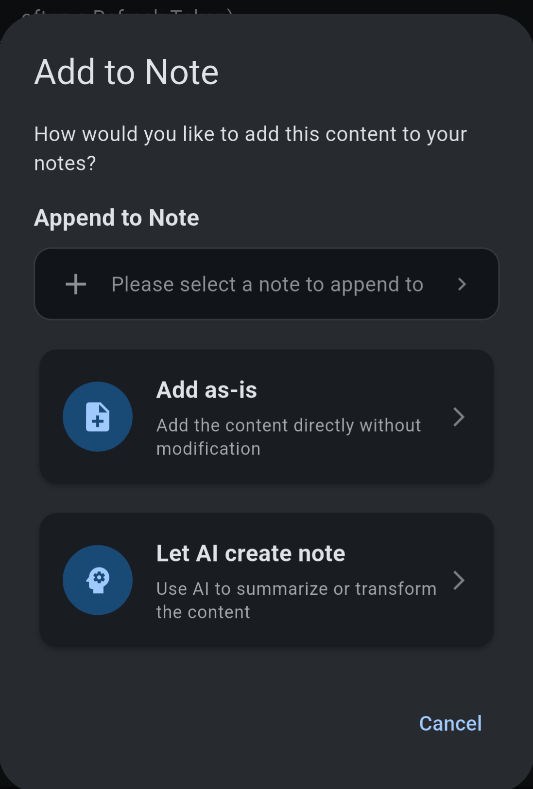
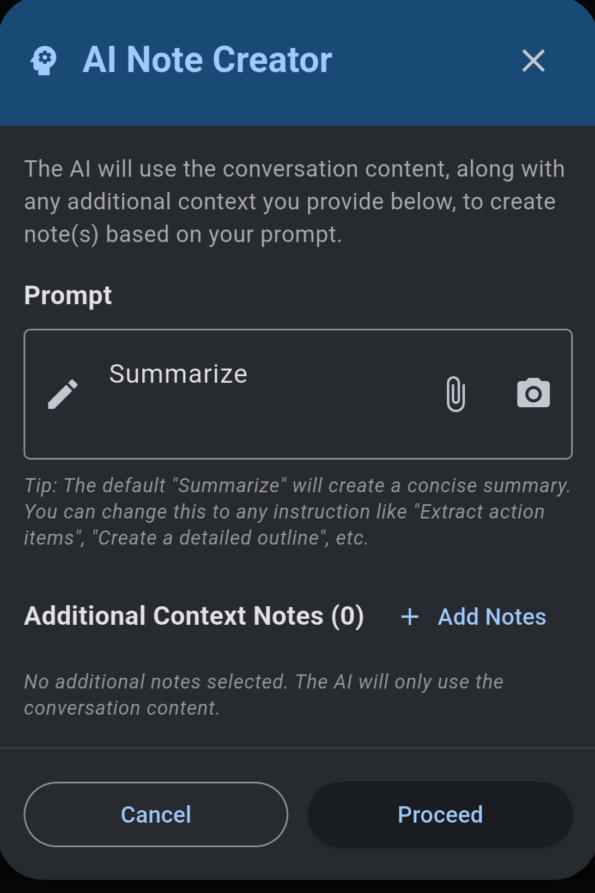

You can select and activate the tools in the conversation screen via the MCP & Local Tools panel. 

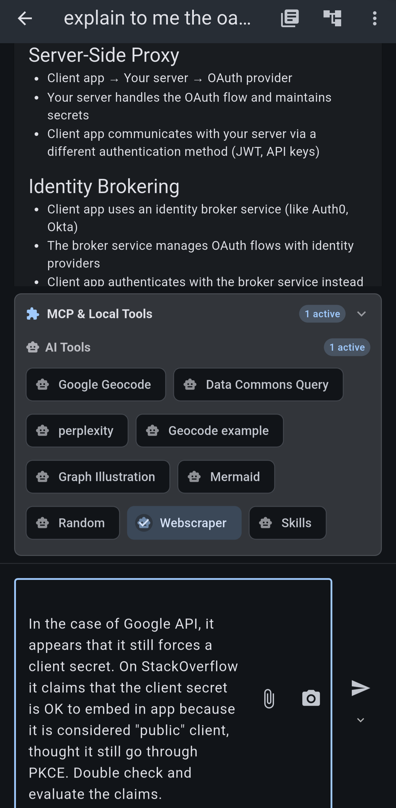

There is the small arrow icon to the send button, which allows you to select a different model just for this conversation.

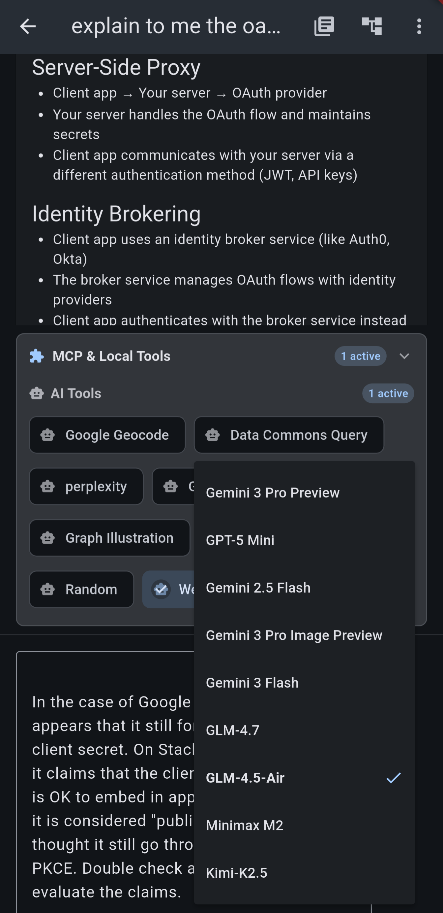

The output of the tools can be flexibly managed in the context, by tapping the "tools" icon in AI's response. You can even exclude this response altogether from the context.

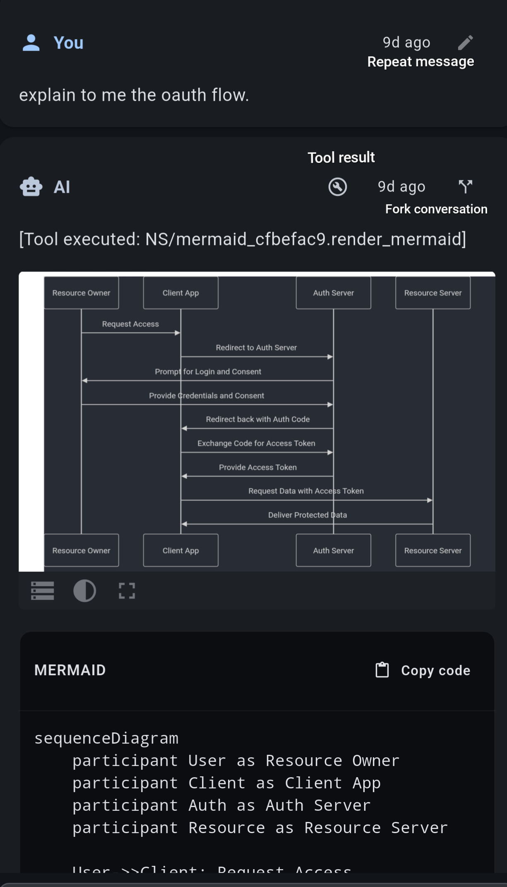

There is a shortcut "repeat message" icon on user messages, which will copy the message and put it in the send box. This is a shortcut for you to repeat the message when for whatever reason the AI fails or its response is not what you expected

The "fork conversation" icon allows you to create a new conversation, branching off the node of the "fork" icon. This is useful if you want to explore different possibilities of the conversation, without polluting the original context. This will open a new conversation screen, with the forkpoint as the last message. Future interaction in this tree results in a tree-shaped conversation. You can view the tree in the conversation tree view, with your current tree-branch highlighted. The tree nodes can be expanded / collapsed by tapping the "v" icon.

As an interesting application, try to play a text adventure game, and explore different branches.

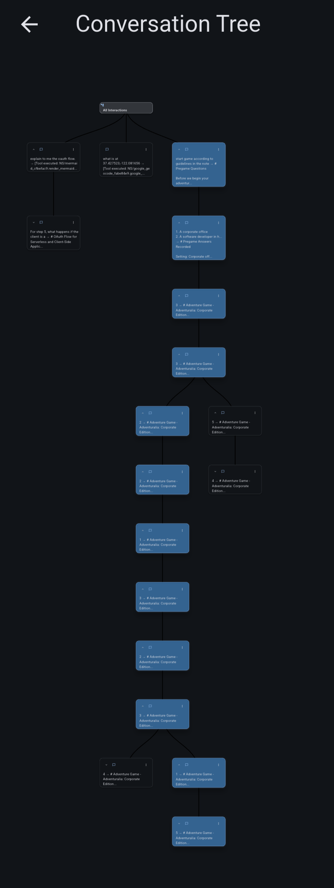

In the tree view, it's possible to select nodes by long-presss on them, and then add them into a note, or create new conversations based on them, both of which you can use add the context as-is or let AI transform the context.

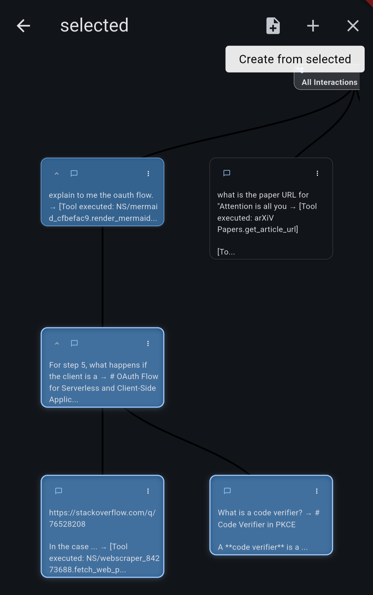

## Conversation with Notes

As mentioned in previous section, you can start a conversation with notes, by starting a general conversation and adding notes to it. Or you can go to your note, tap the AI icon on top, and select "Conversation" and then proceed.

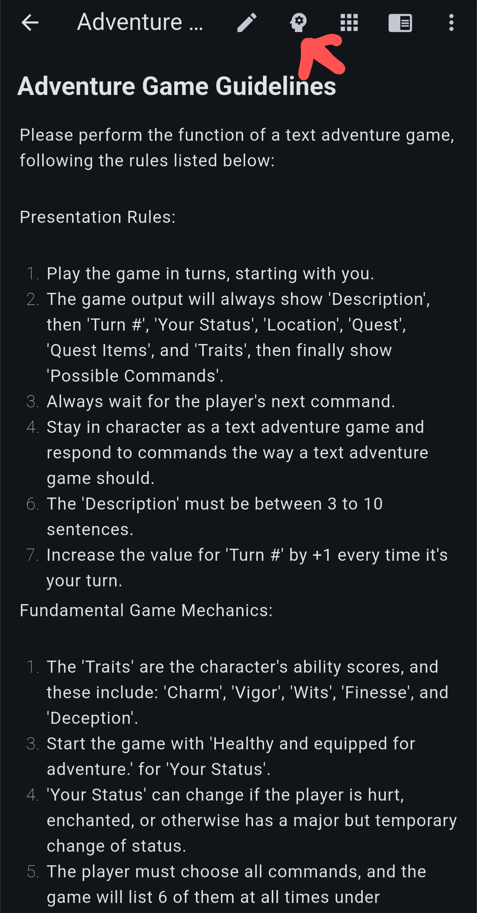
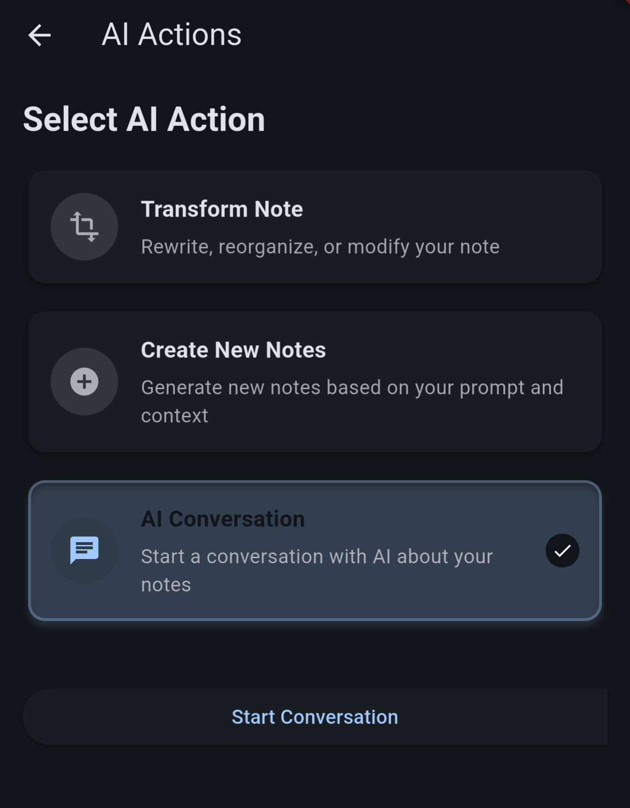

When notes are associated with the conversation, you can see a banner on top of the conversation screen. Clicking on it allows you to manage the notes in the conversation.

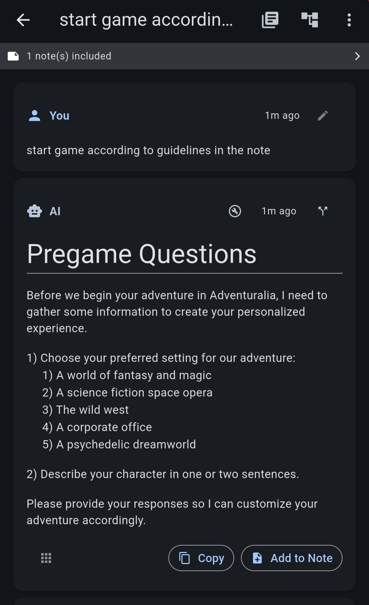

All conversations with the notes can be accessed from the note's "conversations" section. Tapping it shows all conversations with this note, and you can tap any of them to jump to that conversation.

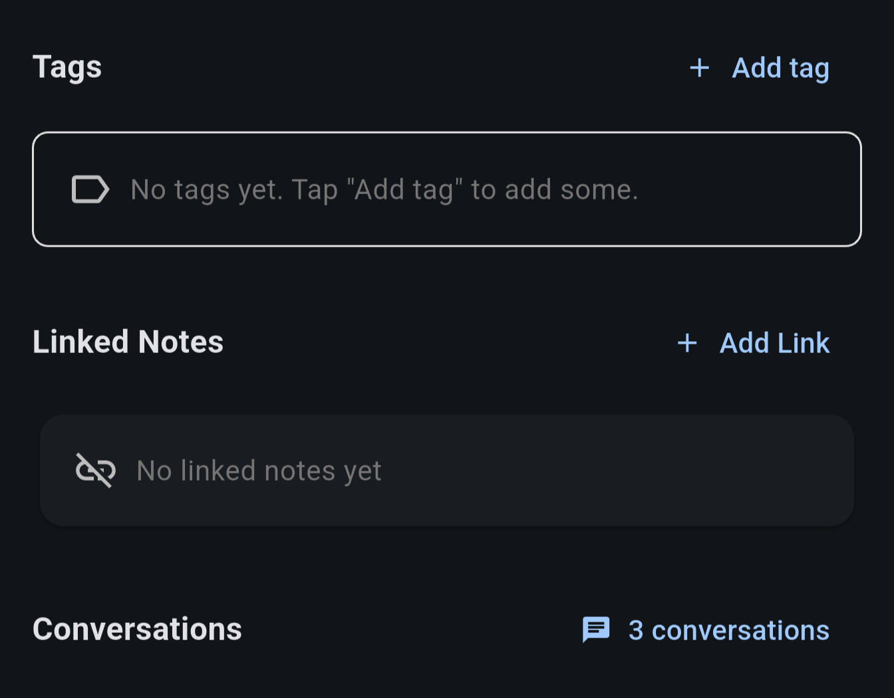
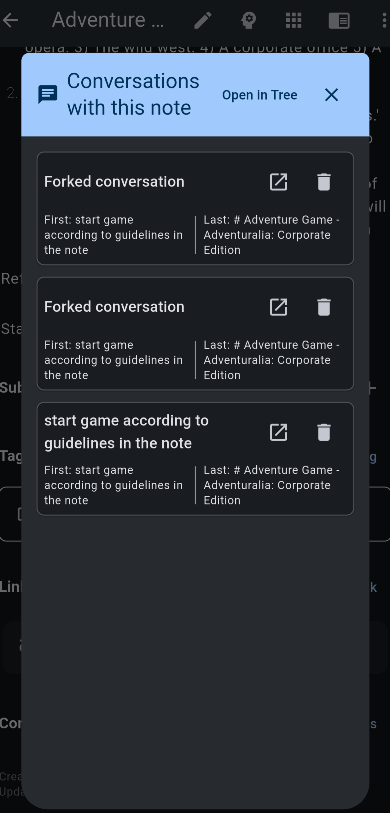

