# Tutorial: Immersive Reading Mode

The immersive mode allows you to focus on reading materials and can precisely interact with AI about the content. For example you can circle a formula on a research paper and ask AI to explain it.

## Enter Immersive Mode
To enter immersive mode, you either click the immersive mode button, or select the immersive mode on the attachment's three dot menu.

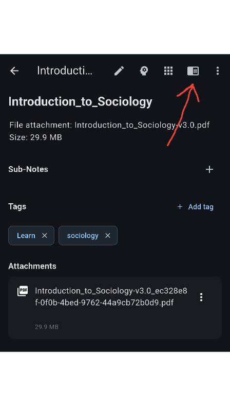

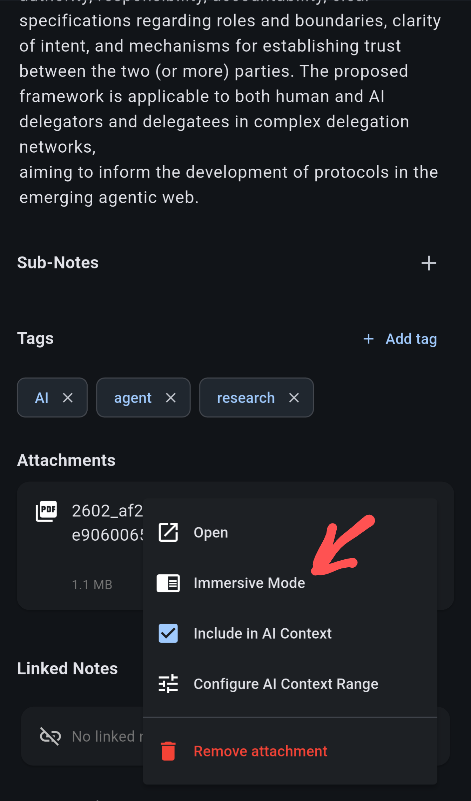
If immersive mode is entered through the top immersive button, by default it's showing the main content of the note. You need to click the outline button again to open the attachments (image, PDF etc).

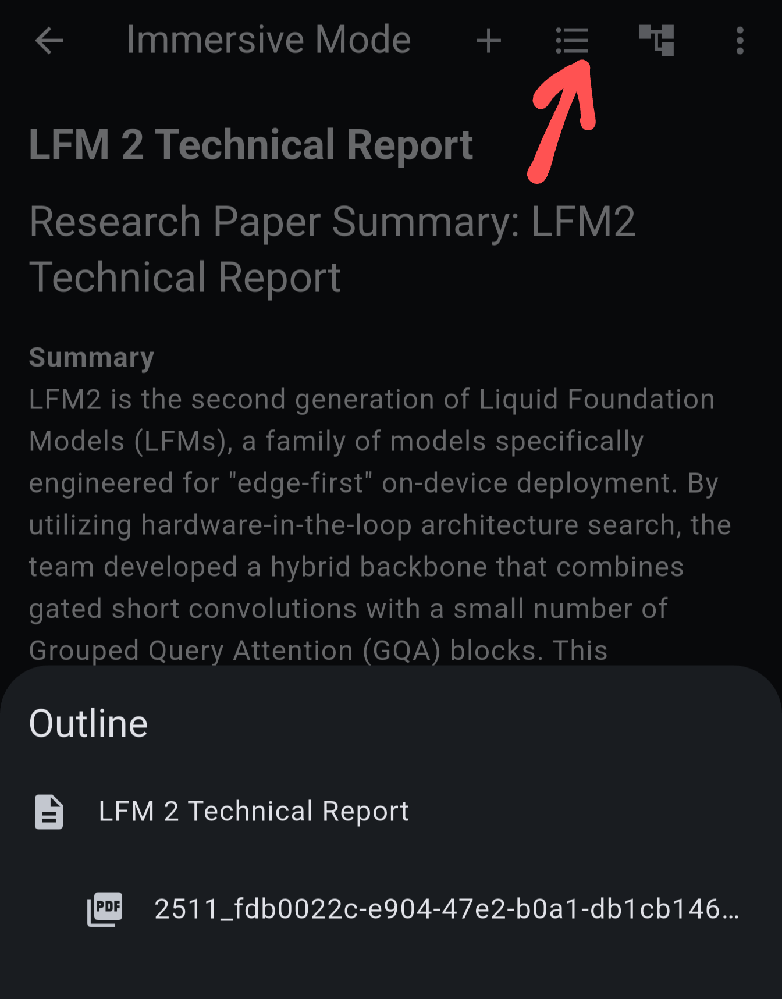

After the PDF is opened, the outline button will further bring up the PDF's table of contents when available.

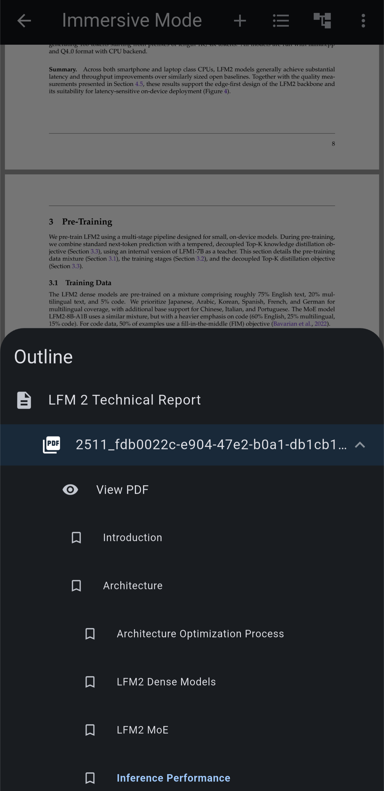

## Interact with AI
In immersive mode, you can use the pen icon to circle stuff on the screen, and ask AI about them in detail.

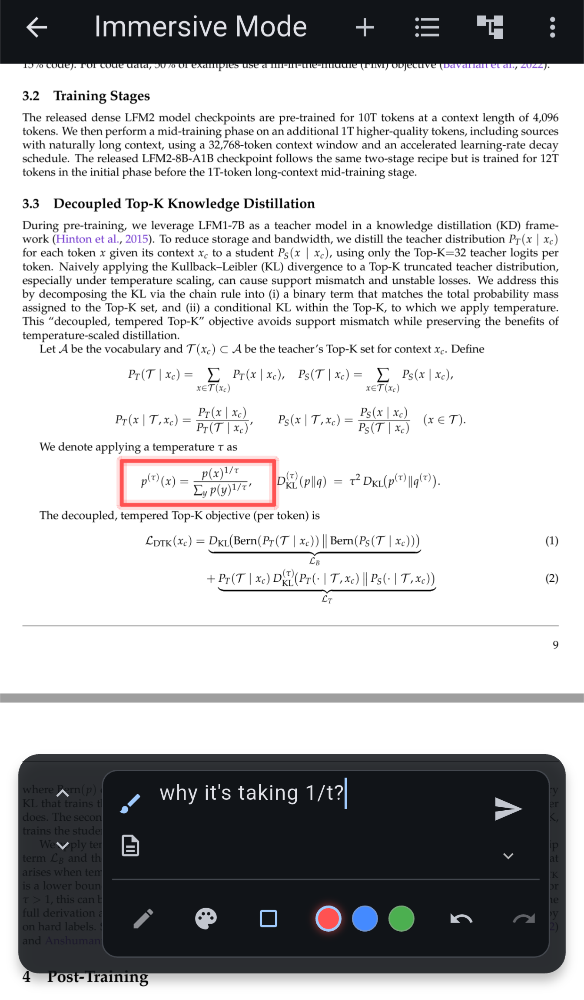

The left handle can be hold and dragged. You can also click the up / down icon to open the AI conversation panel in two different locations.This avoids the panel obscuring the content.

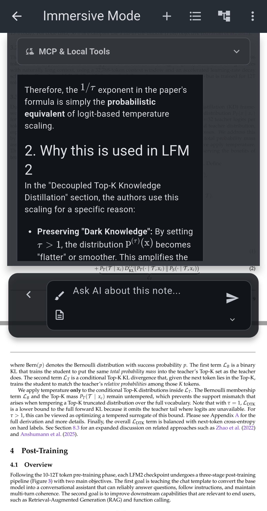

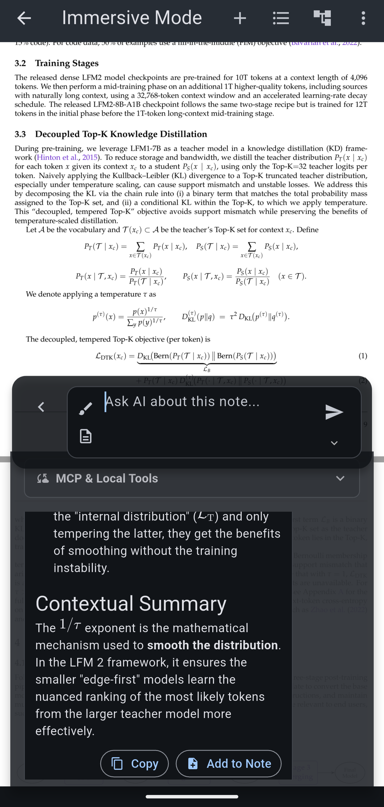

## Optimize Context
Immersive mode allows you to focus your interaction with the AI. But there is a catch -- sometimes it's not efficient to send full file (could be thousands of pages) to AI LLM. You can select from the 3-dot menu -> configure AI context. And it allows you to choose between full file, current page plus or minus a few pages, particular chapters, or bookmarked pages.

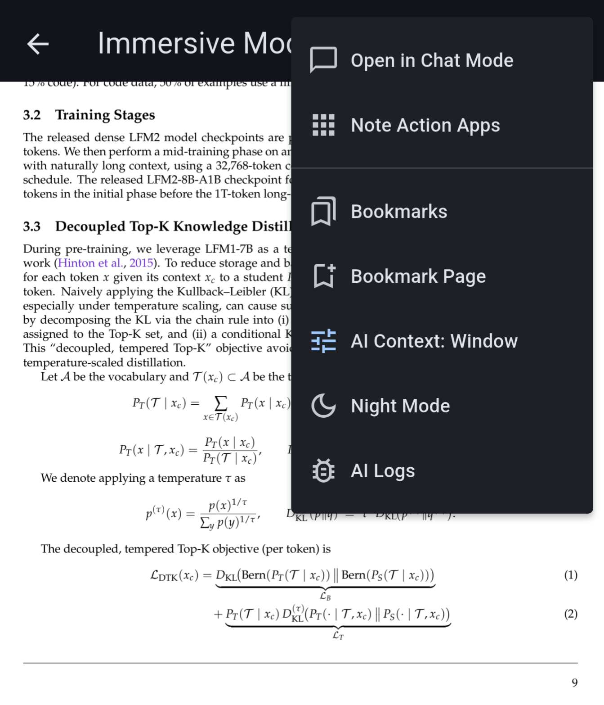

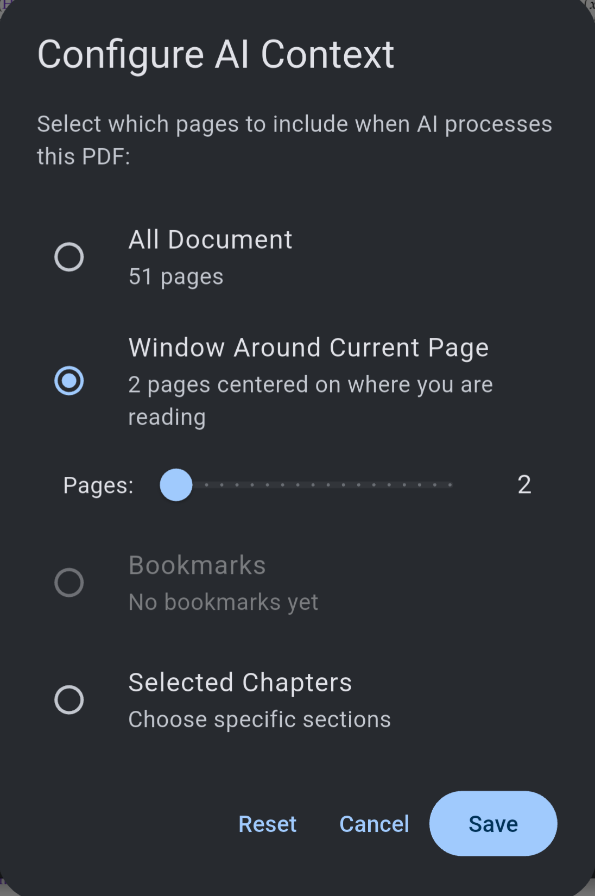

## Use the Scratch Pad
The immersive mode has a ScratchPad that allows you to take quick notes, stash content along the way. You can enable it by selecting the scratchpad icon below the pen icon in the AI interaction box. When it's toggled on, your messages are sent to the scratchpad. 

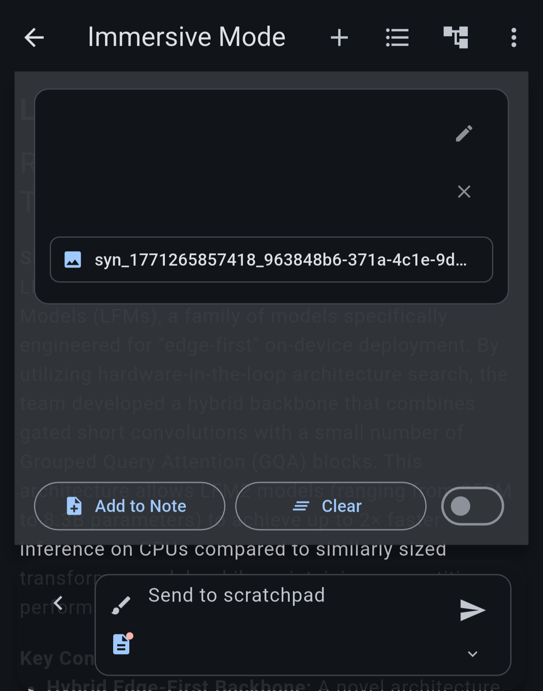

You can choose to include scratchpad in the conversation context, or save it to a note. 

The scratchpad will be cleared when you leave the immersive reading view and any unsaved changes will be lost.

## Circle and Annotate
The pen tool can do more than ask questions — it can leave permanent annotations on the note, an image, or a specific PDF page.

With pen mode on, draw freehand to circle something (or use the rectangle tool), then confirm the drawing. What happens next depends on the mode:

-   In normal chat mode, your question is anchored to the circled region — a marker is left on the spot, and tapping it later re-opens that conversation.
-   In scratchpad mode, sending (with optional text) saves an **annotation**: the drawing is captured as an image and pinned to the circled region, together with your text.

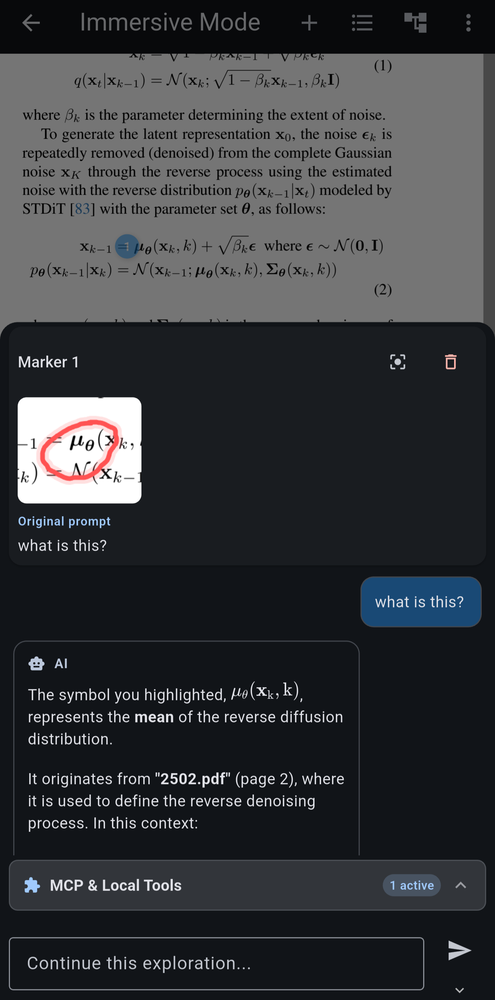

Annotation markers reappear whenever you come back to the note. Tap a marker to preview the captured drawing and your text; from the preview you can add the annotation to the scratchpad or remove it permanently.

