# Tutorial: Add an MCP server

MCP allows NoteSynapse 's AI to connect to external world.

> **WARNING**: Malicious MCP servers can risk prompt injection, or other adverserial actions. Only connect to MCP servers that you trust.

> **DISCLAINER**: The MCP servers in this tutorial are selected for illustration only. It is NOT an endorsement for their quality and safety.

# Add an OAuth Compatible MCP Server
Here we use the arXiV MCP server hosted at Smithery as an example.

Go to settings -> AI settings -> MCP Settings
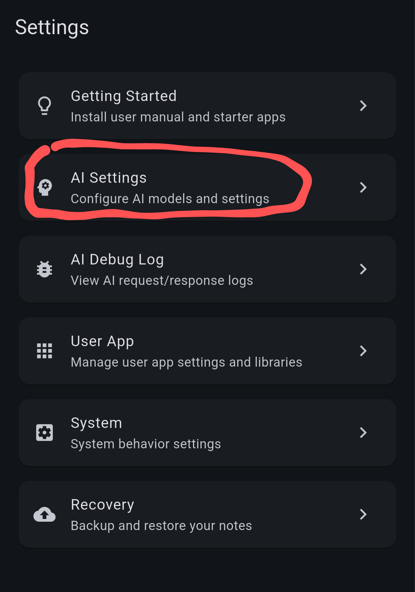

Click "Add MCP Endpoint"

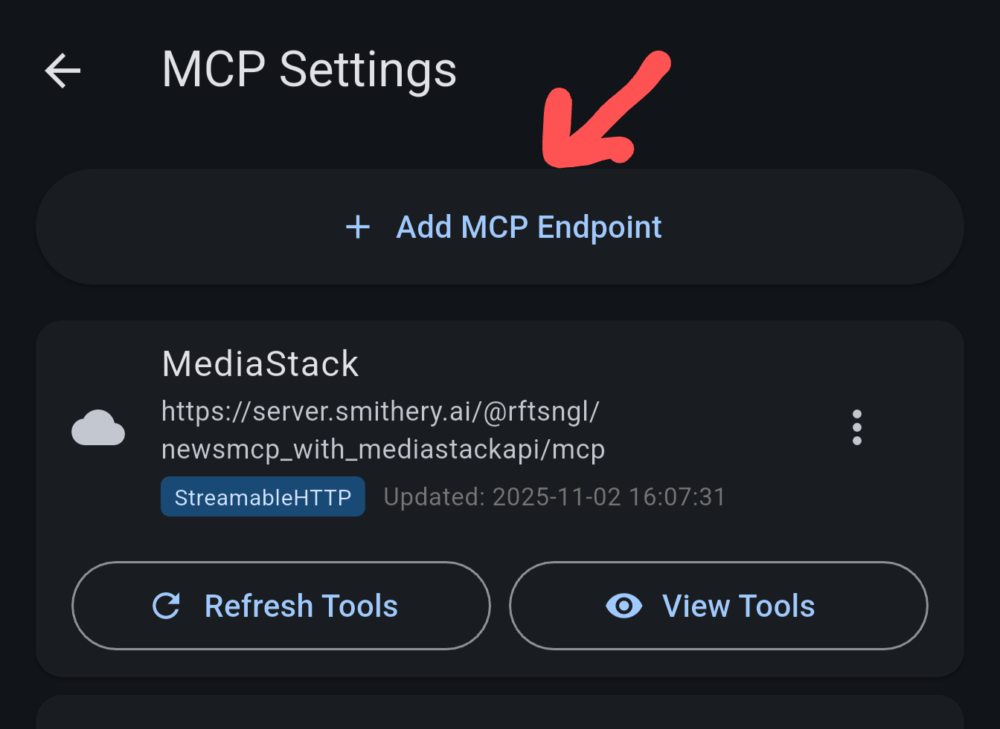

In the dialog, fill the name and URL to the MCP server (note the name "base url" is a bit misleading, it's actually the full URL to the MCP server).

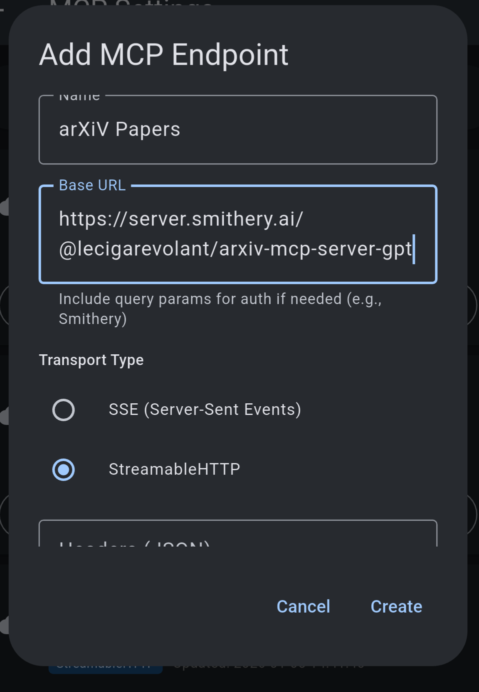

## Set OAuth Login
Now it's time to go through the OAuth flow.

Select the OAuth tab, and click "Auto configure". This will perform OAuth discovery and auto client registration.

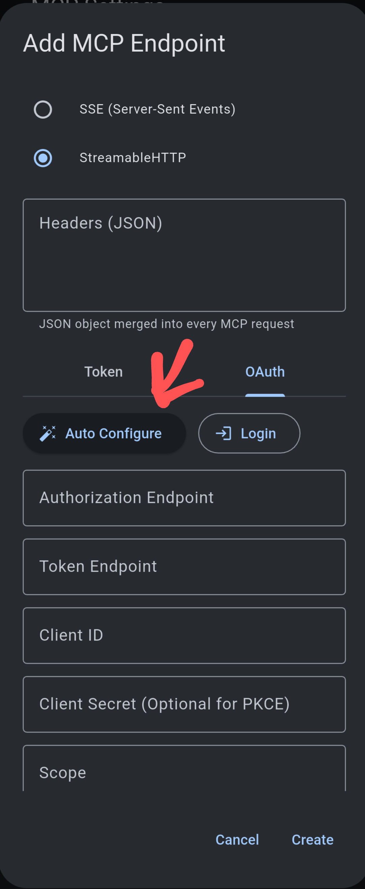

In the OAuth discovery screen, click "Discover"

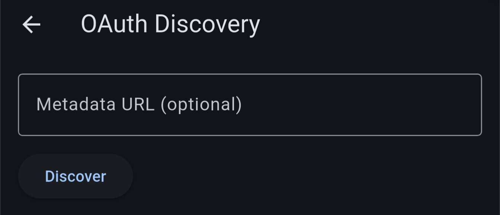

This will allow NoteSynapse to probe the well-known OIDC endpoints. When it suceeds, you can view the information. 

Next, click "Register client":

!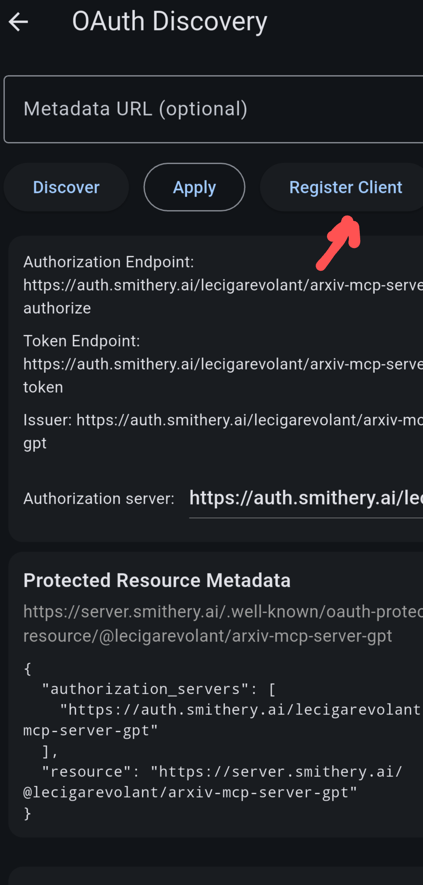

When it suceeds, you should see the client ID. Click "Apply" to exit the discovery screen.

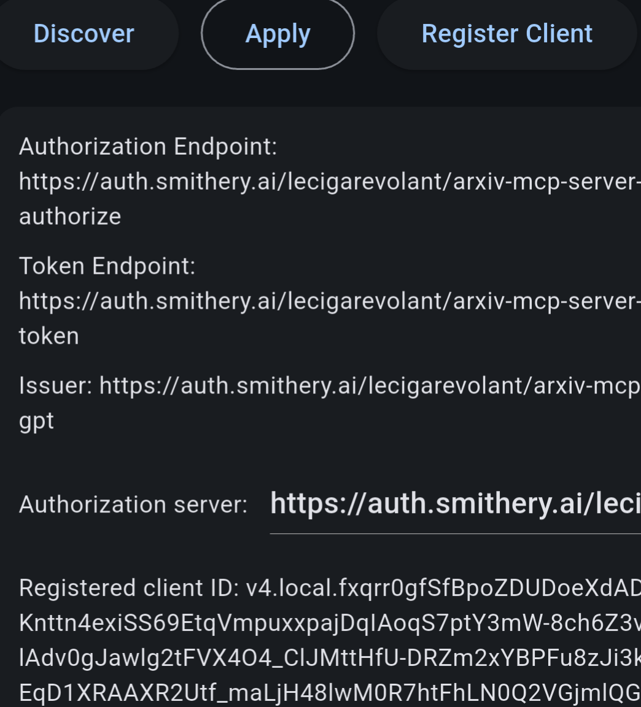

In the MCP service screen, observe that client ID and client secrets are configured. You can now click the login button to go through the OAuth flow:

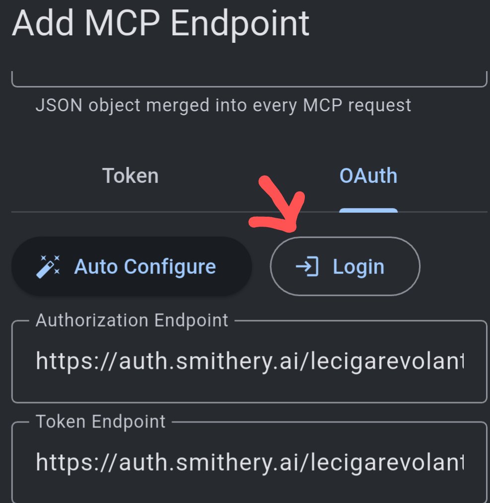

when you finish login flow, you should see the success message with OAuth token:

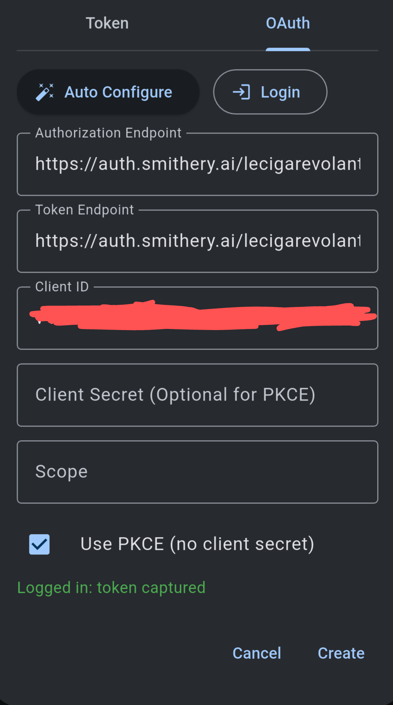

Click "Create" and you have finished creating an MCP Endpoint.

The last crucial step is to press "refresh tools". This will connect to your MCP server with the credentials configured. It will also get the list of tools available, which is necessary.

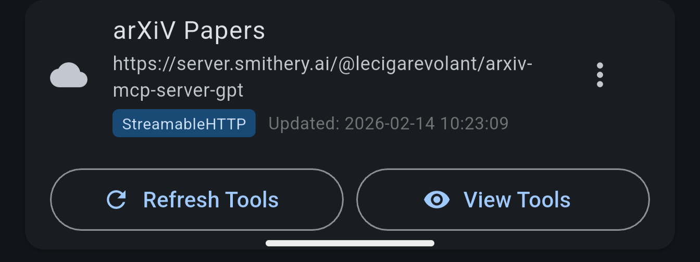

After it suceeds, you can select "View tools" to see the tool manifest.

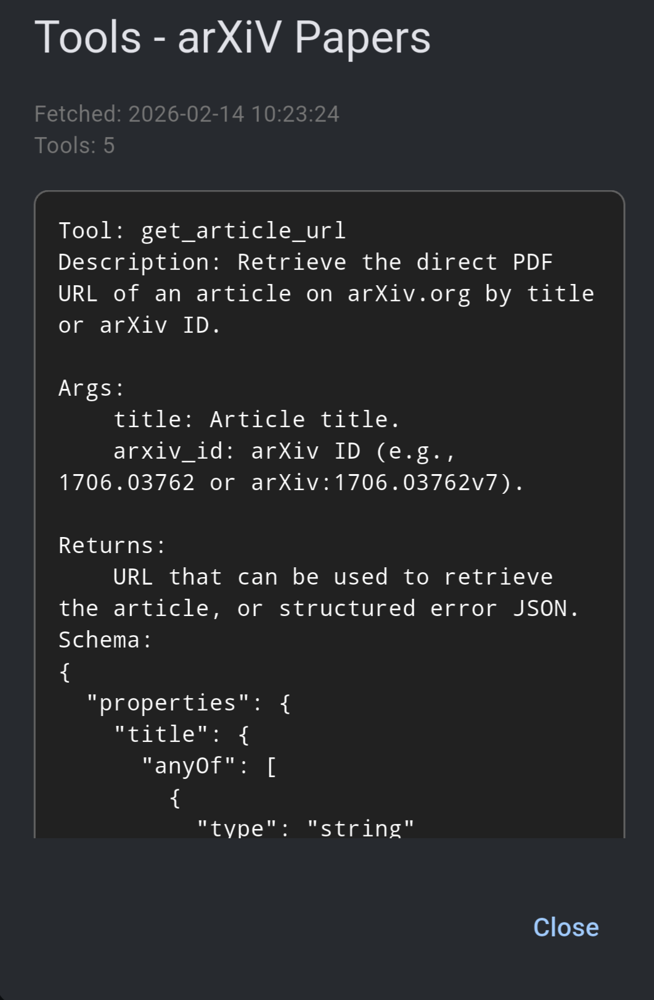

Head to the chat screen, enable the MCP. And give it a try.

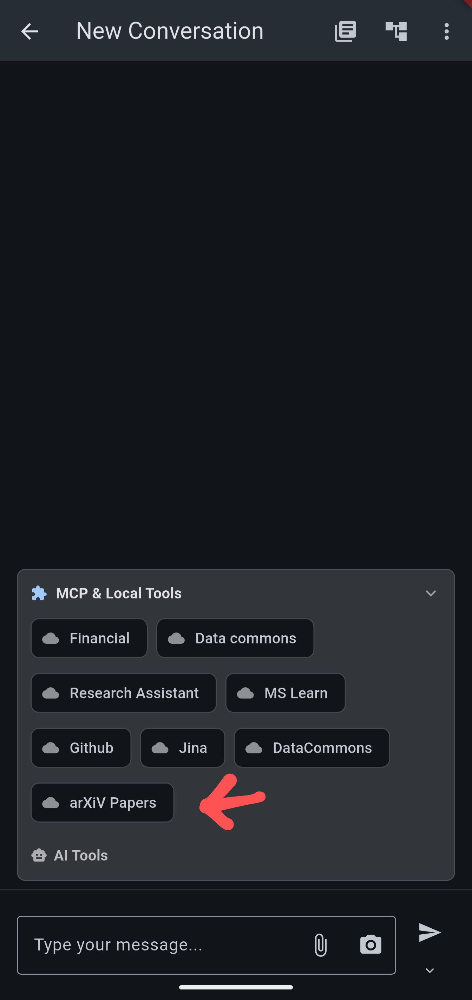

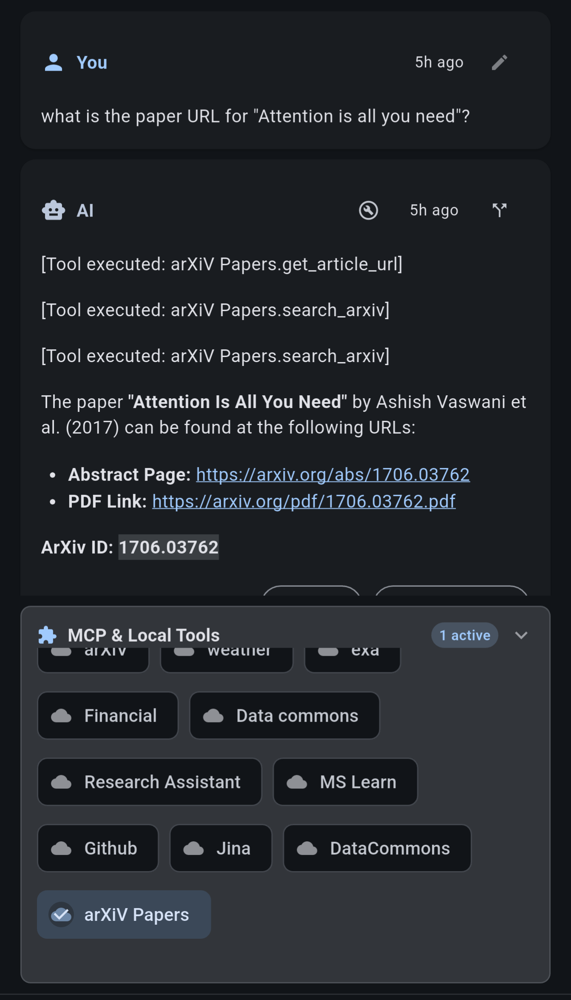

# Add MCP with Custom Auth Header
 Note Synapse allows you to specify a custom JSON that will be merged to the request header.
 
 For example, for DataCommons MCP (GCP managed), you can specify the API key in header.
 
 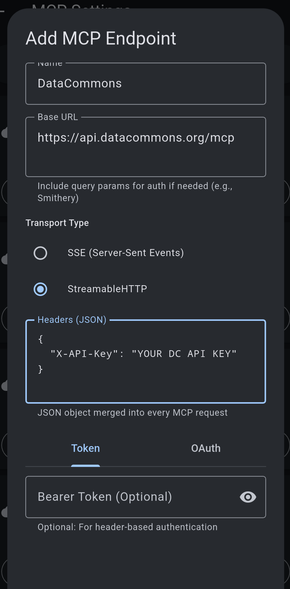
 
 You can then skip the OAuth steps, but still need to refresh tools. Then test it in the Chat screen.
 
 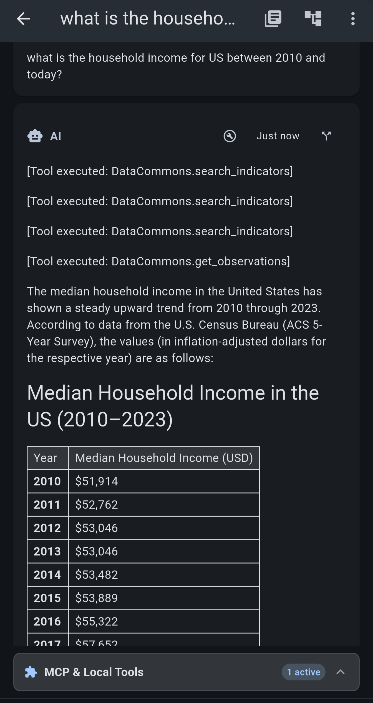
