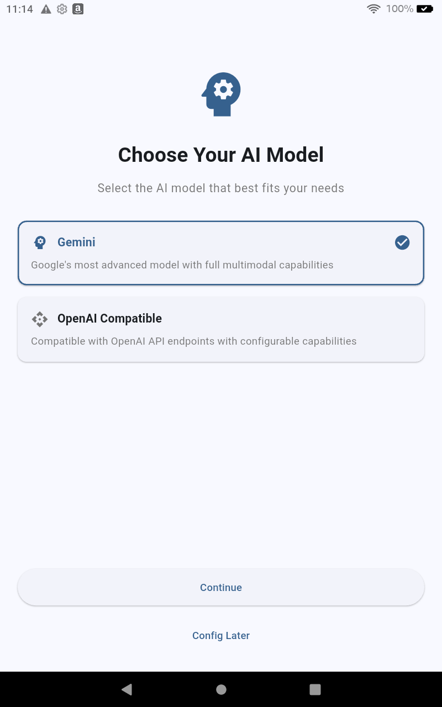
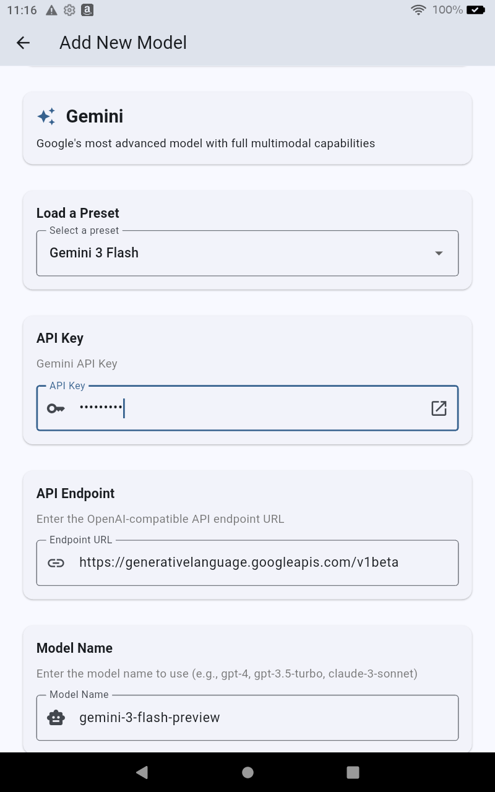
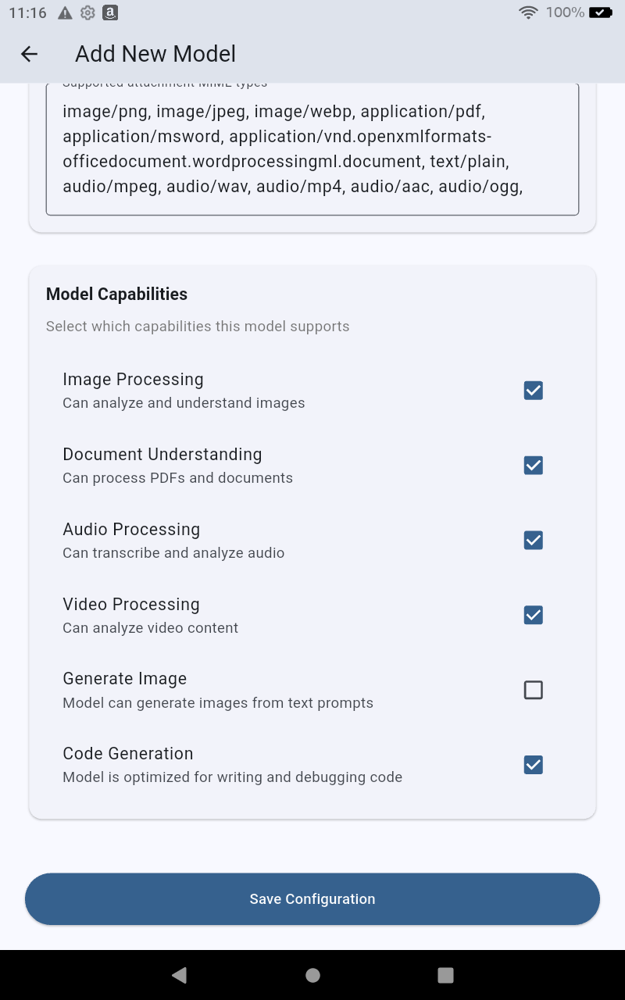

# Getting Started: Validating Your Key

Welcome to Note Synapse! The first time you launch the app, you'll be guided through a simple setup process to connect your preferred AI model.

## 1. Choose Your Model Type

You'll see a selection screen offering different AI providers. Note Synapse currently supports:

-   **Gemini**: Google's multimodal models (Recommended for full feature support including images and video).
-   **OpenAI Compatible**: Connect to OpenAI (GPT-5) or any local/hosted model that supports the OpenAI API format (e.g., GLM, vLLM).

> **Note**: You can skip this step by tapping **"Configure Later"** at the bottom of the screen. You can always add or change models later in **Settings > AI Models**.

## 2. Configure Your Model

Once you select a provider, you'll be taken to the configuration screen.

### Using Presets
The easiest way to get started is to use a **Preset**.
1.  Tap the **"Load a Preset"** dropdown.
2.  Select a model (e.g., `Gemini 3 Flash Preview` or `GPT-5.2`).
3.  This will automatically fill in the optimal settings for that model.

### API Keys
You will need an API key from your chosen provider.

-   **Gemini**: Get a free key from [Google AI Studio](https://aistudio.google.com/app/apikey).
-   **OpenAI**: Get a key from the [OpenAI Platform](https://platform.openai.com/api-keys).
-   **Other OpenAI API Compatible Platforms**: Get a key from the provider.

Paste your key into the **API Key** field. The specific endpoint URL will be set automatically by the preset, but you can edit it if you are using a custom proxy or local server.

### Customizing Capabilities
You can fine-tune what the model can do, such as:
-   **Context Window**: Adjust max input/output tokens.
-   **Capabilities**: Enable/disable vision (images), audio, or video support if your model supports it.

Once you're ready, tap **"Continue"** to finish setup and start using Note Synapse!
