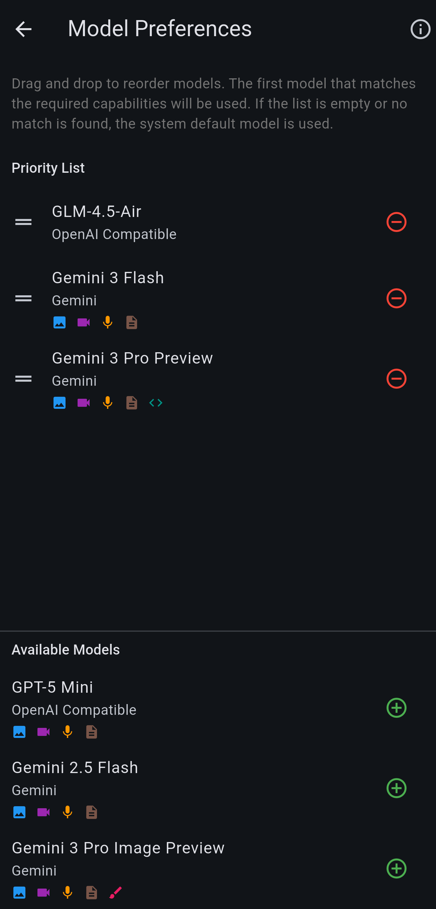

# Smart Model Matching (Multi-Capability Selection)

With **Smart Matching**, you set a default (cheap) model, and Synapse automatically swaps in a powerful model **only when required**.

## Problem
You default to a text-only or lightweight model (e.g., local Llama on your Mac, or GLM-4.5) for speed and cost. But occasionally, you need multi-modal capabilities for **Image** or a **PDF**, or ask for **Code Generation**. Your default model fails or gives poor results.

## Solution: Capability-Based Priority
You define a "Priority List" of models. When you send a message, Synapse analyzes it:
*"This message contains an Image and requires Code Generation."*

It then scans your models in order:
1.  **Active Model** (Default): Does it support Images + Code? -> No.
2.  **Priority 1** (e.g., Gemini 3 Flash): Does it support Images + Code? -> **Yes**.
3.  **Result**: Synapse automatically uses Priority 1 for *this specific turn*.

The next message (text only) reverts to your lightweight default.

## How to Configure
1.  Go to **Settings -> AI Settings -> Model Preference**.
2.  **Defaults**: Set your "Active Model" (main chat screen) to your preferred daily driver (e.g., Flash).
3.  **Priority List**: Drag and drop powerful models from "Available" to "Priority List".
    *   *Recommendation*: Put your most capable "Swiss Army Knife" model at the top, next to your cost-effective everyday model.
    *   *Recommendation*: Put specialized models below (e.g., a dedicated Image Generator).

## Matching Logic
The selector follows this strict order:

1.  **Perfect Match**: Scans the Priority List for the first model that supports **ALL** required capabilities (Images, Audio, Docs, etc.) found in your message.
2.  **Critical Media Fallback**: If no perfect match is found but your message has Media (Images/Video), it prioritizes *any* model that can see the media, even if it lacks other skills to avoid "I can't see that" errors.
3.  **Fallback**: If nothing matches, it uses your Active Default.

## Supported Capabilities
*   🖼️ **Images**: Analyzing photos/screenshots.
*   📄 **Documents**: Reading PDFs or text files.
*   🎥 **Video**: Analyzing video files.
*   🎙️ **Audio**: Listening to voice notes.
*   🎨 **Image Gen**: Creating images (Gemini 3 Pro Nano Banana).
*   💻 **Code Gen**: Writing complex code.
