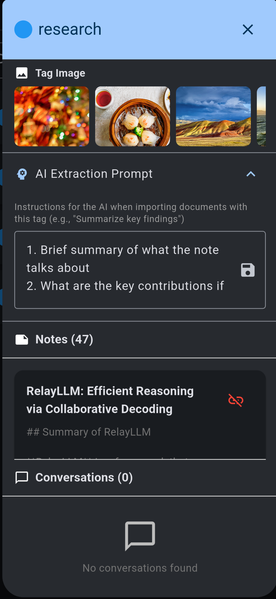

# Tutorial: Prompt Associates with Tags

Note Synapse allows you to attached to a tag an AI prompt, which will be executed to transform the note when tag is applied.

Go to filters -> manage tags -> click the info icon next to the tag.

Expand the AI prompt section, and write your prompt to describe what you want the AI to do to transform the note. Then click the save icon.

Note if you have multiple tags that has the AI prompt associated, the behavior is non-deterministic and only one action will be executed.

When
