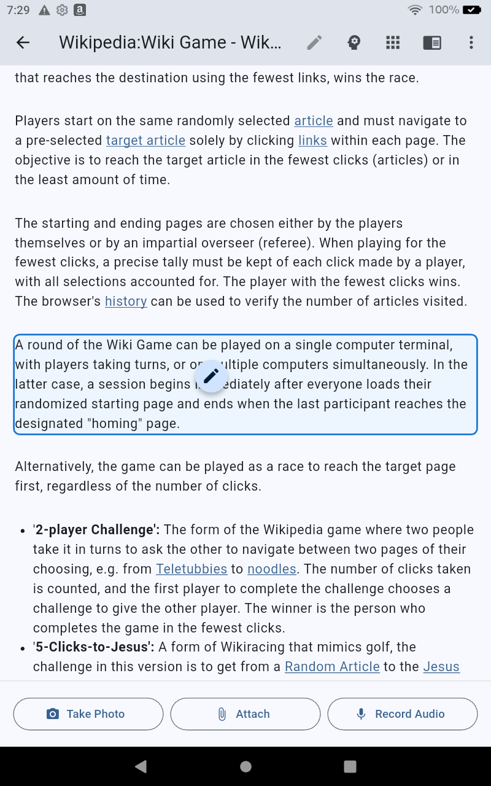
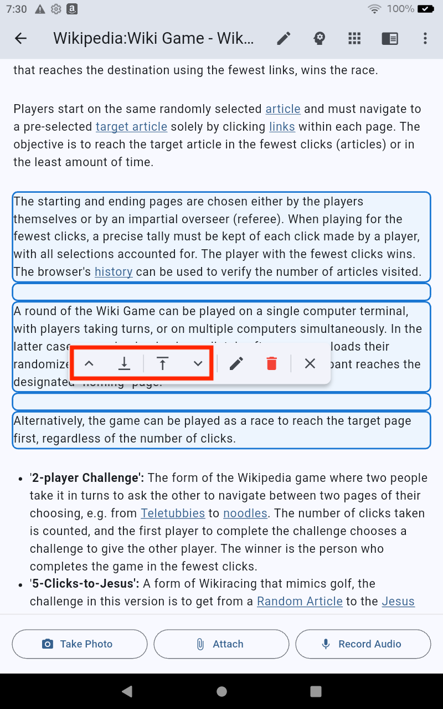
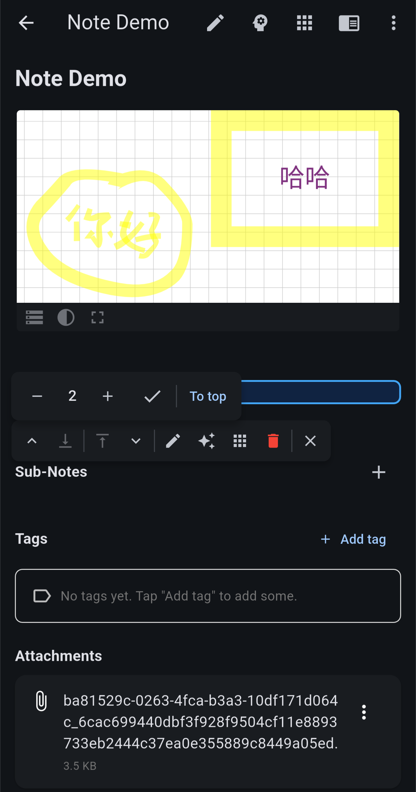
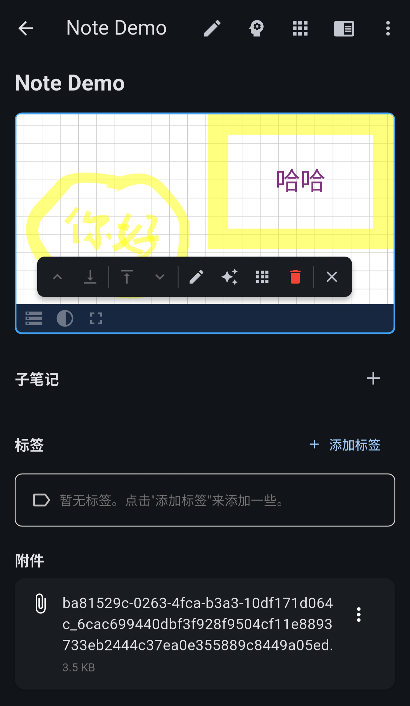

# Block-Based Editing

Block-editing allows for quick operations without needing to go into the editing view.

## The Interaction Model

### 1. Initiating Block Mode (The "Pen Drop")
To start block editing, you **drag the edit button** itself.
*   **Gesture**: Long-press the **Edit Button** (pencil icon) in the top-right toolbar.
*   **Action**: Drag the floating icon and drop it onto any paragraph or element in your note.
*   **Visual**: The target block will highlight, and the floating **Action Menu** will appear.

### 2. Expanding Selection
The pen drop selects a single block. Grow the selection from either end:
*   **Action**: Tap the **Up (`^`)** or **Down (`v`)** chevron arrows on the Block Menu.
*   **Result**: The selection highlight grows to include adjacent blocks.

### 3. Reaching Further (Long-Press)
Tapping once per block gets tedious across a long section. Long-press an arrow and a popup opens above it.

*   `−` and `+` set a number of blocks, and `✓` moves that boundary by that many at once.
*   The text button on the right goes all the way in one step: **To top** on the up chevron, **To bottom** on the down chevron, and **Reset** on the two inner arrows, which collapses the selection back to the block you dropped the pen on.

The inner arrows do nothing until more than one block is selected, so straight after the pen drop the popup is only on the outer chevrons.

## The Block Menu
The menu reads left to right: four arrows that move the edges of the selection, four actions, then exit.

| Button | What it does |
| :--- | :--- |
| Chevron up (`^`) | Extend the top of the selection upward |
| Arrow down to a line | Pull the top of the selection back down |
| Arrow up to a line | Pull the bottom of the selection back up |
| Chevron down (`v`) | Extend the bottom of the selection downward |
| Pencil | Open an editor holding *only* the selected blocks, so you can rewrite a section without scrolling the whole note |
| Sparkle | Hand the selection to the AI for an edit |
| Grid | Run a Note Action app on the selection |
| Trash | Delete every selected block at once |
| `✕` | Leave block mode |

An arrow greys out when its edge has nowhere left to go — the up chevron at the top of the note, the down chevron at the bottom.

## Running an App on a Selection
The grid button hands the selected blocks to a Note Action app as a temporary note. Whatever the app writes is spliced back over that same range, leaving the rest of the note untouched. Formula Studio and Diagram Studio show a **selected block** chip when launched this way, and saving still goes through the usual "Allow Note Modification?" approval.

A blank block is a valid target. Formula Studio treats it as an anchored insertion point: drop the pen on an empty line, launch Formula Studio from the grid button, and the formula you build lands there.

See **[Plugins](../plugins/overview.md)** for what you can run this way.
