# Note Editing & Management

## Editor Basics
**Cursor & Selection**: Standard text selection works as expected. You can tap to place the cursor or long-press to select text.

**Cursor Navigation**: You can use the virtual arrow keys to precisely navigate the cursor.

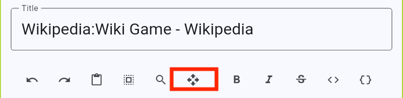
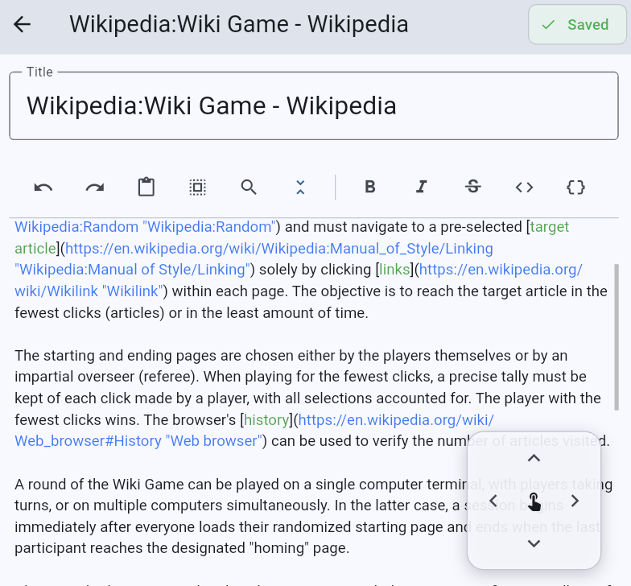

** Copy, Cut, Select All **: You can use the toolbar icon to copy, cut, select all and paste the text. When no text is selected, you can use the toolbar icon to paste or select text. When text is selected, you can additionally use the toolbar icons to copy and cut.

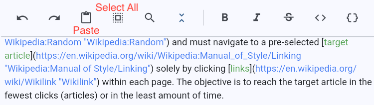
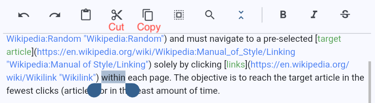

## Auto-Save & Sync status
The editor saves your work automatically, but it's important to know the status to prevent data loss.

**Look at the Top Right of the screen:**
*   **Orange "Unsaved" (`edit` icon)**: You have unsaved changes. **Do not close the editing view.** The auto-save timer is running (usually triggering 2 seconds after you stop typing).

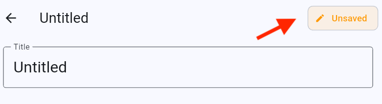

*   **Green "Saved" (`check` icon)**: All changes are safely written to the database. It is safe to exit.

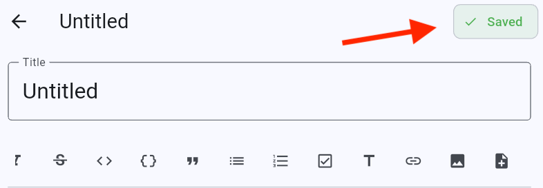

## Inserting Content

### 1. Images
You can insert images directly into your notes.
*   **Action**: Tap the **Image Icon** in the toolbar.
*   **Source**: Choose from your device gallery, draw image, or from attached image.
*   **Format**: Images outside NoteSynapse are copied to local and inserted as standard Markdown

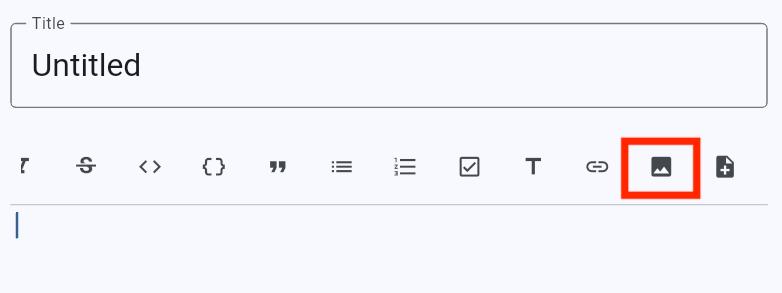
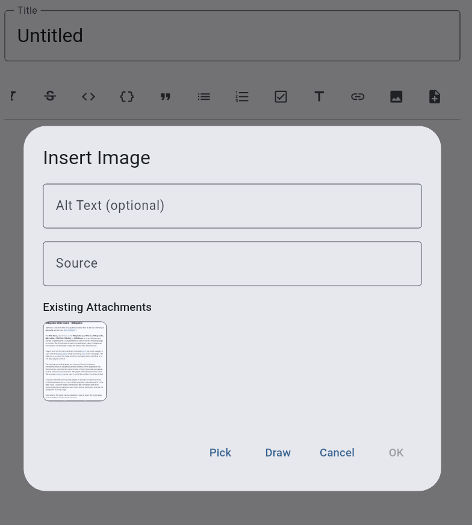

### 2. Linking Notes
Connect your thoughts by linking notes together.
*   **Action**: Tap the **Note Link Icon**
*   **Selection**: Select "Pick Note" and a dialog will appear showing your notes. Select a note to link.
*   **Format**: Creates a clickable internal link: `[Note Title](synapseresource://note/ID)`. Tapping this link in View Mode instantly navigates to that note.

> TIP: By default, a "references" relationship will be created between these notes. If you don't want this note to be included in AI conversation, you can always delete the reference relation in the note view screen.

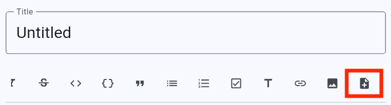
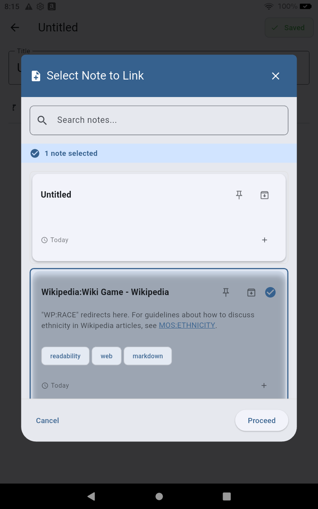
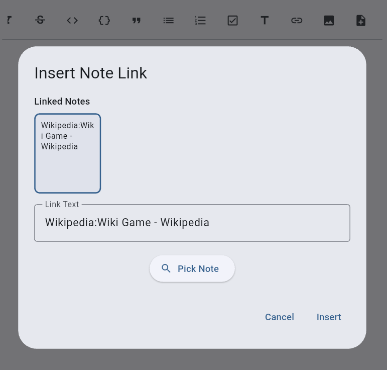
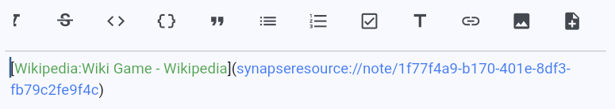

## Notes vs. Sub-notes
Note Synapse uses a hierarchy to keep your workspace clean.

| Feature | Main Note | Sub-note |
| :--- | :--- | :--- |
| **Purpose** | Core knowledge entity, detailed documentation. | Quick scratchpad, checklist item, or specific detail. |
| **Content** | **Rich**: Supports images, links, tags, and complex markdown. | **Lightweight**: Text-only (markdown supported). |
| **Use Case** | Project Overview, Research Paper, Meeting Minutes. | "Action Items", "Sub-content belonging to a note"|

> TIP: for tasks, sub-note are "sub-tasks", and will count towards the task's completion progress.

### Managing Sub-notes
*   **Add**: Tap the "Add Sub-note" button within a main note.
*   **Edit**: Tapping a sub-note opens a focused editor window.
*   **Reparent**: You can move sub-notes to different parent notes if they grow in scope.

