# Tutorial: Tag Filter

There are 2 paradigms of organizing files:

1. tags: cheap to create and update, but can get messy when many tags are created and does not reveal hierarchy of information.
2. folders: effectively groups information, builtin support for hierachy, but is less flexible when files need to be moved around. And it is tricky for a file to appear in two folders -- the solution typically is symlink which does not work well in mobile world.

Note Synapse features Tag Filter, which brings you the benefits of both worlds.

A tag filter is a matcher that matches a set of tags. For example, we can have a tag filter A matches tags [AI, Research].This representation creates a "virtual folder" concept out of the flat tags. And it's hierarchical by default -- If a tag filter B matches tags [AI], the set of notes that B selects is a superset of notes selected by A. This we have a hierachy \( A \subseteq B \).

Tag filters also fix the issue with multiple presence. For example, a note tagged [AI, Research, Learn] can appear both in [Learn] and [AI].

To create a tag filter, click the [+] button on the tag filter strip.

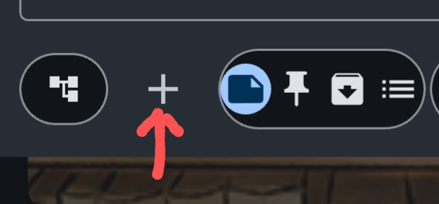

You can create a bunch of tag filters, for example:
 
 Investment:
 
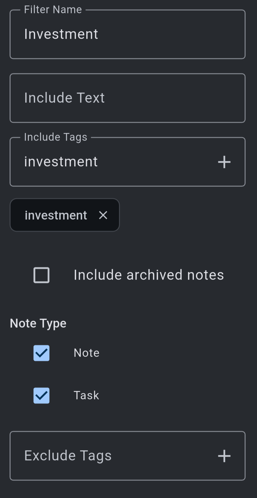

Investiment - Tax:
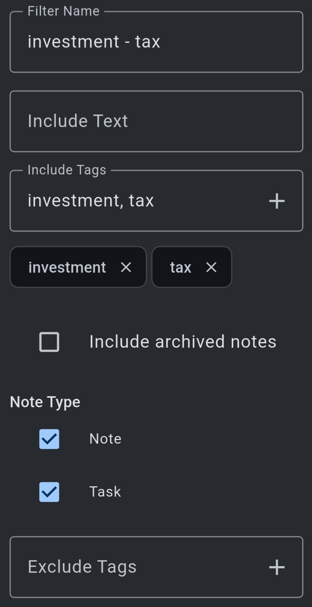

Investiment - Stock:
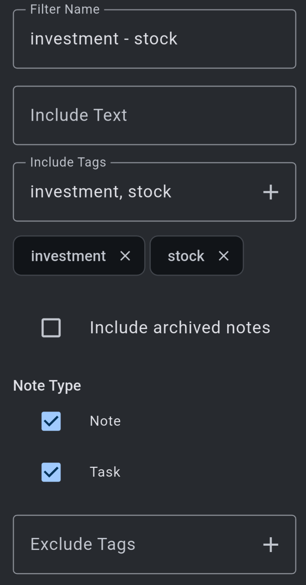

Now note that they form a hierachy:

On the tag filter strip, by default tag filters are laid out flat:

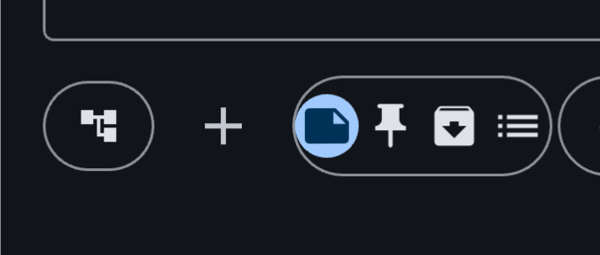

You can tap the hierachy icon on the left, which will turn the tag filters in the strip into hierarchy view. The status of this icon is memorized in settings so next time it remains your last set state. Note that when the hierarchy is activated, only top level tag filters are shown.  There is a small triangle on them to open up the hierachy.

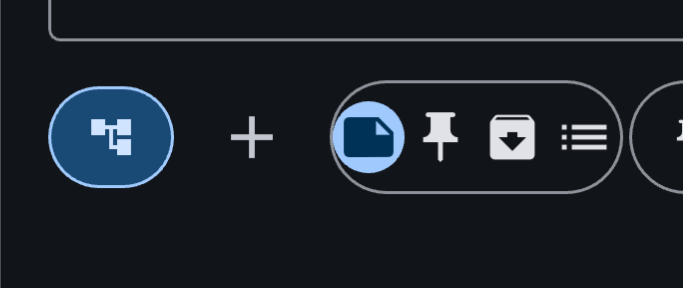

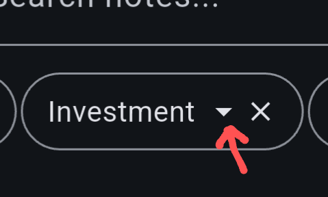

When you long-press the hierarchy icon on the tag filter strip, you can open the tree view of the full hierarchy:

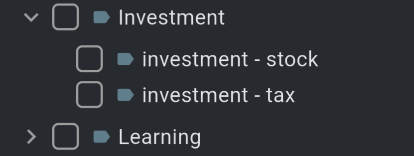

When you select a tag filter in the hierarchy, you can pin them so that they appear on the first among the tag strip.

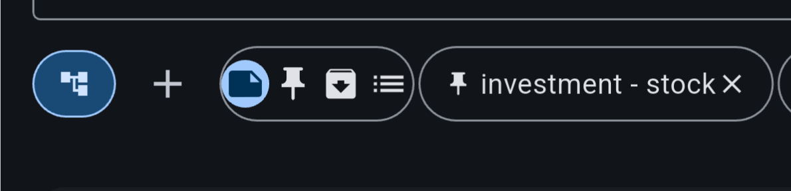

You can activate multiple tag filters at the same time. They will be OR'd together. You can remove your active tag filters by tapping on the filter icon.

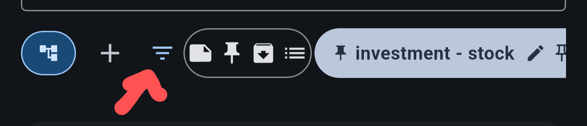

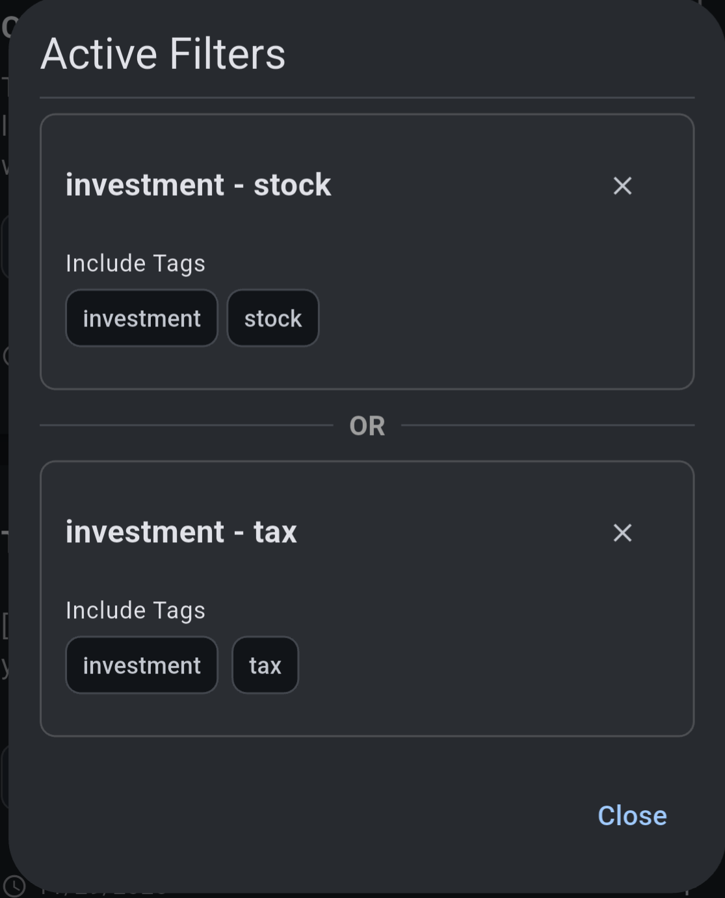

**Tips**

You can apply tags to multiple notes at the same time by multi select them and select the three dot menu -> select tags

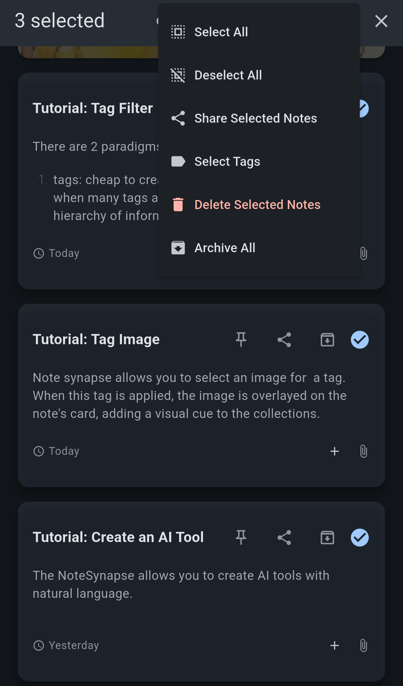

You can add tags directly from tag filters, which will apply the set of all tags in the filter.

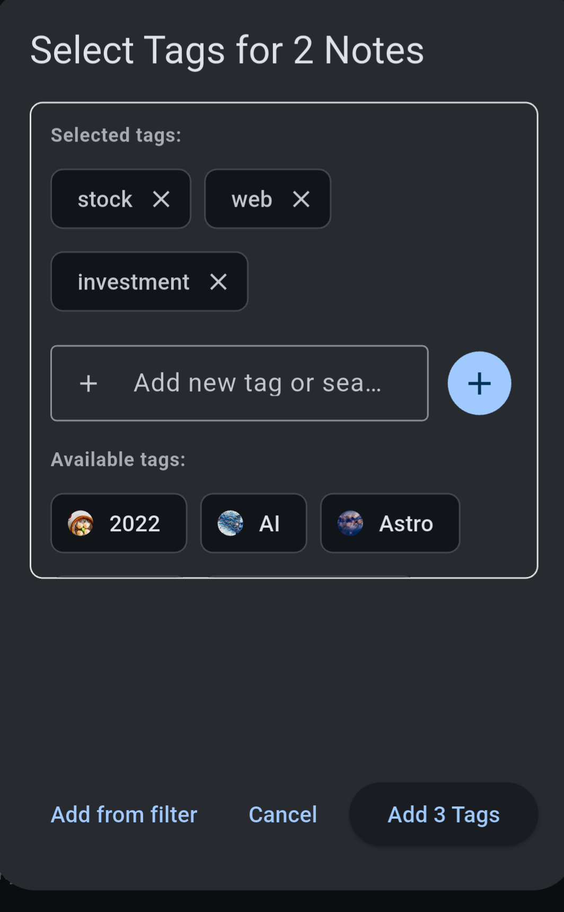

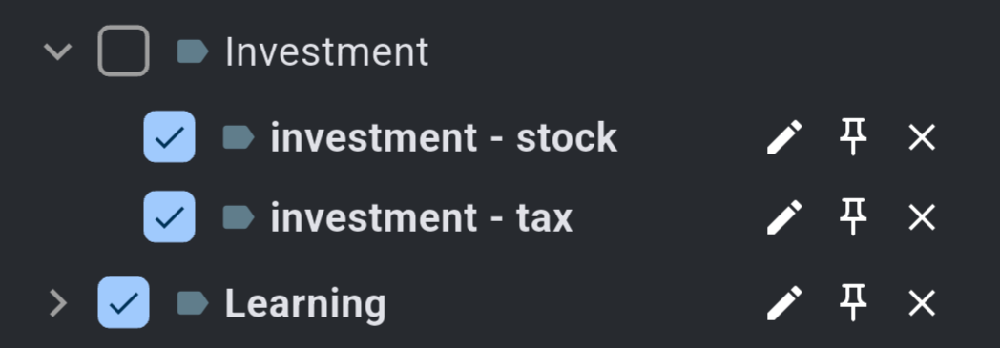

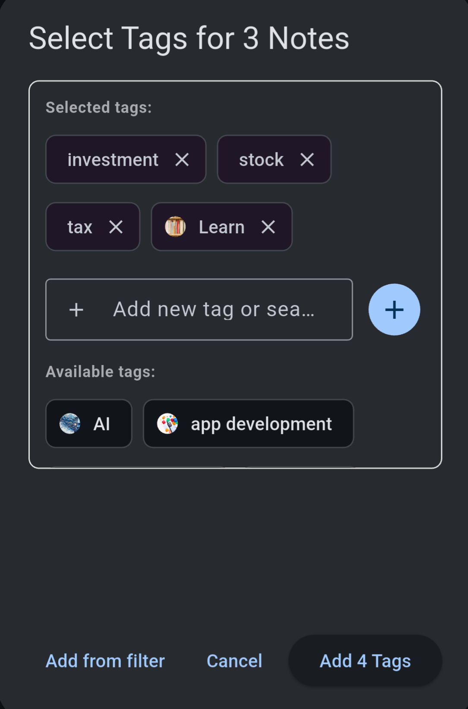
