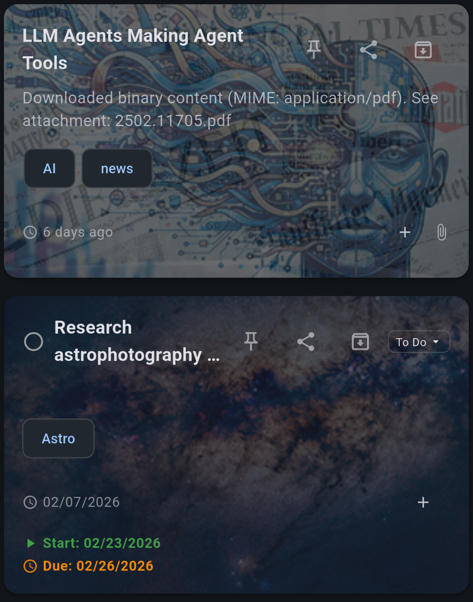
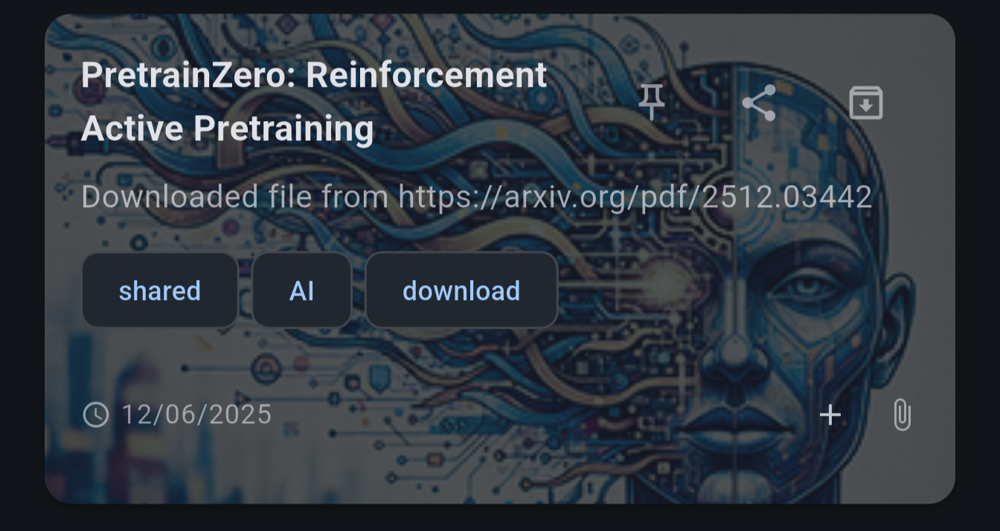
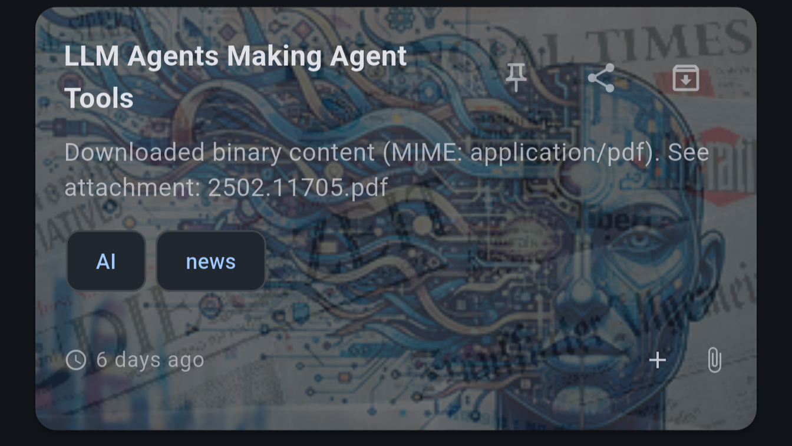
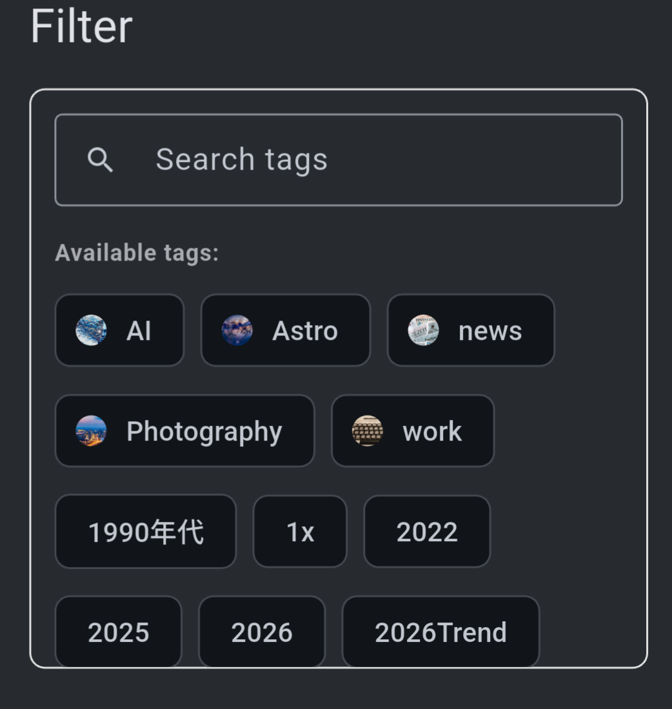
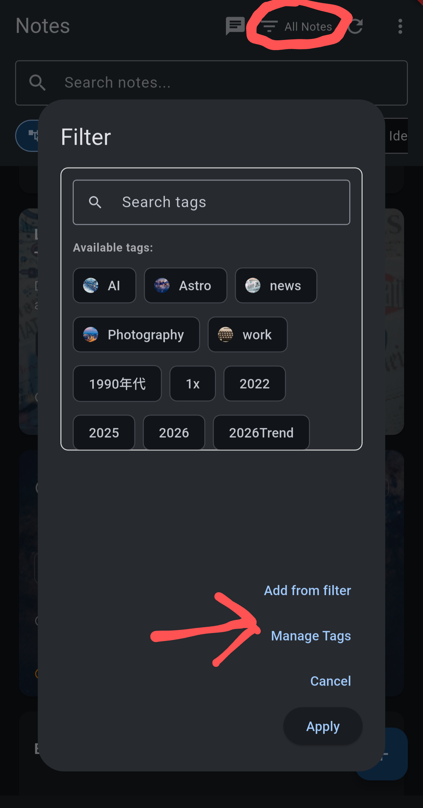
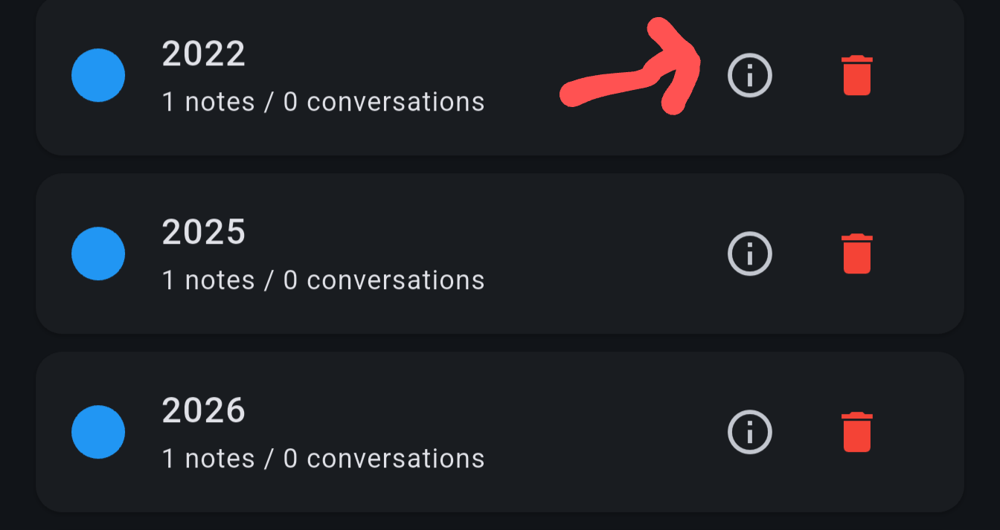
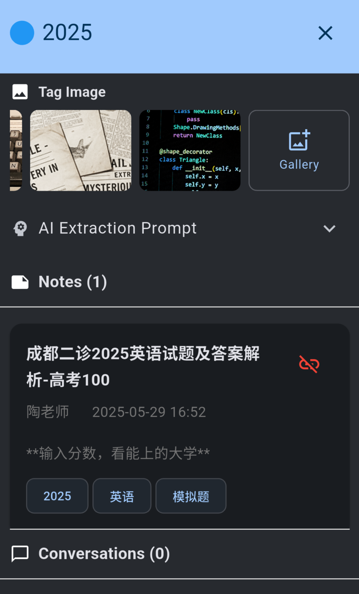

# Tutorial: Tag Image

Note synapse allows you to select an image for  a tag. When this tag is applied, the image is overlayed on the note's card, adding a visual cue to the collections.

If multiple tags associated with images are applied, the alphabetically first 2 images will be used and alpha overlayed.

Single tag - AI

Overlayed - AI + news

Tags' associated images are also shown during tag selection.

To add an image to a tag, go to tag manager by tapping "tag" icon, then choose manage tags.

In tag manager, tap the info icon in front of the tag.

In the tag detail dialog, you can select one of the preset image, or you can choose one of your own in gallery.

Custom images work best if they are 3:2 ratio, with lighter background.
