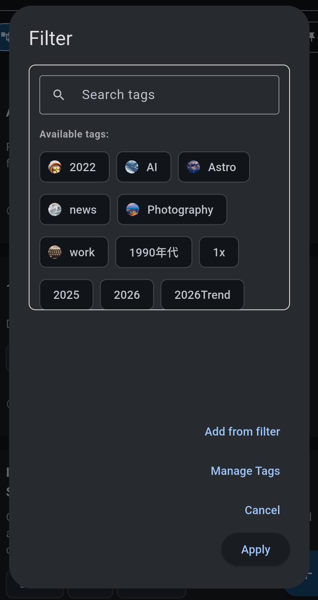

# Tag Manager & Deduplication

As your knowledge base grows, so does your tag list. The **Tag Manager** is a dedicated tool for pruning, merging, and organizing your taxonomy.

## Accessing the Manager
Select the filter icon on the app bar. Then in the tag management dialog, select "Manage Tags".

## Managing Tags
The "Delete Tags" tab allows for removal of unused or obsolete tags.
*   **Search**: Filter the list by name to find specific tags.
*   **Usage Stats**: Each tag shows how many Notes and Conversations utilize it.
*   **Delete**: Tap the trash icon to remove the tag. This removes the *label* from your notes but **does not** delete the notes themselves.
*.  **Info**: Tap the info icon to see the notes and conversations that utilize the tag, as well as configure [tag images](./tag_image.md), and [AI prompts](../ai/tag_prompts.md).

## Deduplication (Merging)
The "Dedup Tags" tab is designed to fix fragmentation (e.g., `ai-agent` vs `ai_agent` vs `agent`).

### Manual Rules
You can explicitly tell Synapse to merge two tags.
1.  **Add Rule**: Tap **+ Add Dedup Rule**.
2.  **Select Tags**: Choose the "Old" tag (Left) and the "New" tag (Right).
    *   *Logic*: "Replace instances of [Left] with [Right]".
3.  **Execute**: Tap the **Execute Dedup** (Play icon) button to run the replacement across your entire database.

### AI Suggestions
Note Synapse can automatically analyze your tag list to find synonymous or typically fragmented concepts.
*   **Analyze**: Tap the **AI Suggest Dedup** button.
*   **Review**: The AI will populate the rule list with suggested merges (e.g., suggesting `software_eng` -> `software_engineering`).
*   **Protect**: The AI is context-aware and will typically avoid merging tags that are currently active in your filters.
*   **Apply**: Review the suggestions, delete any you disagree with, and then tap **Execute**.
