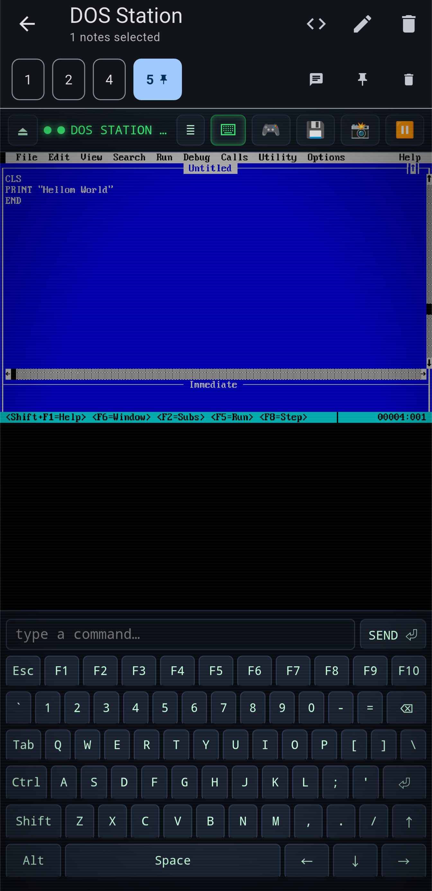
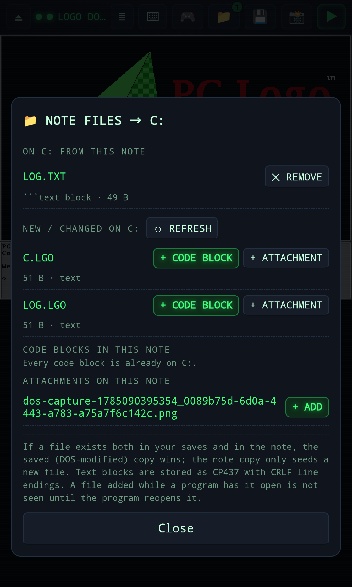

# DOS Station

DOS Station runs a DOSBox emulator, compiled to WebAssembly, inside a note. Attach a game's `.zip` and it becomes the DOS `C:` drive; code blocks you name become files on that drive; anything DOS writes can come back to the note.

**DOS Station is not bundled with Note Synapse.** It downloads the js-dos build of DOSBox onto your device at runtime, and DOSBox is GPL-2.0, which is why it ships on its own.

## Getting It

1.  Download [`DOS_Station.yaml`](https://github.com/Stowplex/Note-Synapse/raw/main/contrib/dos-station/plugins/DOS_Station.yaml) from the project repository.
2.  Open or share that file into Note Synapse to import it as a user app.
3.  Optional: create a skill from `contrib/dos-station/skills/DOS_Station.md` so the assistant can prepare game notes and embed the player for you.

The first launch needs a network connection to fetch the emulator (about 2 MB). It is checked against a pinned hash and cached, so later launches work offline.

## Preparing a Game Note

Create a note, attach the game's `.zip`, and optionally add a config block:

````markdown
```dosbox
[cpu]
cycles=fixed 12000

[autoexec]
mount c /dos
c:
KEEN1.EXE
```
````

The zip is always mounted at `/dos`, and `mount c /dos` plus `c:` are added for you if you leave them out. An `[autoexec]` section boots straight into the game. Without one — no `dosbox` block at all, or one that only sets `[cpu]` — DOS Station scans the zip for `.exe`, `.com` and `.bat` programs and shows a launcher menu.

Then select the note and run **DOS Station** from the note actions menu.

A note needs no game at all. If it has files but no zip, DOS Station boots to a bare `C:\>` holding just those files — enough to try a `.bat`, a BASIC listing or a config file.

## Playing

The HUD along the top holds eject, the console log, the on-screen keyboard, the gamepad, the files panel, save, frame capture, and pause/run.

The keyboard docks below the picture, and carries sticky modifiers plus a quick-type bar for sending a whole command at once.



The gamepad gives you an analog d-pad, four discrete direction buttons for games that expect arrow keys, and mappable A/B/C buttons.

## Files Shared with the Note

Tag a fenced code block with `dos-name` and it is written to `C:` every time the note is mounted:

````markdown
```basic {dos-name="HELLO.BAS"}
10 PRINT "HELLO WORLD!"
20 GOTO 10
```
````

You never have to type that attribute: pick a code block in the 📁 panel, give it a name, and DOS Station writes it into the fence. Names follow DOS 8.3 rules and may include subdirectories, so `src/main.bas` becomes `C:\SRC\MAIN.BAS`. Text is transcoded to code page 437 with CRLF line endings on the way in, and back again on the way out.

Attachments are never copied automatically — choose them in the panel. Your choices are recorded in the note as a ` ```dos-files ` block, so they travel with it.



The panel has two halves. *ON C: FROM THIS NOTE* lists what the note put on the drive, flags anything DOS has since changed, and offers `↑ TO NOTE` to bring the DOS version back or `↻ FROM NOTE` to throw it away. *NEW / CHANGED ON C:* lists files a DOS program created that the note does not know about yet, each addable as a code block or as an attachment.

At boot a saved copy wins over the note's copy, so the note only seeds files the saves do not already have. A file added while a program has it open is not seen until that program reopens it.

## Capture and Ask

The camera button snapshots the current frame. Attach it to the note with an optional comment, or put a question to the assistant about what is on screen first.


## Game Saves

Save inside the game as you normally would. DOS Station diffs `C:` against the game zip and writes just the difference to the note as a `dos-saves-*.zip` attachment, then unpacks it over the game files on the next boot.

Saving happens on the 💾 button, every 60 seconds while the game is running and something actually changed, when the app is backgrounded, and on eject. Each save replaces the previous one for that game zip, and a note holding several game zips keeps their saves apart. Delete the attachment to reset the game to a fresh install; move it with the game zip to carry progress to another device.

## Embedding the Player

To put the player in the note body instead of launching it from the menu:

```markdown
@[640x480](synapseresource://app/282d85c5-82cd-4d0f-b03d-1bb99a84419b?note=current&autoboot=1)
```

`autoboot` skips the launcher, `exe=KEEN1.EXE` picks the program, and `zip` picks the attachment when the note has more than one.
