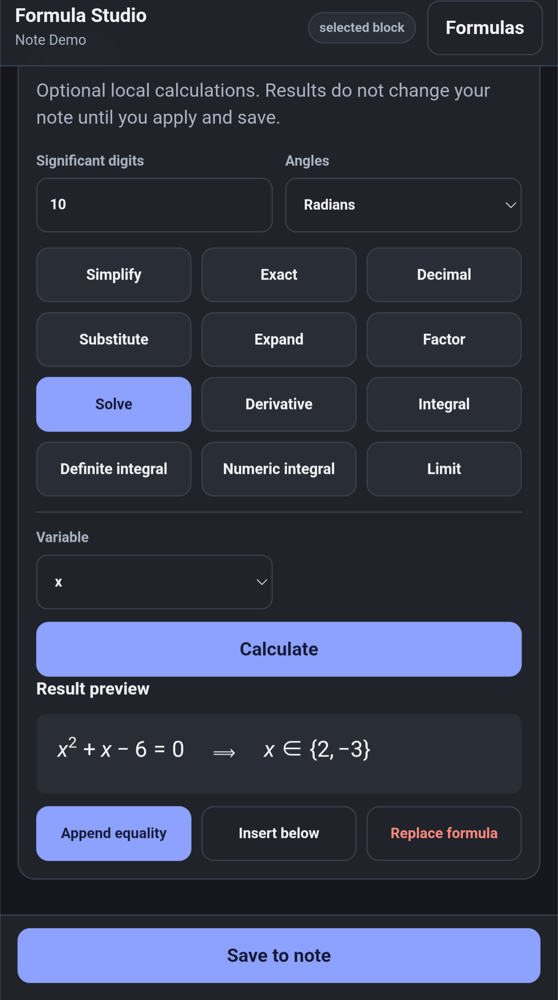

# Formula Studio

Formula Studio edits the LaTeX formulas in a note visually, and can run algebra and calculus on them. The math field and the compute engine are packaged in the app, so editing and every supported calculation work with no network connection.

Select a note and launch **Formula Studio** from the note actions menu.

## Launching It

-   **On a selected block** — drop the edit pen on a formula or paragraph and tap the grid button in the block menu (see **[Block-Based Editing](../editor/block_editing.md)**). The studio shows a **selected block** chip.
-   **On a blank block** — the empty line becomes the insertion point for a new display formula.
-   **On whole notes** — pick a note, then pick one of its formulas or add a new one.

## Editing

The math field takes typed input directly: `x^2` raises, `/` starts a fraction, and the **Templates** row has a fraction button. On a touch device the field's own math keyboard opens when you focus it, with tabs for numbers, symbols, Roman letters and Greek.

**Visual** and **LaTeX** switch between the rendered field and the raw source. **Inline** and **Display** choose how the formula sits in the note — `\( ... \)` inline, `\[ ... \]` on its own line.

Legacy `$$...$$` formulas are always recognized. Single-`$` formulas are recognized only when you launch on a selected block. Either is rewritten to the `\( ... \)` or `\[ ... \]` form when you save a formula you have edited.

## Calculating

The **Calculate** section works on the formula in the field. Nothing it produces reaches your note until you apply it and save.

Pick an operation — Simplify, Exact, Decimal, Substitute, Expand, Factor, Solve, Derivative, Integral, Definite integral, Numeric integral, or Limit — choose the variable it applies to, and tap **Calculate**. Significant digits and the radians/degrees setting affect numeric results.

The result appears under **Result preview**. Then decide what happens to it:

-   **Append equality** adds the result to the formula as a further step.
-   **Insert below** puts it in a new formula under the current one.
-   **Replace formula** discards the original and keeps the result.

## Saving

**Save to note** writes your changes. Note Synapse asks for approval and shows exactly what will change.

Tick **Allow for this session** to stop being asked for each save while you keep working.
