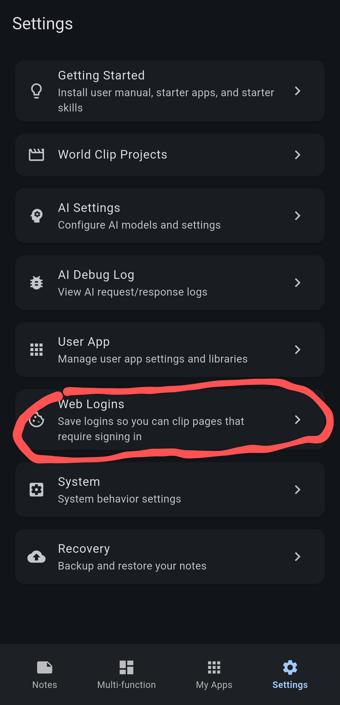
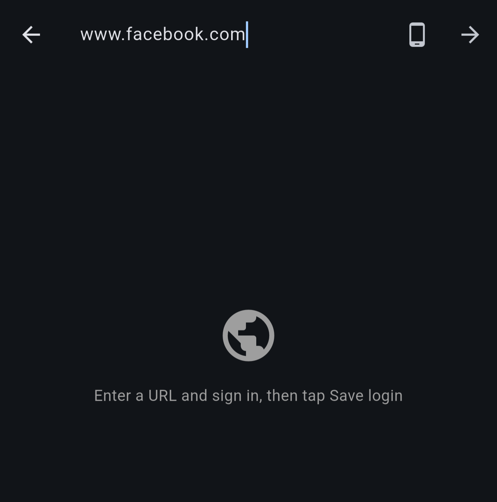
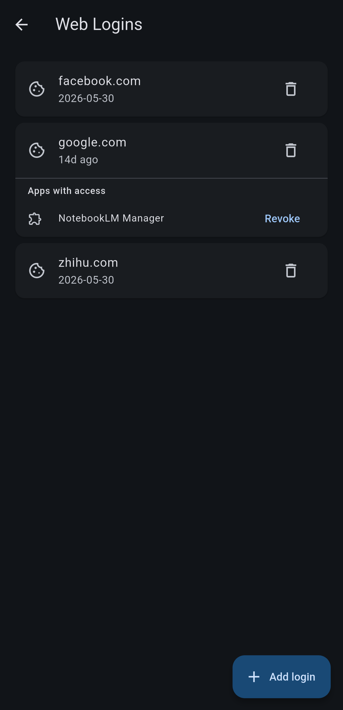

# Tutorial: Clipping the web content

With Note Synapse, you can clip and save content from the web for offline reading.

You can copy the URL, then select the [+] button on the note main page. Select New Note from Clipboard.

Note Synapse will detect the URL and prompt for web extraction.

Here if you select As-Is the URL will be saved as text. We select "Extract" to save the web content.

By default, NoteSynapse loads the page inside a webview, then it applies Readability script to strip the irrelevant information.

This most of the time does a good job but sometimes it can be too aggressive or inaccurate. In our case, if omits the content in the expandable region, which are loaded just-in-time. Hence we need tap the Readability toggle to temporarily disable it.

When Readability is toggled off, you can scroll the page, expanding the collapsible area.

Once these sections are expanded, you can toggle Readability back on and press extract. Note that extract with AI will by default give a summary, which is not useful for our case.

Then adjust the tags, select which media to download to local, and click create note.

You have successfully clipped a web page.

If Note Synapse detects that the URL points to a blob file, it will download it and add as attachment.

## Where a Clip Came From

A clipped note remembers the page it came from, in a small card under the title in both the reading and the editing view.

It is not part of the note text, so editing, block operations and AI edits never touch it. Collapsed, it takes two lines: the page title, then the site and how long ago you clipped it, such as `Example · clipped 3d ago`. Several sources add a third line such as **+2 more**.

Tap the title to open the page. Long-press it for **Copy link**, **Edit source** and **Remove source**; removing asks first and leaves the content alone. With more than one source, the chevron or **+2 more** expands the card to list every source with a shortened address. The `⋯` on each row opens the same menu, and **Show less** folds the card again. While editing you can open or copy a source but not change it.

**Extract**, **AI-Extract**, downloaded files and appended clips all record a source, and an appended clip joins the note's existing list. **As-Is** records none, since that note is the URL itself.

Any saved note can be given a source by hand. Open the menu at the top of the note, choose **Add source…** and fill in the **URL**; a **Title** and **Site name** are optional. Only http and https links are accepted; `https://` is added when left out. A link the note already has is refused with `This link is already a source of this note`, a malformed one with `Enter a valid http(s) link`.

The source follows the note out of the app. Share a note from its menu: **Share as Zip**, **Share as Text** and **Copy to clipboard** add a `**Source:** [title](url)` line per source, and **Import Markdown Zip** brings them back from that zip. **Share as PDF** adds a **Source** row per source. Plugins find the sources in each `Synapse.Notes` entry, and the AI sees them when it reads a note, so it can cite the page it quotes.

## Signing In to Sites

Some pages show nothing useful until you are signed in, and the clipper's webview starts out signed out. Save a login once and clipping that site works from then on.

Open **Settings → Web Logins**.

Tap **Add login**, type the site's address, and sign in the way you normally would. This is a real browser, so single sign-on, two-factor prompts and captchas all work. Your password is never handled or stored — only the session cookies the site gives back afterwards.

Once you are signed in, tap **Save login**. If a site hides its login form from phones, the toolbar's **Request desktop site** toggle switches the browser to a desktop user agent for that visit.

Sign in before you save. Saving fails only when the site handed over no cookies at all — so on a site that sets a cookie before you log in, saving while signed out still succeeds and leaves you with a login that authenticates nothing.

Clip the page as usual; Note Synapse restores that site's cookies before the page loads.

## Managing Saved Logins

The Web Logins screen lists each saved site, when you saved it, and how much life it has left.

Logins are saved per domain: signing in at `https://news.example.com/article` files one login under `example.com`, which is reused for any page on that domain. Whether it also authenticates a *different* subdomain is up to the site — cookies it pinned to `news.example.com` are only ever sent back there. Saving again for the same domain replaces what was there.

The timestamp counts up — `just now`, `5m ago`, `3h ago`, `14d ago` — and becomes a `YYYY-MM-DD` date once the login is 30 days old. A second line reports the expiry the site set: `Valid until 2026-11-04`, or `Expires in 2 days — refresh soon`, or `Expired — refresh to sign in again`. Sites that set no expiry at all show `No expiry set by the site`, which means the login lasts as long as the site decides to honour it.

### Keeping a Login Alive

Most sites hand back a fresh session cookie every time you use them, and Note Synapse now keeps those: clipping a page or letting an app make a request rolls the saved login forward instead of leaving it frozen at the moment you saved it. A login you use regularly generally stays signed in on its own, and the row shows `Refreshed 2h ago` when that has happened.

### Refreshing a Login

Sites still expire sessions on their own schedule, and when that happens clipping quietly returns the signed-out page instead. The circular **Refresh login** arrow on the row signs you in again without losing anything else about the login.

Tapping it clears just that site's cookies and reopens the browser at the page you originally signed in on. Clearing first is the point: an expired session usually has *not* passed the expiry date the site put on it, so without that step the site keeps accepting the dead cookie and shows a broken half-signed-in page rather than a login form. Sign in as usual — the new session is captured on its own, and you will see `Login refreshed for {domain}`. Tap **Done** when you are finished, or **Save login** if the automatic capture did not fire.

Refreshing keeps everything a delete would have taken with it: the apps you approved under **Apps with access** stay approved. If you back out without signing in, the previous login is put back exactly as it was, so a refresh you change your mind about costs nothing.

The **Clear cookies for this site** broom in the login browser's toolbar does the same clearing on demand, which helps in the plain **Add login** flow when a site refuses to show its login form.

A plugin that finds its access has expired can ask for this too, and you will get the same one-tap refresh with the app's access intact.

The trash icon removes the stored session and clears the cookies for the domain and for the host you signed in on. It confirms first, with "Delete the saved login for {domain}? Clipping pages on this site will no longer be authenticated." This is a local sign-out: the site is never told, and cookies on other subdomains are left alone. Note Synapse itself never uploads a saved login.

## Apps with Access

User apps (plugins) can ask to use a saved login, which is how NotebookLM Manager reaches your notebooks. The first time an app asks, Note Synapse shows **Allow use of your {domain} login?** and states the terms: the app will be able to make requests as you on that domain and any of its subdomains, and to read that login's cookies. It can read the cookie values themselves, so approve only apps you would be comfortable signing in on your behalf.

Approved apps are listed under **Apps with access** beneath their domain, each with a **Revoke** button. Revoking stops the app using the login until you approve it again, though it cannot recall cookie values the app has already read. Deleting the saved login and uninstalling the app both revoke access as well.
