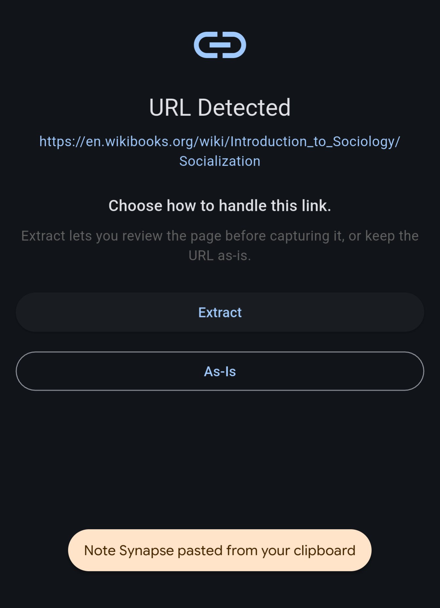
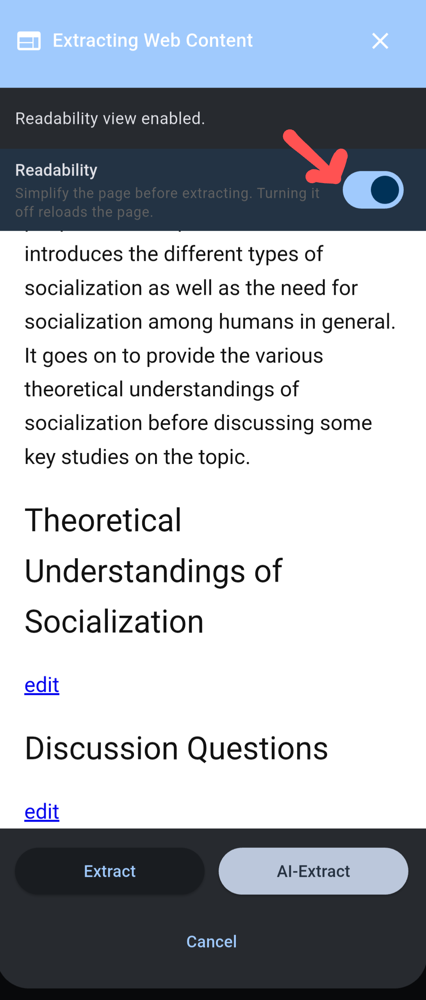
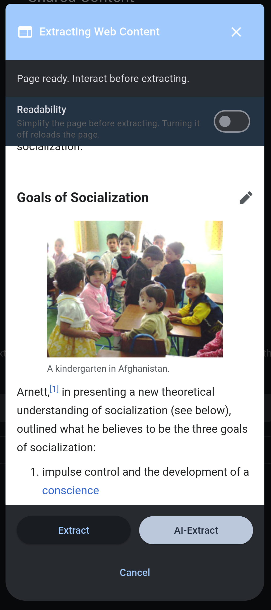
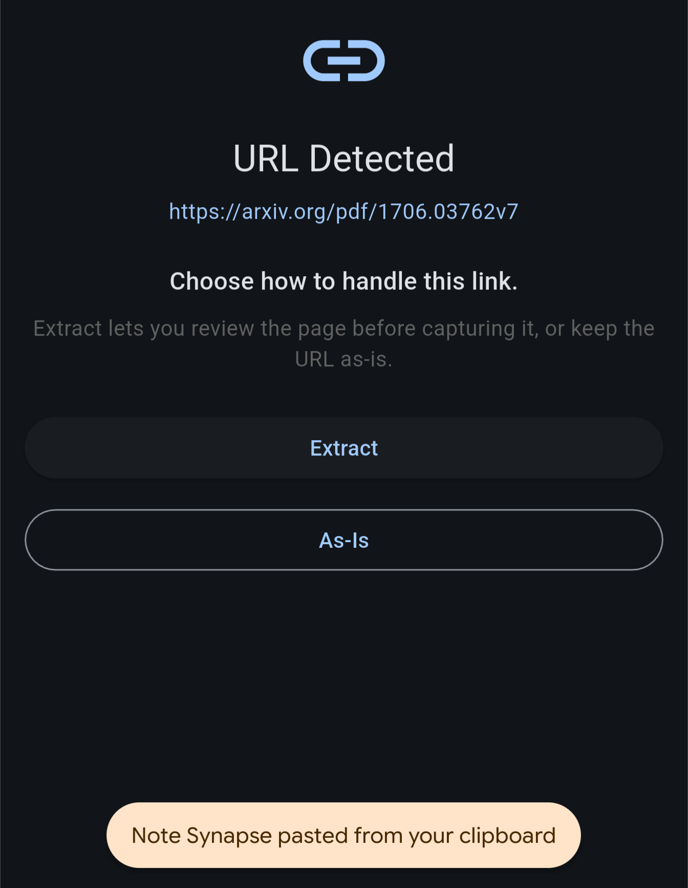
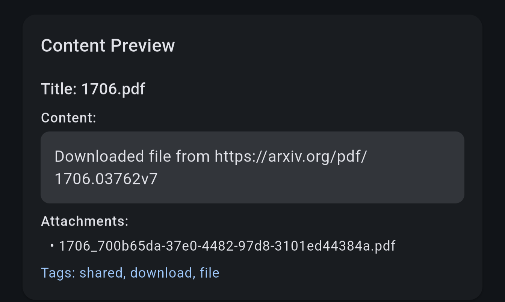

# Tutorial: Clipping the web content

With Note Synapse, you can clip and save content from the web for offline reading.

You can copy the URL, then select the [+] button on the note main page. Select New Note from Clipboard.

Note Synapse will detect the URL and prompt for web extraction.

Here if you select As-Is the URL will be saved as text. We select "Extract" to save the web content.

By default, NoteSynapse loads the page inside a webview, then it applies Readability script to strip the irrelevant information.

This most of the time does a good job but sometimes it can be too aggressive or inaccurate. In our case, if omits the content in the expandable region, which are loaded just-in-time. Hence we need tap the Readability toggle to temporarily disable it.

When Readability is toggled off, you can scroll the page, expanding the collapsible area.

Once these sections are expanded, you can toggle Readability back on and press extract. Note that extract with AI will by default give a summary, which is not useful for our case.

Then adjust the tags, select which media to download to local, and click create note.

You have successfully clipped a web page.

If Note Synapse detects that the URL points to a blob file, it will download it and add as attachment.

