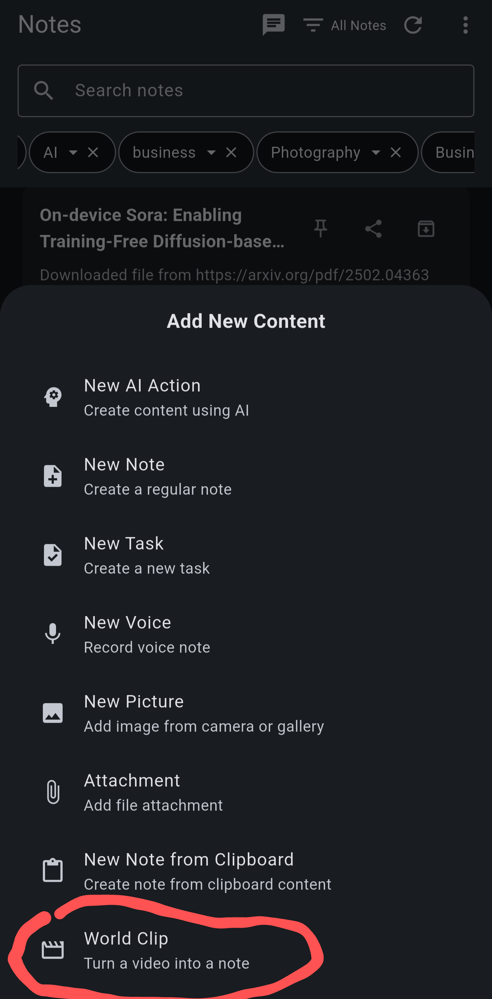
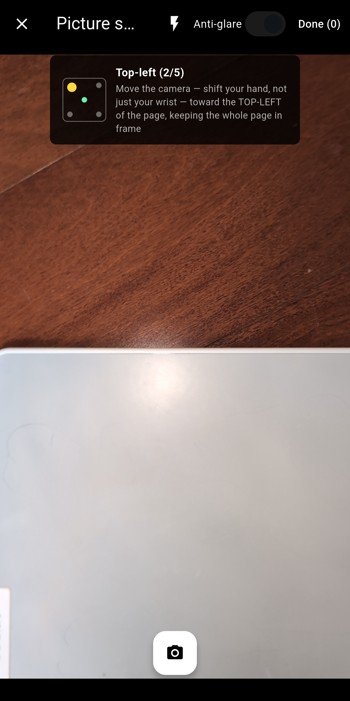
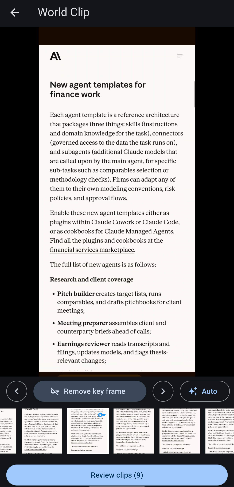

# Tutorial: World Capture (World Clip)

World Clip turns things you see in the real world — a document, a whiteboard, a stack of pages, a bulletin board, or something on a screen — into a clean note. You capture a video, a burst of photos, or a screen recording; the app picks out the good frames, lets you correct perspective and lighting, and compiles the pages into a note as inline images or a PDF.

To start, open the note-creation ("+") menu and choose **World Clip**. You can leave a capture half-done and come back to it later via **Settings → World Clip Projects**, life time of the raw project is subjected to OS's cache purge.

## Capture Sources

The first screen offers four ways to bring pages in:

-   **Import video**: pick a video.
-   **Import pictures**: multi-select existing photos; each photo becomes a page.
-   **Picture sequence**: shoot pages one at a time with the in-app camera.
-   **Screen capture** (when the device supports it): record your screen, switch to the app you want to capture, then return and tap **Stop & import**. The recording is processed like a video.

## Picture Sequence

In picture sequence mode you shoot each page, then choose **Keep** or **Retake**. Kept pages line up in a thumbnail strip at the bottom, where any page can be retaken or discarded. Tap **Done** to send the pages on for review.

The **Anti-glare** switch turns each page into a guided five-shot capture — center, then the four corners, following the on-screen prompts. The shots are aligned and fused so glare, reflections and shadows that only appear in some of the shots are voted out, which works wonders on glossy paper and laminated pages.

## Key Frames

Videos and screen recordings go through a timeline stage: a scrubbable thumbnail strip with a large zoomable preview so you can check sharpness.

Tap **Auto** and the app analyzes the clip for you, then drops near-duplicates. Suggested key frames show a key badge in the timeline.

The suggestions are just a starting point — use **Set key frame** / **Remove key frame** on any frame, and the chevrons to jump between key frames. When at least one frame is tagged, **Review clips** moves on.

## Keystone Correction and Review

The review stage shows each captured page. Tap **Edit** on a page to open the correction editor:

-   **Auto edges** finds the document outline for you; you can then drag the keystone quad's corners to fine-tune the perspective correction.
-   **Add horizontal/vertical crease** bends the correction grid to flatten folded or curved pages.
-   **Rotate** and **Level** square the page up, and color controls (contrast, brightness, warmth, shadows, …) clean up the lighting.

Edits can be applied in bulk: select multiple pages and use **Clone edits** (copies the exact keystone quad) or **Clone edit actions** (copies rotation and color, re-running edge detection per page).

You can also reorder pages by dragging, and remove pages you don't want.

## Creating the Note

Finish with one of the two output options:

-   **As inline images**: each page becomes an image embedded in the note body.
-   **As a PDF**: all pages are rendered into a single PDF attachment.

Either way you get a new note, tagged `world-clip`, ready for everything else Note Synapse does — tagging, AI conversations, immersive reading, or syncing to other tools.
