# Tutorial: Create an AI Tool

The NoteSynapse allows you to create AI tools with natural language.

In this tutorial, we create an AI tool that invokes Google's Geocoding API and returns a list of places given a latitude/ longitude coordinates.

## Preparation

The LLM that implements the tool works best when it is given the context to work with. Here we'll use Note Synapse's Webclipper to save Google Geocoding's API.

First, copy Google's Geocoding API URL to clipboard:

```
https://developers.google.com/maps/documentation/geocoding/overview
```

Then, add note button -> New Note from Clipboard 

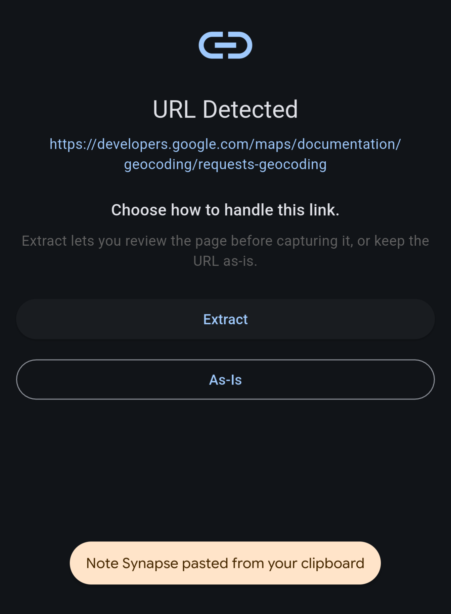

Click Extract -> Extract in Webview -> Create note

Now you have saved the documentation to geocoding API in note:

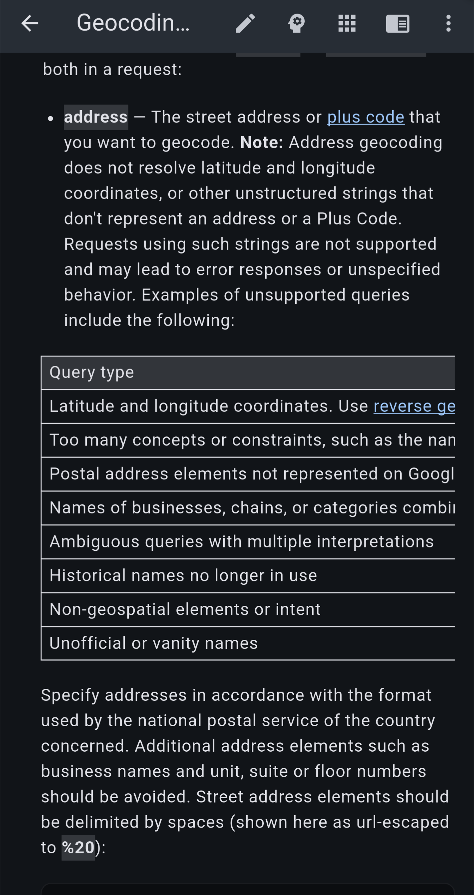

## Create the AI Tool

Tap the add button, and select the Create App option.

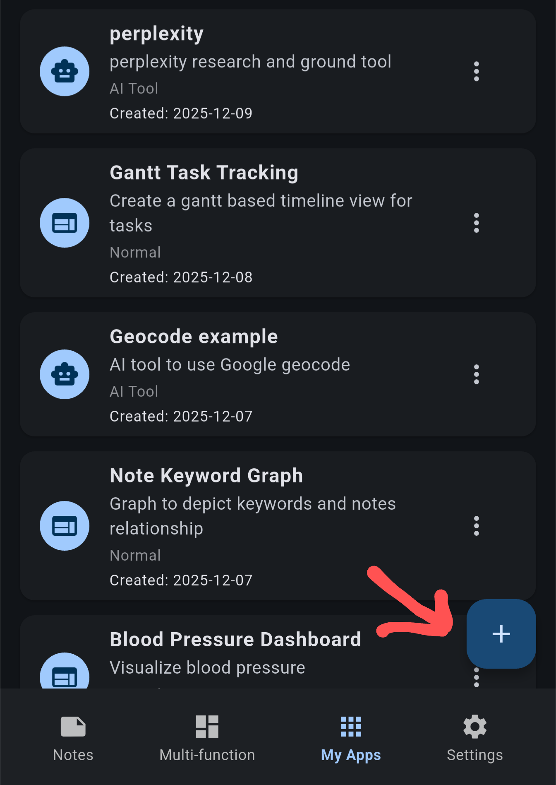

The app's type should be AI tool, and you should select the option to attach a note.

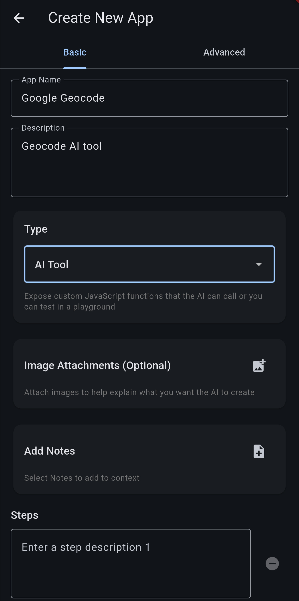

Select the note about geocoding API that we clipped.

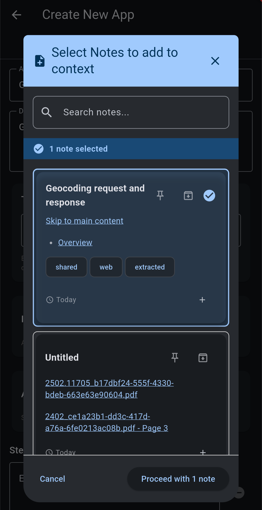

Fill in the description, and the steps. The steps is also a perfect place to put down requirements.

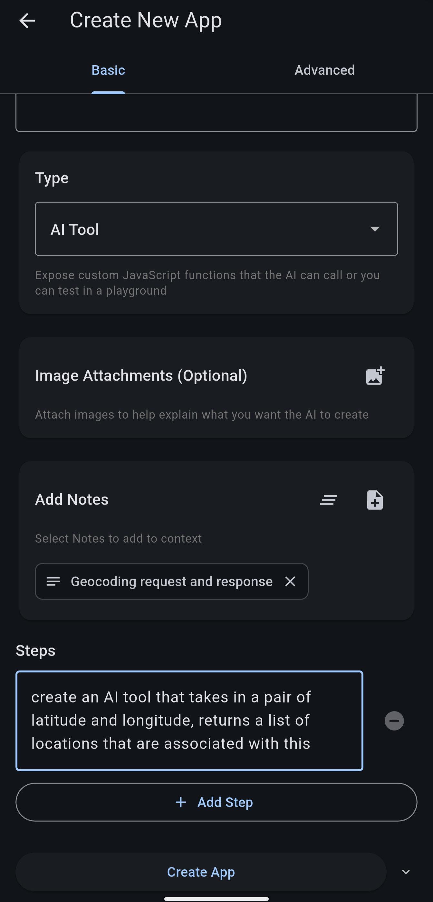

Click create app, and wait for it to finish. Once it's done, you will see the success screen.

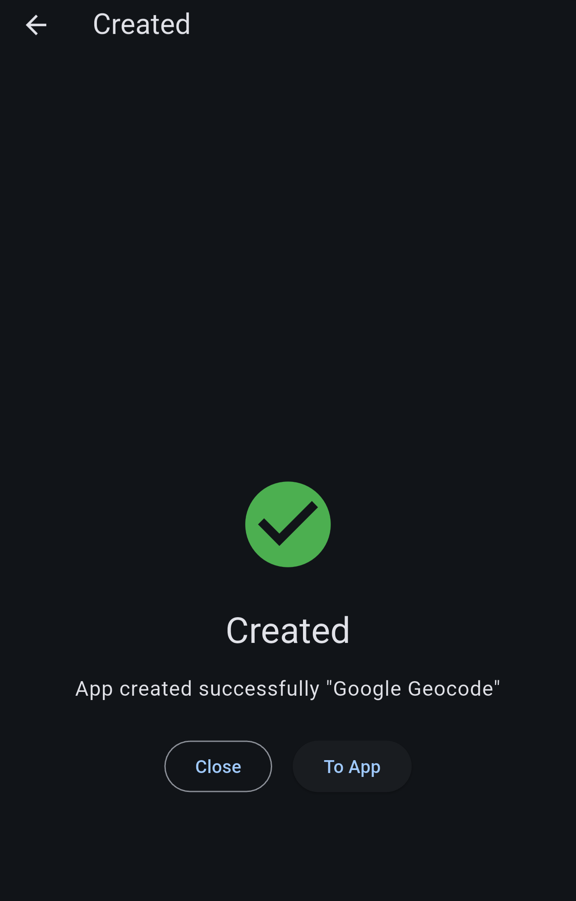

Tap "To App" and you should be able to open the playground. All AI tools are required to have a playground for configuration and debugging.

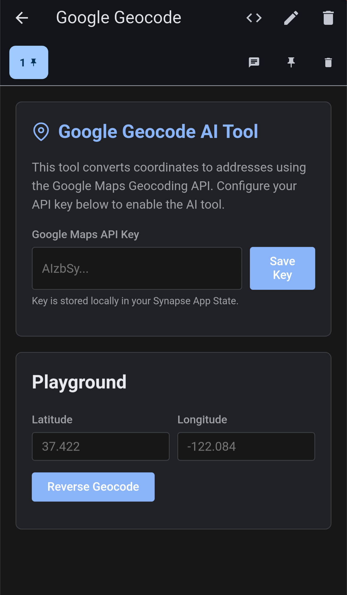

Set the API key and put down a coordinate to test.

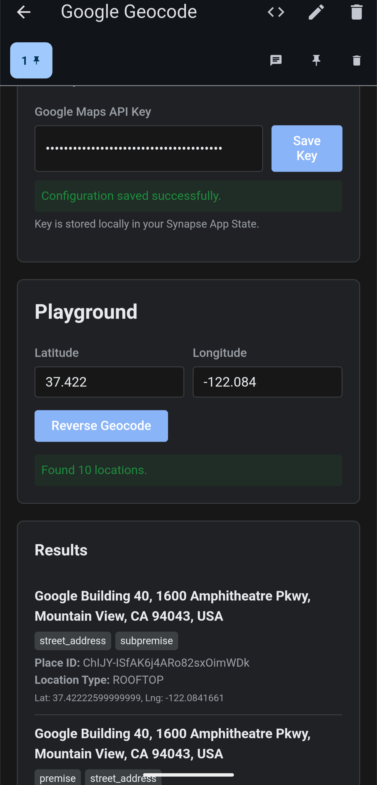

Now you can go to the chat screen and enable this tool, then test.

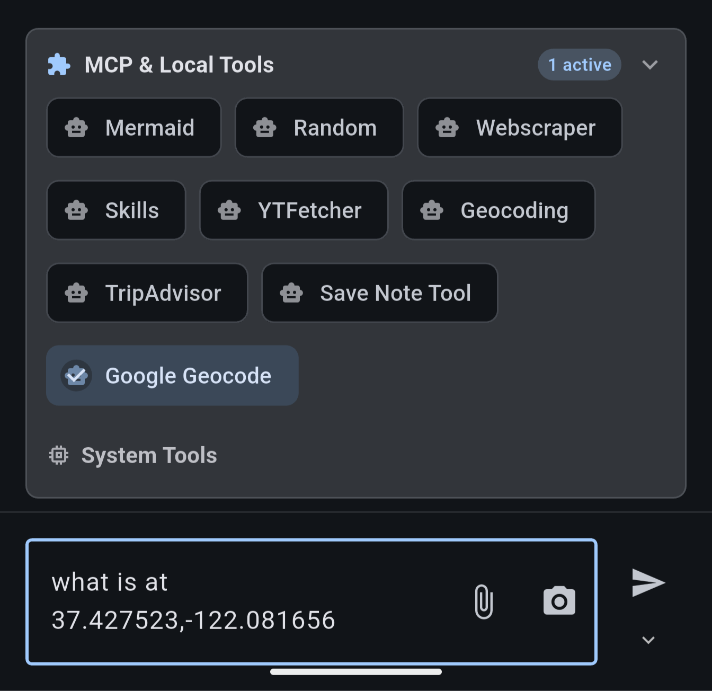

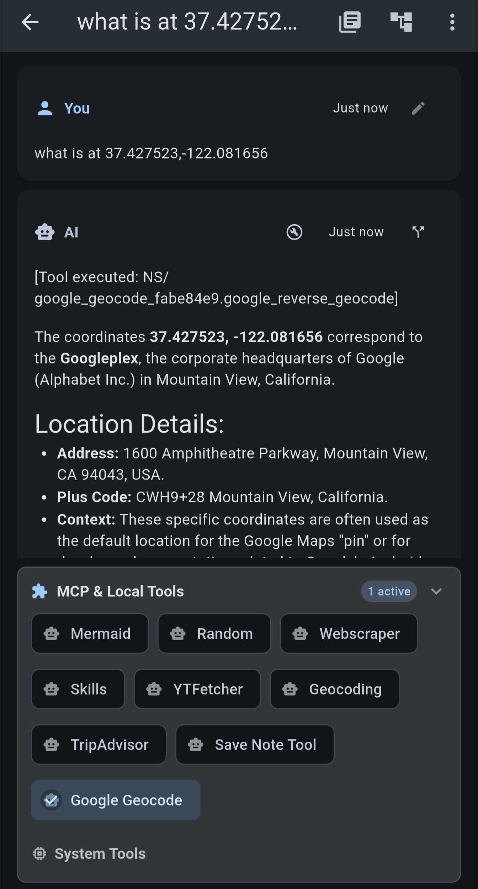
